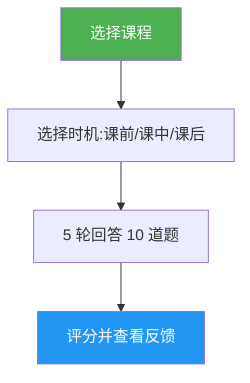

# 课时测验

> 交互式测验工具，通过 10 道问题测试你对特定 Claude Code 课程的理解，提供逐题反馈和针对性的复习指导。

## 亮点

- 每门课程 10 道题，混合概念理解和实际应用
- 覆盖全部 10 门课程（01-Slash Commands 到 10-CLI）
- 三种时机模式：课前预测试、课中进度检查、课后掌握验证
- 逐题反馈，含正确答案和解析
- 针对性复习建议，指向具体的课程章节
- 100 题题库分布于所有课程，存放在 `references/question-bank.md` 中

## 使用时机

| 你这样说... | 技能将... |
|-----------|----------|
| "给我出道钩子的测验" | 运行 Lesson 06: Hooks 的 10 题测验 |
| "lesson quiz 03" | 测试你对 Lesson 03: Skills 的知识 |
| "我理解 MCP 吗" | 评估你对 Lesson 05: MCP 的理解 |
| "练习测验" | 让你选择课程，然后对你进行测验 |

## 工作原理



## 使用方法

```
/lesson-quiz [课程名称或编号]
```

示例：
```
/lesson-quiz hooks
/lesson-quiz 03
/lesson-quiz advanced-features
/lesson-quiz           # （提示选择课程）
```

## 输出

### 分数报告
- 总分（满分 10）及评级（已精通 / 熟练 / 发展中 / 入门）
- 按题目类别分解（概念 vs 实践）

### 逐题反馈
对于每道错误答案：
- 你的回答 vs 正确答案
- 为什么正确答案是对的
- 课程中需复习的具体章节

### 时机感知的指导
- **课前**：建立基线，突出学习重点
- **课中**：识别已掌握的内容和待复习的内容
- **课后**：确认掌握程度或定位剩余差距

## 资源

| 路径 | 描述 |
|-----|------|
| `references/question-bank.md` | 100 道预编写问题（每课 10 道），含答案、解析和复习指针 |
