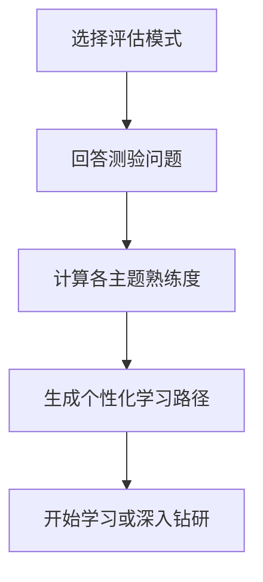

# 自我评估与学习路径顾问

> 全面的 Claude Code 熟练度评估工具,跨 10 个功能领域进行评估,识别技能差距,并生成个性化的升级学习路径。

## 亮点

- 两种评估模式:快速(8 道题,2 分钟)和深度(5 轮,5 分钟)
- 评估 10 个功能领域:斜杠命令、记忆、技能、钩子、MCP、子代理、检查点、高级功能、插件、CLI
- 各主题评分及掌握度等级(无 / 基础 / 熟练)
- 基于依赖关系的差距分析与优先级排序
- 个性化学习路径,含具体练习和成功标准
- 后续行动选项:开始学习、深入钻研、实践项目或重新测评

## 使用时机

| 你这样说... | 技能将... |
|-----------|----------|
| "评估我的水平" | 运行评估测验并确定你的级别 |
| "我应该从哪里开始" | 评估你的经验并建议起点 |
| "检查我的技能" | 在所有 10 个领域生成详细的技能概况 |
| "我接下来应该学什么" | 识别差距并构建优先级学习路径 |

## 工作原理



## 评估模式

### 快速评估(约 2 分钟)
- 2 轮共 8 道是/否经验问题
- 确定整体级别:入门 / 中级 / 高级
- 列出具体差距及教程链接
- 适用场景:首次用户、快速自检

### 深度评估(约 5 分钟)
- 5 轮问题,覆盖 10 个功能领域(每轮 2 个主题)
- 各主题计分(每题 0-2 分,总分 20 分)
- 掌握度表格,含强项、优先差距和待复习项
- 基于依赖关系的学习路径,分阶段并提供时间估算
- 推荐结合多个差距领域的实践项目
- 适用场景:有经验的用户想要提升等级、定期技能回顾

## 使用方法

```
/self-assessment
```

## 输出

### 技能概况表
展示各主题得分、掌握度级别和状态(学习 / 复习 / 已精通)。

### 个性化学习路径
- 基于依赖顺序组织为各阶段
- 每个主题包含:教程链接、重点区域、关键练习、完成标准
- 时间预估根据已精通的主题进行调整
- 结合多个差距领域的实践项目

### 后续行动
结果呈现后可选择:
- 从第一个差距教程开始带引导练习
- 深入钻研某个具体差距领域
- 搭建覆盖你差距的练习项目
- 换一种评估模式重新测评
