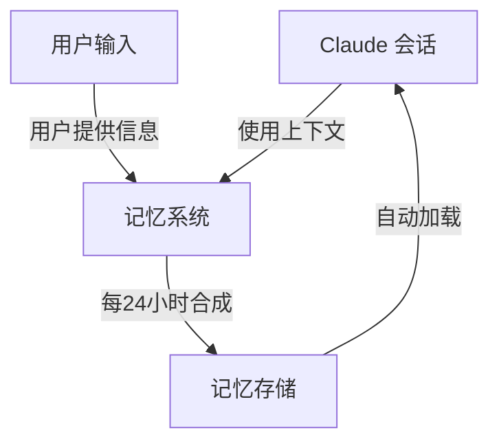
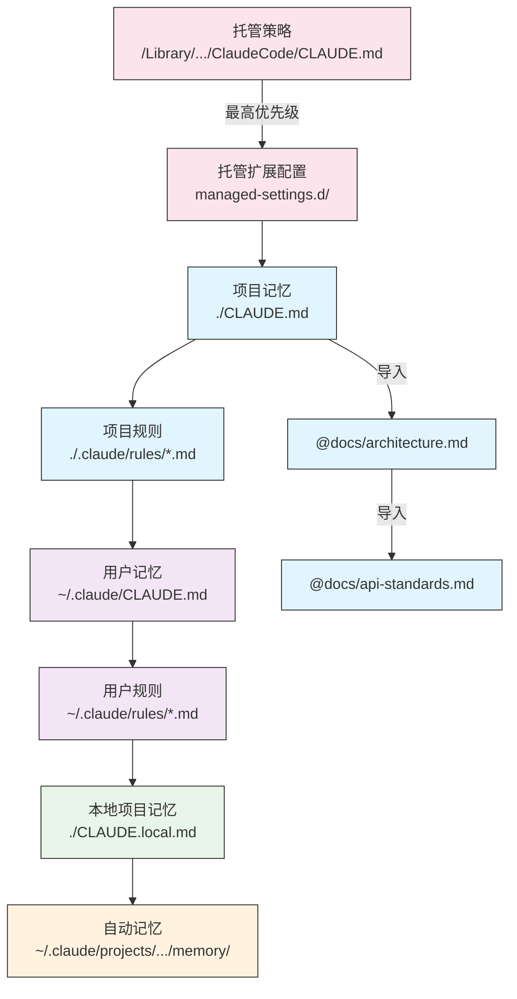
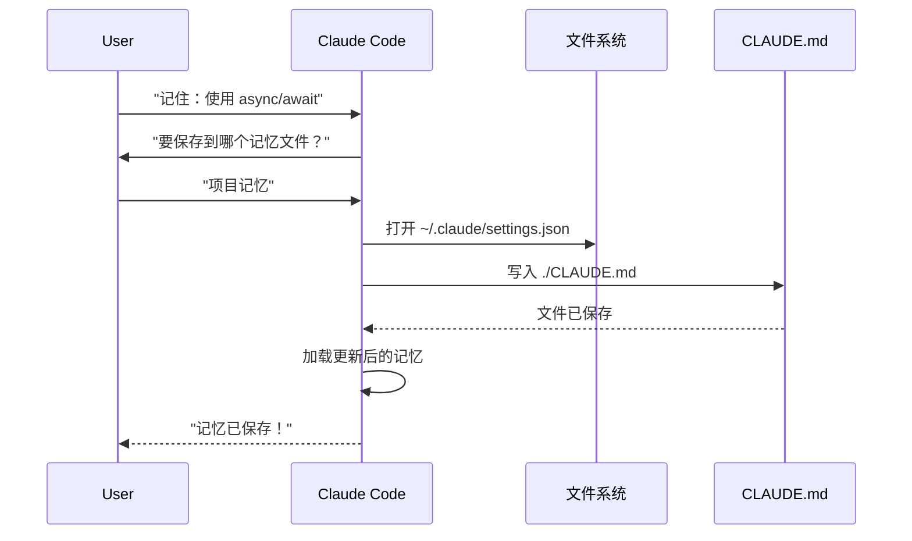
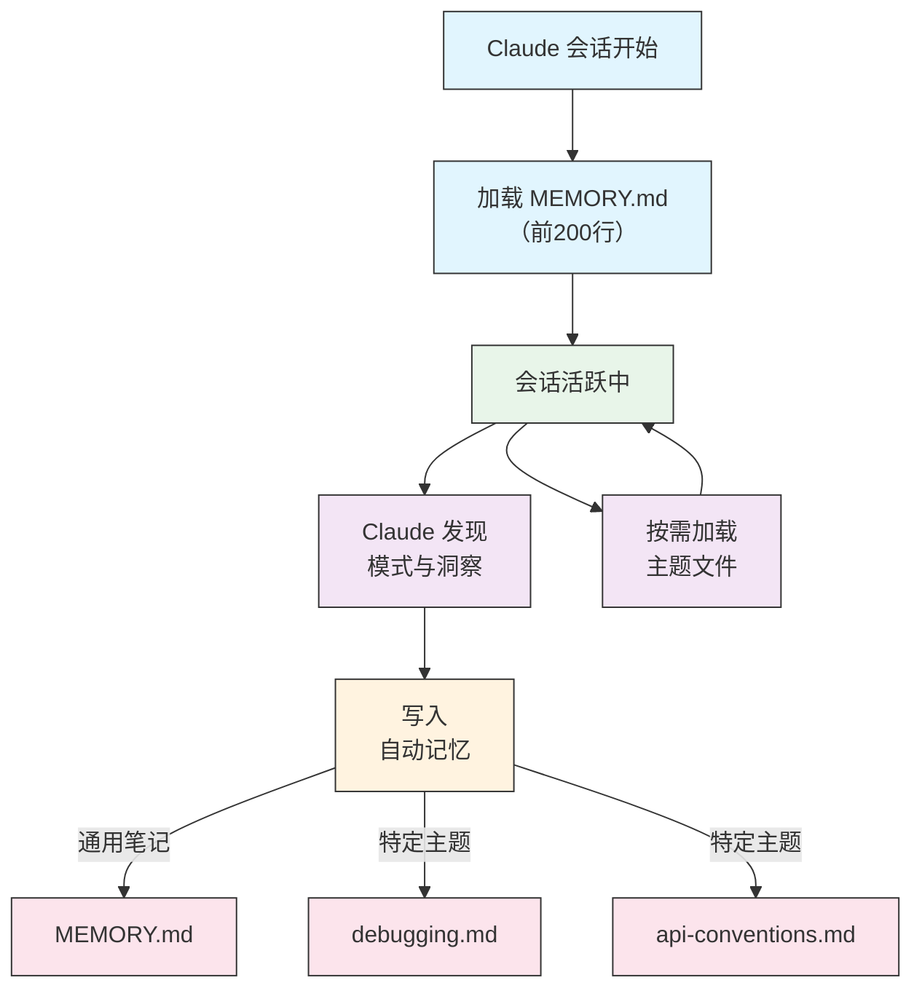

<picture>
  <source media="(prefers-color-scheme: dark)" srcset="../resources/logos/claude-howto-logo-dark.svg">
  
</picture>

# Memory（记忆）指南

Memory 使 Claude 能够在多个会话和对话之间保留上下文。它以两种形式存在：claude.ai 中的自动合成，以及 Claude Code 中基于文件系统的 CLAUDE.md。

## 概览

Claude Code 中的 Memory 提供跨多个会话和对话持久化的上下文。与临时的上下文窗口不同，记忆文件允许你：

- 在团队间共享项目规范
- 存储个人开发偏好
- 维护特定目录的规则和配置
- 导入外部文档
- 将记忆作为项目的一部分进行版本控制

记忆系统运行于多个层级，从全局个人偏好到特定子目录，允许精细控制 Claude 记住的内容及其应用方式。

## 记忆命令速查表

| 命令 | 用途 | 使用方式 | 适用场景 |
|------|--------|----------|----------|
| `/init` | 初始化项目记忆 | `/init` | 新项目启动、首次设置 CLAUDE.md |
| `/memory` | 在编辑器中编辑记忆文件 | `/memory` | 大规模更新、重组、审阅内容 |
| `#` 前缀 | 快速添加单行记忆 | `# 你的规则` | 对话中快速添加规则 |
| `# new rule into memory` | 显式添加记忆 | `# new rule into memory<br/>你的详细规则` | 添加复杂的多行规则 |
| `# remember this` | 自然语言记忆 | `# remember this<br/>你的指令` | 对话式记忆更新 |
| `@path/to/file` | 导入外部内容 | `@README.md` 或 `@docs/api.md` | 在 CLAUDE.md 中引用已有文档 |

## 快速上手：初始化记忆

### `/init` 命令

`/init` 命令是在 Claude Code 中设置项目记忆的最快方式。它会初始化一个包含基础项目文档的 CLAUDE.md 文件。

**使用方法**：

```bash
/init
```

**它的作用**：

- 在项目中创建一个新的 CLAUDE.md 文件（通常位于 `./CLAUDE.md` 或 `./.claude/CLAUDE.md`）
- 建立项目的约定和规范
- 为跨会话的上下文持久化奠定基础
- 提供记录项目规范的模板结构

**增强交互模式**：设置 `CLAUDE_CODE_NEW_INIT=true` 可启用多阶段交互流程，逐步引导你完成项目设置：

```bash
CLAUDE_CODE_NEW_INIT=true claude
/init
```

**何时使用 `/init`**：

- 使用 Claude Code 启动新项目
- 建立团队编码规范和约定
- 创建关于代码库结构的文档
- 为协作开发设置记忆层级

### 使用 `#` 快速更新记忆

你可以在任何对话中通过以 `#` 开头来快速向记忆添加信息：

**语法**：

```markdown
# 你的记忆规则或指令
```

**示例**：

```markdown
# 本项目始终使用 TypeScript 的严格模式

# 优先使用 async/await 而非 Promise 链

# 每次提交前运行 npm test

# 文件名使用 kebab-case 命名法
```

**工作原理**：

1. 以 `#` 开头后跟你的规则
2. Claude 将其识别为记忆更新请求
3. Claude 询问要更新哪个记忆文件（项目级还是个人级）
4. 规则被添加到相应的 CLAUDE.md 文件
5. 后续会话自动加载此上下文

**替代写法**：

```markdown
# new rule into memory
始终使用 Zod Schema 校验用户输入

# remember this
所有发布版本使用语义化版本号

# add to memory
数据库迁移脚本必须可逆
```

### `/memory` 命令

`/memory` 命令提供对 CLAUDE.md 记忆文件的直接编辑访问。它在系统编辑器中打开你的记忆文件进行全面编辑。

**使用方法**：

```bash
/memory
```

**何时使用 `/memory`**：

- 审阅已有记忆内容
- 大规模更新项目规范
- 重组记忆结构
- 添加详细的文档或指南
- 随着项目演进维护和更新记忆

**`/memory` vs `/init` 对比**：

| 方面 | `/memory` | `/init` |
|------|-----------|---------|
| **用途** | 编辑已有记忆文件 | 初始化新的 CLAUDE.md |
| **适用场景** | 更新/修改项目上下文 | 开始新项目 |
| **操作** | 打开编辑器进行修改 | 生成初始模板 |
| **工作流** | 持续性维护 | 一次性设置 |

### 使用记忆导入

CLAUDE.md 文件支持 `@path/to/file` 语法来引入外部内容：

```markdown
# 项目文档
参见 @README.md 了解项目概览
参见 @package.json 获取可用的 npm 命令
参见 @docs/architecture.md 了解系统设计

# 使用绝对路径导入主目录的文件
@~/.claude/my-project-instructions.md
```

**导入功能特点**：

- 支持相对路径和绝对路径（如 `@docs/api.md` 或 `@~/.claude/my-project-instructions.md`）
- 支持递归导入，最大深度为 5 层
- 首次从外部位置导入时会弹出安全确认对话框
- 导入指令不会在 Markdown 代码片段或代码块内被解析（因此在示例中记录它们是安全的）
- 有助于通过引用已有文档避免重复
- 自动将引用内容包含在 Claude 的上下文中

---

## 记忆架构

Claude Code 中的记忆遵循分层体系结构，不同作用域服务于不同目的：



## Claude Code 中的记忆层级

Claude Code 使用多层级分层记忆系统。记忆文件在 Claude Code 启动时自动加载，高层级的文件优先级更高。

**完整记忆层级（按优先级排序）**：

1. **Managed Policy（托管策略）** — 组织范围的指令
   - macOS: `/Library/Application Support/ClaudeCode/CLAUDE.md`
   - Linux/WSL: `/etc/claude-code/CLAUDE.md`
   - Windows: `C:\Program Files\ClaudeCode\CLAUDE.md`

2. **Managed Drop-ins（托管扩展配置）** — 按字母顺序合并的策略文件（v2.1.83+）
   - 托管策略 CLAUDE.md 旁的 `managed-settings.d/` 目录
   - 文件按字母顺序合并，用于模块化策略管理

3. **Project Memory（项目记忆）** — 团队共享上下文（受版本控制）
   - `./.claude/CLAUDE.md` 或 `./CLAUDE.md`（仓库根目录）

4. **Project Rules（项目规则）** — 模块化的、特定主题的项目指令
   - `./.claude/rules/*.md`

5. **User Memory（用户记忆）** — 个人偏好（所有项目）
   - `~/.claude/CLAUDE.md`

6. **User-Level Rules（用户级规则）** — 个人规则（所有项目）
   - `~/.claude/rules/*.md`

7. **Local Project Memory（本地项目记忆）** — 个人项目特定偏好
   - `./CLAUDE.local.md`

> **注意**：截至 2026 年 3 月，`CLAUDE.local.md` 在[官方文档](https://code.claude.com/docs/en/memory)中未被提及。它可能仍作为遗留功能存在。对于新项目，建议改用 `~/.claude/CLAUDE.md`（用户级别）或 `.claude/rules/`（项目级别、路径范围限定）。

8. **Auto Memory（自动记忆）** — Claude 自动记录的笔记和学习内容
   - `~/.claude/projects/<project>/memory/`

**记忆发现行为**：

Claude 按以下顺序搜索记忆文件，先找到的位置优先级更高：



## 使用 `claudeMdExcludes` 排除 CLAUDE.md 文件

在大型 monorepo 中，某些 CLAUDE.md 文件可能与当前工作无关。`claudeMdExcludes` 设置允许你跳过特定的 CLAUDE.md 文件，使它们不会被加载到上下文中：

```jsonc
// 在 ~/.claude/settings.json 或 .claude/settings.json 中
{
  "claudeMdExcludes": [
    "packages/legacy-app/CLAUDE.md",
    "vendors/**/CLAUDE.md"
  ]
}
```

模式匹配相对于项目根目录的路径。这特别适用于：
- 包含多个子项目的大型 monorepo，其中只有部分与当前工作相关
- 包含第三方或供应商提供的 CLAUDE.md 文件的仓库
- 通过排除过时或不相关的指令来减少 Claude 上下文窗口中的干扰

## 配置文件层级

Claude Code 设置（包括 `autoMemoryDirectory`、`claudeMdExcludes` 和其他配置）由五层层级结构解析，高优先级覆盖低优先级：

| 层级 | 位置 | 作用域 |
|------|--------|-------|
| 1（最高） | Managed policy（系统级） | 组织范围内强制执行 |
| 2 | `managed-settings.d/`（v2.1.83+） | 模块化策略扩展配置，按字母顺序合并 |
| 3 | `~/.claude/settings.json` | 用户偏好设置 |
| 4 | `.claude/settings.json` | 项目级设置（提交到 git） |
| 5（最低） | `.claude/settings.local.json` | 本地覆盖设置（git 忽略） |

## 模块化规则系统

使用 `.claude/rules/` 目录结构创建有组织的、路径特定的规则。规则可以在项目级别和用户级别定义：

```
your-project/
├── .claude/
│   ├── CLAUDE.md
│   └── rules/
│       ├── code-style.md
│       ├── testing.md
│       ├── security.md
│       └── api/                  # 支持子目录
│           ├── conventions.md
│           └── validation.md

~/.claude/
├── CLAUDE.md
└── rules/                        # 用户级规则（所有项目生效）
    ├── personal-style.md
    └── preferred-patterns.md
```

规则在 `rules/` 目录中被递归发现，包括任何子目录。`~/.claude/rules/` 下的用户级规则在项目级规则之前加载，允许个人默认值被项目配置覆盖。

### 使用 YAML Frontmatter 定义路径特定规则

定义仅适用于特定文件路径的规则：

```markdown
---
paths: src/api/**/*.ts
---

# API 开发规范

- 所有 API 接口必须包含输入校验
- 使用 Zod 进行 Schema 校验
- 记录所有参数和响应类型
- 所有操作必须包含错误处理
```

**Glob 模式示例**：

- `**/*.ts` — 所有 TypeScript 文件
- `src/**/*` — src/ 下的所有文件
- `src/**/*.{ts,tsx}` — 多种扩展名
- `{src,lib}/**/*.ts, tests/**/*.test.ts` — 多个模式

## 记忆位置速查表

| 位置 | 作用域 | 优先级 | 是否共享 | 访问方式 | 最适用于 |
|------|--------|--------|---------|----------|----------|
| `/Library/Application Support/ClaudeCode/CLAUDE.md` (macOS) | 托管策略 | 1（最高） | 组织 | 系统 | 公司范围的政策 |
| `/etc/claude-code/CLAUDE.md` (Linux/WSL) | 托管策略 | 1（最高） | 组织 | 系统 | 组织标准 |
| `C:\Program Files\ClaudeCode\CLAUDE.md` (Windows) | 托管策略 | 1（最高） | 组织 | 系统 | 企业规范 |
| `managed-settings.d/*.md` (策略旁) | 托管扩展配置 | 1.5 | 组织 | 系统 | 模块化策略文件（v2.1.83+） |
| `./CLAUDE.md` 或 `./.claude/CLAUDE.md` | 项目记忆 | 2 | 团队 | Git | 团队规范、共享架构 |
| `./.claude/rules/*.md` | 项目规则 | 3 | 团队 | Git | 路径特定的模块化规则 |
| `~/.claude/CLAUDE.md` | 用户记忆 | 4 | 个人 | 文件系统 | 个人偏好（所有项目） |
| `~/.claude/rules/*.md` | 用户规则 | 5 | 个人 | 文件系统 | 个人规则（所有项目） |
| `./CLAUDE.local.md` | 项目本地 | 6 | 个人 | Git（忽略） | 个人项目特定偏好 |
| `~/.claude/projects/<project>/memory/` | 自动记忆 | 7（最低） | 个人 | 文件系统 | Claude 的自动笔记和学习内容 |

## 记忆更新生命周期

以下是记忆更新在你的 Claude Code 会话中的流转过程：



## Auto Memory（自动记忆）

Auto Memory 是一个持久化目录，Claude 在处理你的项目时自动记录学习到的模式、规律和洞察。与你手动编写和维护的 CLAUDE.md 文件不同，自动记忆由 Claude 自身在会话过程中写入。

### Auto Memory 工作原理

- **位置**：`~/.claude/projects/<project>/memory/`
- **入口文件**：`MEMORY.md` 作为自动记忆目录的主文件
- **主题文件**：针对特定主题的可选附加文件（如 `debugging.md`、`api-conventions.md`）
- **加载行为**：`MEMORY.md` 的前 200 行在会话启动时被加载到系统提示词中。主题文件按需加载，不在启动时加载。
- **读写操作**：Claude 在会话期间读取和写入记忆文件，随着发现模式和项目特定知识

### Auto Memory 架构



### Auto Memory 目录结构

```
~/.claude/projects/<project>/memory/
├── MEMORY.md              # 入口文件（启动时加载前200行）
├── debugging.md           # 主题文件（按需加载）
├── api-conventions.md     # 主题文件（按需加载）
└── testing-patterns.md    # 主题文件（按需加载）
```

### 版本要求

Auto Memory 需要 **Claude Code v2.1.59 或更高版本**。如果你使用的是旧版本，请先升级：

```bash
npm install -g @anthropic-ai/claude-code@latest
```

### 控制 Auto Memory

可以通过 `CLAUDE_CODE_DISABLE_AUTO_MEMORY` 环境变量控制自动记忆：

| 值 | 行为 |
|-----|------|
| `0` | 强制开启自动记忆 |
| `1` | 强制关闭自动记忆 |
| *（未设置）* | 默认行为（自动记忆启用） |

```bash
# 禁用单次会话的自动记忆
CLAUDE_CODE_DISABLE_AUTO_MEMORY=1 claude

# 强制显式开启自动记忆
CLAUDE_CODE_DISABLE_AUTO_MEMORY=0 claude
```

## 实际示例

### 示例 1：项目记忆结构

**文件**：`./CLAUDE.md`

```markdown
# 项目配置

## 项目概览
- **名称**：电商平台
- **技术栈**：Node.js、PostgreSQL、React 18、Docker
- **团队规模**：5 名开发人员
- **截止日期**：2025 年第四季度

## 架构说明
@docs/architecture.md
@docs/api-standards.md
@docs/database-schema.md

## 开发规范

### 代码风格
- 使用 Prettier 格式化
- 使用 ESLint 配合 airbnb 规则集
- 最大行宽：100 字符
- 使用 2 空格缩进

### 命名规范
- **文件名**：kebab-case（user-controller.js）
- **类名**：PascalCase（UserService）
- **函数/变量**：camelCase（getUserById）
- **常量**：UPPER_SNAKE_CASE（API_BASE_URL）
- **数据库表名**：snake_case（user_accounts）

### Git 工作流
- 分支命名：`feature/描述` 或 `fix/描述`
- 提交消息：遵循 Conventional Commits 规范
- 合并前必须提交 PR
- 所有 CI/CD 检查必须通过
- 至少需要 1 人审批

### 测试要求
- 最低代码覆盖率：80%
- 所有关键路径必须有测试
- 使用 Jest 编写单元测试
- 使用 Cypress 编写端到端测试
- 测试文件命名：`*.test.ts` 或 `*.spec.ts`
```

### 示例 2：目录特定记忆

**文件**：`./src/api/CLAUDE.md`

```markdown
# API 模块规范

本文件为 /src/api/ 目录下的所有内容覆盖根目录的 CLAUDE.md 配置。

## API 专用规范

### 请求校验
- 使用 Zod 进行 Schema 校验
- 始终校验输入参数
- 校验失败返回 400 状态码
- 包含字段级别的错误详情

### 身份认证
- 所有接口均要求 JWT Token
- Token 通过 Authorization 请求头传递
- Token 有效期为 24 小时
- 实现 Refresh Token 机制
```

> 💡 **中文开发者提示**：对于中文团队，建议将 CLAUDE.md 中的技术文档统一使用中文编写。如果团队是国际化的，可以保持英文但确保术语一致。项目记忆是团队协作的基础设施，值得在项目初期就投入时间建立好。

---

## 最佳实践

### 推荐做法 —— 应该包含的内容

- **具体且详细**：使用清晰、详细的指令而非模糊的指导
  - ✅ 推荐："所有 JavaScript 文件使用 2 空格缩进"
  - ❌ 避免："遵循最佳实践"

- **保持条理清晰**：用清晰的 Markdown 章节和标题组织记忆文件

- **使用合适的层级**：
  - **托管策略**：公司范围的政策、安全标准、合规要求
  - **项目记忆**：团队规范、架构、编码约定（提交到 git）
  - **用户记忆**：个人偏好、沟通风格、工具选择
  - **目录记忆**：模块特定的规则和覆盖配置

- **善用导入功能**：使用 `@path/to/file` 语法引用已有文档
  - 支持最多 5 层递归嵌套
  - 避免记忆文件间的重复内容
  - 示例：`参见 @README.md 了解项目概览`

- **记录常用命令**：包含你反复使用的命令以节省时间

- **将项目记忆纳入版本控制**：将项目级 CLAUDE.md 文件提交到 git 以便团队共享

- **定期审阅更新**：随着项目演进和需求变化定期更新记忆

- **提供具体的示例**：包含代码片段和具体场景

### 避免事项 —— 不应该做的

- **不要存储密钥**：绝不要包含 API 密钥、密码、Token 或凭证信息

- **不要包含敏感数据**：不含个人身份信息（PII）、隐私信息或专有秘密

- **不要重复内容**：使用导入语法（`@path`）引用已有文档

- **不要模糊不清**：避免"遵循最佳实践"或"写好的代码"这类泛泛而谈的说法

- **不要过长**：单个记忆文件应聚焦主题，控制在 500 行以内

- **不要过度组织**：策略性地使用层级；不要创建过多的子目录覆盖

- **不要忘记更新**：过时的记忆会导致混淆和过时的做法

- **不要超出嵌套限制**：记忆导入最多支持 5 层嵌套深度

## 安装说明

### 设置项目记忆

#### 方法 1：使用 `/init` 命令（推荐）

设置项目记忆的最快方式：

1. **进入你的项目目录**
2. **在 Claude Code 中运行初始化命令**：`/init`
3. **Claude 将创建并填充 CLAUDE.md**，生成模板结构
4. **自定义生成的文件**以匹配你的项目需求
5. **提交到 git**

#### 方法 2：手动创建

1. **在项目根目录创建 CLAUDE.md**
2. **添加项目规范**
3. **提交到 git**

#### 方法 3：使用 `#` 快速更新

一旦 CLAUDE.md 存在，可以在对话中快速添加规则：

```markdown
# 所有发布版本使用语义化版本号

# 提交前始终运行测试

# 优先使用组合而非继承
```

### 设置个人记忆

1. **创建 ~/.claude 目录**
2. **创建个人 CLAUDE.md**
3. **添加你的偏好设置**

### 设置目录特定记忆

1. **为特定目录创建记忆文件**
2. **添加目录特定规则**
3. **提交到版本控制**

### 验证设置

1. **检查记忆文件位置**
2. **Claude Code 启动时会自动加载**这些文件
3. **在你的项目中启动新的 Claude Code 会话进行测试**

---

## 相关概念链接

### 集成关联
- [MCP Protocol（模型上下文协议）](../05-mcp/) — 与记忆配合使用的实时数据访问
- [Slash Commands（斜杠命令）](../01-slash-commands/) — 会话级快捷操作
- [Skills（技能）](../03-skills/) — 结合记忆上下文的自动化工作流

### 相关 Claude 功能
- [Claude Web Memory](https://claude.ai) — 自动合成功能
- [官方记忆文档](https://code.claude.com/docs/en/memory) — Anthropic 官方文档

---

**最后更新**：2026 年 3 月
