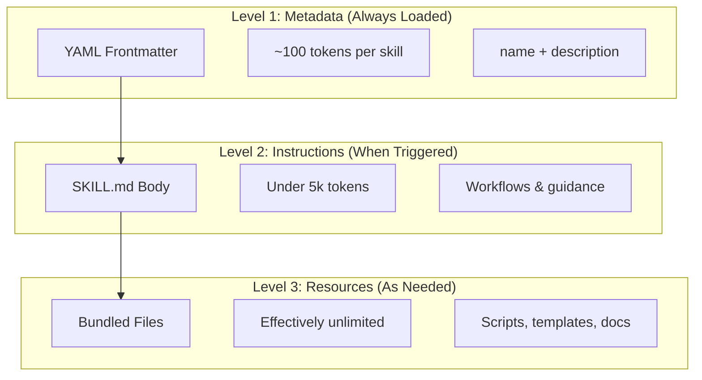
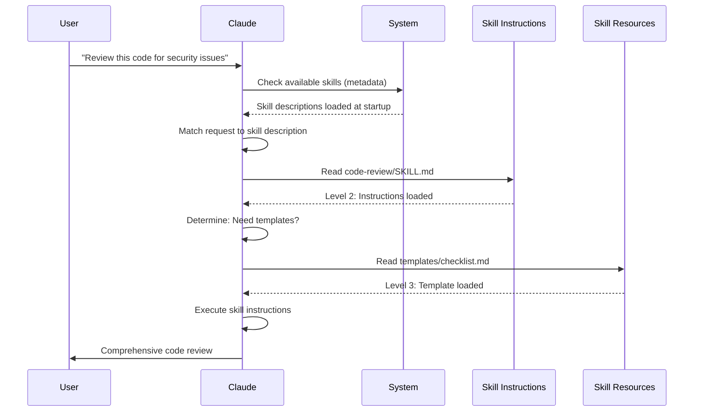

<picture>
  <source media="(prefers-color-scheme: dark)" srcset="../resources/logos/claude-howto-logo-dark.svg">
  
</picture>

# 代理技能（Skills）指南

代理技能是可重用的、基于文件系统的能力，用于扩展 Claude 的功能。它们将特定领域的专业知识、工作流程和最佳实践打包成可发现的组件，Claude 在相关时会自动使用这些组件。

## 概览

**Agent Skills**（代理技能）是将通用代理转化为专家的模块化能力。与提示词（一次性任务的对话级指令）不同，技能按需加载，消除了在多次对话中反复提供相同指导的需要。

### 核心优势

- **专业化 Claude**：为特定领域任务定制能力
- **减少重复**：创建一次，在多个对话中自动使用
- **组合能力**：结合技能以构建复杂的工作流程
- **扩展工作流**：在多个项目和团队中重用技能
- **维护质量**：将最佳实践直接嵌入到您的工作流中

技能遵循 [Agent Skills](https://agentskills.io) 开放标准，该标准适用于多种 AI 工具。Claude Code 通过调用控制、子代理执行和动态上下文注入等附加功能扩展了该标准。

> **注意**：自定义斜杠命令已合并到技能中。`.claude/commands/` 文件仍然有效并支持相同的 frontmatter 字段。建议在新开发中使用技能。当两者存在于相同路径时（例如 `.claude/commands/review.md` 和 `.claude/skills/review/SKILL.md`），技能优先。

## 技能如何工作：渐进式披露

技能利用**渐进式披露**架构 — Claude 根据需要分阶段加载信息，而不是预先消耗上下文。这实现了高效的上下文管理，同时保持无限的可扩展性。

### 三级加载



| 级别 | 加载时机 | Token 成本 | 内容 |
|------|----------|------------|------|
| **Level 1: 元数据** | 始终（启动时） | 每个技能约 100 tokens | YAML frontmatter 中的 `name` 和 `description` |
| **Level 2: 指令** | 当技能被触发时 | 不到 5k tokens | 包含指令和指导的 SKILL.md 正文 |
| **Level 3+: 资源** | 按需 | 实际上无限制 | 通过 bash 执行的捆绑文件，不将内容加载到上下文中 |

这意味着您可以安装许多技能而不会产生上下文惩罚 — Claude 仅知道每个技能的存在以及何时使用它，直到实际被触发为止。

## 技能加载过程



## 技能类型与位置

| 类型 | 位置 | 作用域 | 可共享 | 最适合 |
|------|------|--------|--------|--------|
| **企业级** | 托管设置 | 所有组织用户 | 是 | 组织范围的标准 |
| **个人** | `~/.claude/skills/<skill-name>/SKILL.md` | 个人 | 否 | 个人工作流 |
| **项目** | `.claude/skills/<skill-name>/SKILL.md` | 团队 | 是（通过 git） | 团队标准 |
| **插件** | `<plugin>/skills/<skill-name>/SKILL.md` | 启用的位置 | 取决于情况 | 与插件捆绑 |

当技能在不同级别共享相同名称时，较高优先级的位置获胜：**企业 > 个人 > 项目**。插件技能使用 `plugin-name:skill-name` 命名空间，因此它们不会冲突。

### 自动发现

**嵌套目录**：当您在子目录中使用文件时，Claude Code 会自动从嵌套的 `.claude/skills/` 目录中发现技能。例如，如果您正在编辑 `packages/frontend/` 中的文件，Claude Code 还会在 `packages/frontend/.claude/skills/` 中查找技能。这支持包具有自己技能的 monorepo 设置。

**`--add-dir` 目录**：通过 `--add-dir` 添加的目录中的技能会自动加载，并具有实时更改检测功能。对这些目录中技能文件的任何编辑都会立即生效，无需重启 Claude Code。

**描述预算**：技能描述（Level 1 元数据）上限为**上下文窗口的 1%**（回退值：**8,000 个字符**）。如果您安装了许多技能，描述可能会缩短。始终包含所有技能名称，但会修剪描述以适应。在描述中将关键用例放在前面。使用 `SLASH_COMMAND_TOOL_CHAR_BUDGET` 环境变量覆盖预算。

## 创建自定义技能

### 基本目录结构

```
my-skill/
├── SKILL.md           # 主要指令（必需）
├── template.html        # 供 Claude 填写的模板
├── examples/
│   └── sample.md      # 显示预期格式的示例输出
└── scripts/
    └── validate.sh    # Claude 可执行的脚本
```

### SKILL.md 格式

```yaml
---
name: your-skill-name
description: Brief description of what this Skill does and when to use it
---

# Your Skill Name

## Instructions
Provide clear, step-by-step guidance for Claude.

## Examples
Show concrete examples of using this Skill.
```

### 必需字段

- **name**：仅限小写字母、数字和连字符（最多 64 个字符）。不能包含 "anthropic" 或 "claude"。
- **description**：技能的作用以及何时使用它（最多 1024 个字符）。这对于 Claude 知道何时激活技能至关重要。

### 可选 Frontmatter 字段

```yaml
---
name: my-skill
description: What this skill does and when to use it
argument-hint: "[filename] [format]"        # 自动完成提示
disable-model-invocation: true              # 仅用户可以调用
user-invocable: false                       # 从斜杠菜单中隐藏
tools: Read, Write, Edit                    # 可用工具白名单
allowed-tools: Read, Grep, Glob            # 允许的工具列表
blocked-tools: Bash, WebFetch              # 阻止的工具列表
subagent-type: code-reviewer               # 子代理执行模式
memory: project                            # 持久化记忆作用域
max-turns: 20                              # 最大轮次限制
effort: high                               # 推理强度
---
```

## 内置技能

Claude Code 包含几个内置技能，始终可用：

| 技能 | 用途 | 触发方式 |
|------|------|----------|
| **code-review** | 全面的代码审查 | 安全问题、代码质量 |
| **test-generator** | 生成测试用例 | 测试相关请求 |
| **documentation** | 生成文档 | 文档任务 |
| **refactor** | 安全重构 | 代码优化请求 |
| **debugger** | 系统化调试 | 错误和问题 |

### 使用内置技能

内置技能会根据上下文自动激活：

```bash
# 自动触发代码审查技能
Please review the authentication module for security vulnerabilities.

# 自动触发测试生成技能
Generate unit tests for the user service.
```

## 技能调用控制

### 自动调用

当满足以下条件时，Claude 会自动调用技能：
- 用户请求匹配技能的描述
- 任务可以从专业技能中受益
- 用户没有明确要求不同的方法

### 手动调用

使用斜杠命令语法：

```bash
# 通过名称调用技能
/code-review Review the payment processing module.

# 带参数调用
/test-generator Generate tests for UserAuth.java --focus edge cases
```

### 调用限制

某些情况下可能需要限制技能调用：

```yaml
---
name: sensitive-operation
description: Performs critical security operations
disable-model-invocation: true  # 仅允许手动调用
user-invocable: true             # 用户可以通过斜杠菜单访问
---
```

## 高级技能特性

### 子代理执行

技能可以指定要使用的子代理类型：

```yaml
---
name: deep-analysis
description: Perform comprehensive code analysis
subagent-type: specialist       # 使用专门的子代理
max-turns: 50                   # 允许更多轮次
effort: max                     # 最大推理强度
---
```

### 工具访问控制

限制技能可用的工具：

```yaml
---
name: read-only-analyzer
description: Analyze code without making changes
allowed-tools: Read, Grep, Glob  # 仅允许只读工具
blocked-tools: Write, Edit, Bash # 明确阻止写入工具
---
```

### 持久化记忆

技能可以维护跨会话的记忆：

```yaml
---
name: project-architect
description: Maintains knowledge of project architecture
memory: project                  # 在项目级别持久化记忆
---
```

### 条件执行

基于复杂条件执行技能：

```yaml
---
name: smart-refactor
description: Intelligent refactoring with safety checks
tools: Read, Grep, Edit
conditional-execution:
  - condition: "file_count > 10"
    action: "use_subagent"
  - condition: "complexity_score > 0.7"
    action: "require_confirmation"
---
```

## 技能开发最佳实践

### 设计原则

1. **单一职责**
   ```yaml
   # ✅ 好：专注的技能
   name: react-component-generator
   description: Generate React components with TypeScript support
   ```

   ```yaml
   # ❌ 差：过于宽泛
   name: do-everything
   description: Handles all development tasks
   ```

2. **清晰的触发条件**
   ```yaml
   # ✅ 好：明确的触发条件
   description: >
    Generate comprehensive unit tests for JavaScript/ TypeScript code.
    Use when user requests testing, test coverage, or quality assurance.
    Focus on edge cases, error scenarios, and integration points.
   ```

3. **渐进式指令**
   ```
   ## Phase 1: Analysis
   [Quick checks]

   ## Phase 2: Generation
   [Main task]

   ## Phase 3: Validation
   [Quality checks]
   ```

### 模板系统

创建可重用的模板：

**template.html:**
```html
<!-- Template for code review output -->
## Code Review: {{filename}}

### Summary
{{summary}}

### Issues Found
{{#each issues}}
- **[{{severity}}]** {{message}}
  Location: {{location}}
  Suggestion: {{suggestion}}
{{/each}}

### Metrics
- Complexity Score: {{complexity}}
- Test Coverage: {{coverage}}%
- Security Issues: {{security_count}}
```

**在 SKILL.md 中使用模板：**
```markdown
## Output Format

When completing a review, use the `template.html` template to format your output. Fill in all fields with specific findings from the code analysis.
```

### 脚本集成

包含可执行的辅助脚本：

**scripts/validate.sh:**
```bash
#!/bin/bash
# Validation script for code review skill

FILE_PATH="$1"

if [ ! -f "$FILE_PATH" ]; then
  echo "{\"error\": \"File not found: $FILE_PATH\"}"
  exit 1
fi

# 运行静态分析
ISSUES=$(eslint "$FILE_PATH" --format json 2>/dev/null)

echo "{\"issues\": $ISSUES, \"file\": \"$FILE_PATH\"}"
exit 0
```

**在 SKILL.md 中调用脚本：**
```markdown
## Validation Step

Run the validation script to identify potential issues:

\`\`\`bash
./scripts/validate.sh <filename>
\`\`\`

Analyze the output and incorporate findings into your review.
```

## 调试技能

### 常见问题

**技能未被识别**

检查：
1. SKILL.md 是否位于正确的目录结构中
2. frontmatter 格式是否正确
3. 描述是否清晰且具体

**技能未自动触发**

验证：
1. 描述是否涵盖用户的请求
2. 技能是否已正确安装
3. 没有其他技能优先匹配

**模板填充错误**

确认：
1. 模板语法是否正确
2. 所有必需字段都已定义
3. 数据格式是否符合预期

### 调试技巧

启用详细日志：

```bash
CLAUDE_CODE_DEBUG=1 claude
```

查看技能加载过程：
```bash
claude --debug 2>&1 | grep -i skill
```

## 技能测试策略

### 单元测试

测试技能的各个组件：

```python
# tests/test_skill_loading.py
import pytest
import yaml
from pathlib import Path

def test_skill_metadata():
    """Test that skill has valid metadata"""
    skill_path = Path("my-skill/SKILL.md")
    
    # 解析 frontmatter
    content = skill_path.read_text()
    frontmatter = yaml.safe_load(
        content.split("---")[1]
    )
    
    # 验证必需字段
    assert "name" in frontmatter
    assert "description" in frontmatter
    
    # 验证命名约定
    assert frontmatter["name"].islower()
    assert len(frontmatter["name"]) <= 64
```

### 集成测试

测试技能在实际场景中的表现：

```bash
#!/bin/bash
# tests/integration_test.sh

set -e

echo "Testing skill invocation..."
OUTPUT=$(claude --print "Use code-review skill on auth.js" 2>&1)

if echo "$OUTPUT" | grep -q "Security"; then
  echo "✅ Integration test passed"
else
  echo "❌ Skill did not produce expected output"
  exit 1
fi
```

### 性能测试

确保技能不会过度消耗上下文：

```javascript
// tests/performance.test.js
import { performance } from 'perf_hooks';

describe('Skill Loading Performance', () => {
  it('should load metadata quickly', () => {
    const start = performance.now();
    
    // 加载所有技能元数据
    loadAllSkills('./.claude/skills');
    
    const duration = performance.now() - start;
    expect(duration).toBeLessThan(100); // 小于 100ms
  });
  
  it('should not exceed token budget', () => {
    const skills = loadAllSkills('./.claude/skills');
    const totalTokens = calculateTotalTokens(skills);
    
    // 应该小于上下文窗口的 1%
    expect(totalTokens).toBeLessThan(2000);
  });
});
```

## 技能分发与共享

### 团队共享

通过 Git 共享项目级技能：

```bash
# 将技能添加到项目
mkdir -p .claude/skills/code-review
cat > .claude/skills/code-review/SKILL.md << 'EOF'
---
name: team-code-review
description: Standardized code review process for our team
---

# Team Code Review Process

Our standardized review checklist...
EOF

git add .claude/skills/
git commit -m "Add team code review skill"
git push origin main
```

### 组织部署

通过托管设置在企业范围内部署：

```json
{
  "skills": [
    {
      "path": "/org-standards/security-review",
      "type": "enterprise"
    },
    {
      "path": "/org-standards/compliance-check",
      "type": "enterprise"
    }
  ]
}
```

### 公开发布

向社区发布技能：

1. **创建技能仓库**
   ```bash
   mkdir my-awesome-skill && cd my-awesome-skill
   # 添加 SKILL.md 和资源
   ```

2. **编写文档**
   ```markdown
   # My Awesome Skill
   
   ## 安装
   
   \`\`\`bash
   mkdir -p ~/.claude/skills/my-awesome-skill
   curl -o ~/.claude/skills/my-awesome-skill/SKILL.md \
     https://raw.githubusercontent.com/user/skill/main/SKILL.md
   \`\`\`
   
   ## 使用
   
   Simply ask Claude to use the skill!
   ```

3. **提交到注册表**
   - 在 Agent Skills Registry 注册
   - 包含清晰的标签和分类
   - 提供示例和使用案例

## 性能优化建议

### 减少上下文消耗

1. **优化描述**
   ```yaml
   # ❌ 冗长的描述
   description: >
     This skill does many things including analyzing code,
     generating tests, writing documentation, and more...
   
   # ✅ 简洁的描述
   description: >
    Analyze code for security vulnerabilities and generate
    targeted test cases. Use for security reviews and QA tasks.
   ```

2. **延迟加载资源**
   ```markdown
   ## Instructions
   
   Keep instructions concise (under 2000 tokens).
   
   ## Resources
   
   Reference external files instead of inline content:
   - See `templates/output.html` for output format
   - Run `scripts/analyze.sh` for detailed analysis
   ```

3. **条件性内容包含**
   ```markdown
   ## Advanced Configuration
   
   Only include this section when:
   - User explicitly requests advanced options
   - Task complexity requires additional configuration
   ```

### 缓存策略

实现智能缓存：

```javascript
// scripts/cache-manager.js
class SkillCache {
  constructor() {
    this.cache = new Map();
    this.maxSize = 100;
    this.ttl = 3600000; // 1 hour
  }
  
  get(key) {
    const item = this.cache.get(key);
    if (!item) return null;
    
    if (Date.now() - item.timestamp > this.ttl) {
      this.cache.delete(key);
      return null;
    }
    
    return item.data;
  }
  
  set(key, value) {
    if (this.cache.size >= this.maxSize) {
      // 淘汰最旧的条目
      const oldestKey = this.cache.keys().next().value;
      this.cache.delete(oldestKey);
    }
    
    this.cache.set(key, {
      data: value,
      timestamp: Date.now()
    });
  }
}
```

## 故障排除指南

### 技能冲突

当多个技能可能匹配同一请求时：

**解决方案：**
1. 使描述更加具体
2. 使用 `disable-model-invocation: true` 进行手动控制
3. 调整安装优先级

### 循环依赖

避免技能之间的循环引用：

```yaml
# ❌ 避免：循环依赖
# skill-a calls skill-b, which calls skill-a

# ✅ 推荐：层次化设计
# base-analysis → specialized-analysis → report-generation
```

### 版本兼容性

处理不同版本的技能：

```yaml
---
name: compatible-skill
description: Works across multiple Claude Code versions
min-version: "2.1.100"
max-version: "2.2.0"
compatibility-note: >
  For older versions, some features may be limited.
  See VERSION_COMPATIBILITY.md for details.
---
```

---

## 相关概念

- **[斜杠命令](../01-slash-commands/)** - 技能的基础机制
- **[子代理](../04-subagents/)** - 技能可以使用专门的子代理
- **[钩子](../06-hooks/)** - 自动化技能生命周期事件
- **[插件](../07-plugins/)** - 打包和分发技能
- **[MCP 服务器](../05-mcp/)** - 扩展技能能力

---

**最后更新**: 2026年4月24日
**Claude Code 版本**: 2.1.119
**来源**:
- https://docs.anthropic.com/en/docs/claude-code/skills
- https://agentskills.io/spec
- https://github.com/anthropics/claude-code/releases/tag/v2.1.119
**兼容模型**: Claude Sonnet 4.6, Claude Opus 4.7, Claude Haiku 4.5
