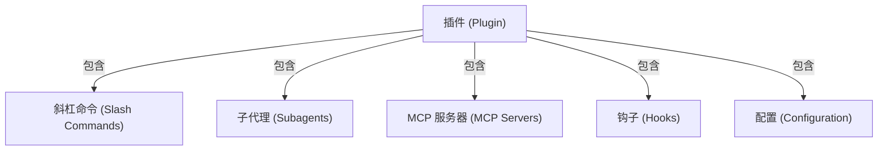

<picture>
  <source media="(prefers-color-scheme: dark)" srcset="../resources/logos/claude-howto-logo-dark.svg">
  
</picture>

# Claude Code 插件（Plugins）

本文件夹包含完整的插件示例，这些示例将多个 Claude Code 功能捆绑成内聚的、可安装的包。

## 概述

**Claude Code 插件**是自定义内容的集合包（斜杠命令、子代理、MCP 服务器和钩子），可以通过单个命令安装。它们代表**最高级别的扩展机制**——将多个功能组合成内聚的、可共享的包。

## 为什么使用插件？

| 特性 | 独立命令 | **插件** |
|------|---------|---------|
| 安装方式 | 手动配置 | 一键安装 (`/plugin install`) |
| 分享性 | 个人使用 | 团队共享、公开发布 |
| 功能捆绑 | 单一功能 | 多功能组合 |
| 配置管理 | 手动设置 | 自动化配置 |
| 版本控制 | 无 | 完整版本管理 |

## 插件架构



## 插件加载过程

```mermaid
sequenceDiagram
    participant User as 用户
    participant Claude as Claude Code
    participant Plugin as 插件市场
    participant Install as 安装程序
    participant SlashCmds as 斜杠命令
    participant Subagents as 子代理
    participant MCPServers as MCP服务器
    participant Hooks as 钩子
    Tools as 已配置工具

    User->>Claude: /plugin install pr-review
    Claude->>Plugin: 下载插件清单
    Plugin-->>Claude: 返回插件定义
    Claude->>Install: 提取组件
    Install->>SlashCmds: 配置完成
    Install->>Subagents: 配置完成
    Install->>MCPServers: 配置完成
    Install->>Hooks: 配置完成
    SlashCmds-->>Tools: 就绪可用 ✅
    Subagents-->>Tools: 就绪可用 ✅
    MCPServers-->>Tools: 就绪可用 ✅
    Hooks-->>Tools: 就绪可用 ✅
    Tools-->>Claude: 插件安装成功 ✅
```

## 插件类型与分发

| 类型 | 作用域 | 可共享？ | 权威来源 | 典型示例 |
|------|--------|---------|----------|----------|
| **官方插件** | 全局 | 所有用户 | Anthropic 官方 | PR Review、安全指南 |
| **社区插件** | 公开 | 所有用户 | 社区贡献者 | DevOps、Data Science |
| **组织插件** | 内部 | 团队成员 | 公司内部 | 内部标准、工具集 |
| **个人插件** | 个体 | 单个用户 | 开发者个人 | 自定义工作流 |

## 插件定义结构

插件清单使用 `.claude-plugin/plugin.json` 中的 JSON 格式：

```json
{
  "name": "my-first-plugin",
  "description": "一个问候插件",
  "version": "1.0.0",
  "author": {
    "name": "你的名字"
  },
  "homepage": "https://example.com",
  "repository": "https://github.com/user/repo",
  "license": "MIT"
}
```

## 插件目录结构

```
my-plugin/
├── .claude-plugin/
│   └── plugin.json       # 清单文件（名称、描述、版本、作者）
├── commands/             # 作为 Markdown 文件的技能命令
│   ├── task-1.md
│   ├── task-2.md
│   └── workflows/
├── agents/               # 自定义代理定义
│   ├── specialist-1.md
│   ├── specialist-2.md
│   └── configs/
├── skills/               # 带有 skill.md 文件的代理技能
│   ├── skill-1.md
│   └── skill-2.md
├── hooks/                # hooks.json 中的事件处理器
│   └── hooks.json
├── .mcp.json             # MCP 服务器配置
├── .lsp.json             # 用于代码智能的 LSP 服务器配置
├── bin/                  # 在插件启用时添加到 PATH 的可执行文件
├── settings.json         # 插件启用时应用的默认设置
├── themes/               # 可选：自定义 Claude Code 主题
├── templates/
│   └── issue-template.md
├── scripts/
│   ├── helper-1.sh
│   └── helper-2.py
├── docs/
│   ├── README.md
│   └── USAGE.md
└── tests/
    └── plugin.test.js
```

### LSP 服务器配置

插件可以包含语言服务器协议（LSP）支持，用于实时代码智能功能。LSP 服务器在您工作时提供诊断、代码导航和符号信息。

**配置位置**：
- 插件根目录中的 `.lsp.json` 文件
- `plugin.json` 中的内联 `lsp` 键

#### 字段参考

| 字段 | 必需？ | 描述 |
|------|--------|------|
| `command` | ✅ 是 | LSP 服务器二进制文件路径（必须在 PATH 中） |
| `extensionToLanguage` | ✅ 是 | 将文件扩展名映射到语言 ID |
| `args` | ❌ 否 | 服务器的命令行参数 |
| `transport` | ❌ 否 | 通信方法：`stdio`（默认）或 `socket` |
| `env` | ❌ 否 | 服务器进程的环境变量 |
| `initializationOptions` | ❌ 否 | LSP 初始化期间发送的选项 |
| `settings` | ❌ 否 | 传递给服务器的工作区配置 |
| `workspaceFolder` | ❌ 否 | 覆盖工作区文件夹路径 |
| `startupTimeout` | ❌ 否 | 等待服务器启动的最长时间（毫秒） |
| `shutdownTimeout` | ❌ 否 | 优雅关闭的最长时间（毫秒） |
| `restartOnCrash` | ❌ 否 | 服务器崩溃时自动重启 |
| `maxRestarts` | ❌ 否 | 放弃前的最大重启尝试次数 |

#### 示例配置

**Go 语言 (gopls)**：

```json
{
  "go": {
    "command": "gopls",
    "args": ["serve"],
    "extensionToLanguage": {
      ".go": "go"
    }
  }
}
```

**Python (pyright)**：

```json
{
  "python": {
    "command": "pyright-langserver",
    "args": ["--stdio"],
    "extensionToLanguage": {
      ".py": "python",
      ".pyi": "python"
    }
  }
}
```

**TypeScript**：

```json
{
  "typescript": {
    "command": "typescript-language-server",
    "args": ["--stdio"],
    "extensionToLanguage": {
      ".ts": "typescript",
      ".tsx": "typescriptreact",
      ".js": "javascript",
      ".jsx": "javascriptreact"
    }
  }
}
```

#### 预配置的 LSP 插件

官方市场包含预配置的 LSP 插件：

| 插件名称 | 支持语言 | 服务器二进制文件 | 安装命令 |
|----------|---------|------------------|----------|
| `pyright-lsp` | Python | `pyright-langserver` | `pip install pyright` |
| `typescript-lsp` | TypeScript/JavaScript | `typescript-language-server` | `npm install -g typescript-language-server typescript` |
| `rust-lsp` | Rust | `rust-analyzer` | `rustup component add rust-analyzer` |

#### LSP 功能特性

一旦配置，LSP 服务器将提供：

- **即时诊断** — 编辑后立即显示错误和警告
- **代码导航** — 跳转到定义、查找引用、查看实现
- **悬停信息** — 鼠标悬停时显示类型签名和文档字符串
- **符号列表** — 浏览当前文件或整个工作区的符号列表

## 用户配置选项（v2.1.83+）

插件可以在清单中通过 `userConfig` 声明用户可配置的选项。标记为 `sensitive: true` 的值将存储在系统密钥链中而不是纯文本设置文件中：

```json
{
  "name": "my-plugin",
  "version": "1.0.0",
  "userConfig": {
    "apiKey": {
      "description": "服务的 API 密钥",
      "sensitive": true
    },
    "region": {
      "description": "部署区域",
      "default": "us-east-1"
    }
  }
}
```

## 持久化数据存储（`${CLAUDE_PLUGIN_DATA}`）（v2.1.78+）

插件可以通过 `${CLAUDE_PLUGIN_DATA}` 环境变量访问持久化状态目录。该目录对于每个插件都是唯一的，并且在会话之间持久存在，适合用于缓存、数据库和其他持久化状态：

```json
{
  "hooks": {
    "PostToolUse": [
      {
        "command": "node ${CLAUDE_PLUGIN_DATA}/track-usage.js"
      }
    ]
  }
}
```

该目录在插件安装时自动创建。存储在此处的文件将持续存在，直到插件被卸载。

### 后台监控器（v2.1.105+）

插件可以注册后台监控器，在会话开始或插件的技能被调用时自动启用。在插件清单中添加顶级 `monitors` 键：

```json
{
  "name": "my-plugin",
  "version": "1.0.0",
  "monitors": [
    {
      "command": "tail -f /var/log/app.log",
      "trigger": "session_start"
    }
  ]
}
```

`trigger` 字段接受以下值：
- `"session_start"` — 会话开始时自动启用监控器
- `"skill_invoke"` — 当插件的技能被调用时启用监控器

监控器在底层使用相同的 Monitor 工具，将 stdout 行作为事件流传输，Claude 可以对这些事件做出反应。

## 内联插件定义（`source: 'settings'`）（v2.1.80+）

插件可以在设置文件中作为市场条目内联定义，使用 `source: 'settings'` 字段。这允许直接嵌入插件定义，而不需要单独的仓库或市场：

```json
{
  "pluginMarketplaces": [
    {
      "name": "inline-tools",
      "source": "settings",
      "plugins": [
        {
          "name": "quick-lint",
          "source": "./local-plugins/quick-lint"
        }
      ]
    }
  ]
}
```

## 默认设置

插件可以附带 `settings.json` 文件以提供默认配置。目前支持 `agent` 键，它设置插件的主线程代理：

```json
{
  "agent": "agents/specialist-1.md"
}
```

当插件包含 `settings.json` 时，其默认值将在安装时应用。用户可以在自己的项目或用户配置中覆盖这些设置。

## 独立方法 vs 插件方法对比

| 方法 | 命令格式 | 配置方式 | 最适合场景 |
|------|----------|----------|-----------|
| **独立命令** | `/hello` | CLAUDE.md 中的手动设置 | 个人使用、项目特定 |
| **插件命令** | `/plugin-name:hello` | 通过 plugin.json 自动化 | 团队共享、公开发布 |

**使用建议**：
- 使用**独立斜杠命令**进行快速个人工作流开发
- 当您想要**捆绑多个功能**、与团队共享或发布以供分发时，请使用**插件**

## 实际示例

### 示例 1：PR Review 插件

**文件：** `.claude-plugin/plugin.json`

```json
{
  "name": "pr-review",
  "version": "1.0.0",
  "description": "完整的 PR 审查工作流程，包含安全检查、测试验证和文档审查",
  "author": {
    "name": "Anthropic"
  },
  "repository": "https://github.com/your-org/pr-review",
  "license": "MIT"
}
```

**文件：** `commands/review-pr.md`

```markdown
---
name: Review PR
description: 启动全面的 PR 审查，包含安全和测试检查
---

# PR 审查工具

此命令启动完整的 Pull Request 审查流程，包括：

- 🔍 安全漏洞扫描
- 🧪 测试覆盖率分析
- 📝 文档完整性检查
- 💻 代码质量评估
- ⚡ 性能影响评估

## 审查流程

### 1️⃣ 安全分析
- 检查常见安全漏洞（OWASP Top 10）
- 审查身份验证和授权模式
- 验证输入清理机制
- 评估依赖安全性

### 2️⃣ 测试审查
- 验证变更代码的测试覆盖率
- 检查测试质量和边界情况
- 识别缺失的集成测试
- 审查模拟策略

### 3️⃣ 文档检查
- 确保 API 变更已记录文档
- 验证 README 是否需要更新
- 检查行内代码注释
- 审查变更日志条目

### 4️⃣ 代码质量
- 应用 linting 规则
- 检查命名规范
- 审查错误处理模式
- 评估代码复杂度

## 输出格式

请按以下格式提供结构化反馈：

### 🔴 严重问题
[列出任何严重的安全或功能性问题]

### ⚠️ 警告
[列出需要解决的问题]

### 💡 建议
[可选的改进和最佳实践]

### ✅ 亮点
[突出实现良好的功能]
```

### 示例 2：DevOps 工具集插件

**文件：** `.claude-plugin/plugin.json`

```json
{
  "name": "devops-toolkit",
  "version": "1.0.0",
  "description": "DevOps 自动化工具集，用于 CI/CD、部署和基础设施管理",
  "author": {
    "name": "DevOps Team"
  },
  "repository": "https://github.com/your-org/devops-toolkit"
}
```

**文件：** `commands/deploy.md`

```markdown
---
name: Deploy
description: 将应用程序部署到指定环境，并执行安全检查
---

# 部署助手

引导完成安全的部署流程，包含自动化检查。

## 部署前清单

- [ ] 所有测试通过
- [ ] 无严重安全漏洞
- [ ] 数据库迁移已准备
- [ ] 回滚计划已记录
- [ ] 监控告警已配置

## 部署步骤

### 1️⃣ 环境选择
- 选择目标环境（staging/production）
- 验证配置差异
- 如需要确认维护窗口

### 2️⃣ 健康检查
- 运行部署前诊断
- 验证服务依赖项
- 检查资源可用性

### 3️⃣ 部署执行
- 执行部署脚本
- 实时监控进度
- 验证部署成功

### 4️⃣ 部署后验证
- 运行冒烟测试
- 检查错误率
- 验证面向用户的功能
- 监控性能指标
```

## 插件开发指南

### 创建新插件

```bash
# 1. 创建插件目录结构
mkdir my-plugin && cd my-plugin
mkdir -p .claude-plugin commands agents skills hooks bin

# 2. 创建 plugin.json 清单
cat > .claude-plugin/plugin.json << 'EOF'
{
  "name": "my-plugin",
  "version": "1.0.0",
  "description": "我的超棒 Claude Code 插件"
}
EOF

# 3. 添加斜杠命令
cat > commands/hello.md << 'EOF'
---
name: Hello
description: 温暖地向用户打招呼
---

# 你好！👋

欢迎来到我的插件！此命令演示基本的插件功能。
EOF

# 4. 测试本地插件
cd /path/to/your/project
claude --plugin-path /path/to/my-plugin
```

### 插件最佳实践

#### 1️⃣ 清晰的命名约定
- 使用描述性插件名称（kebab-case 格式）
- 命令名称应该直观明了
- 保持一致的术语使用

#### 2️⃣ 模块化设计
- 将相关功能组合在一起
- 避免过于复杂的单一插件
- 考虑依赖关系

#### 3️⃣ 全面的文档
- 为每个命令提供清晰描述
- 包含使用示例
- 记录所有配置选项

#### 4️⃣ 错误处理
- 优雅地处理失败情况
- 提供有用的错误消息
- 支持重试机制

#### 5️⃣ 安全考虑
- 验证所有输入数据
- 使用最小权限原则
- 妥善处理敏感数据

### 发布插件

#### 到市场发布

```bash
# 1. 确保清单完整
# 更新 version、description、repository 等

# 2. 添加测试
mkdir tests
# 编写插件测试用例

# 3. 创建发布说明
cat > CHANGELOG.md << 'EOF'
# 更新日志

## [1.0.0] - 2026-05-09

### 新增
- 初始版本发布
- 核心功能实现
EOF

# 4. 提交并推送
git add .
git commit -m "Release v1.0.0"
git tag v1.0.0
git push origin main --tags
```

#### 团队内部分发

```bash
# 方式一：内部 Git 仓库
git clone git@github.com:your-company/plugins.git
cd plugins
mkdir my-plugin
# 复制插件文件到目录

# 方式二：通过文件系统共享
cp -r my-plugin /shared/plugins/
# 团队成员从共享位置安装
```

## 插件调试

### 启用调试模式

```bash
claude --debug --plugin-path ./my-plugin
```

### 常见问题排查

**问题：插件未加载**

检查清单：
1. ✅ `plugin.json` JSON 格式是否正确
2. ✅ 目录结构是否符合要求
3. ✅ 必要的字段是否存在（name, version）

**问题：命令不可用**

验证清单：
1. ✅ 命令文件是否在 `commands/` 目录中
2. ✅ frontmatter 是否包含 name 和 description 字段
3. ✅ 文件格式是否为 Markdown (.md)

**问题：钩子未触发**

确认清单：
1. ✅ 钩子是否在 `hooks/hooks.json` 中正确定义
2. ✅ 事件名称是否正确
3. ✅ 命令是否有执行权限

## 插件安全模型

### 权限隔离

每个插件在自己的沙箱环境中运行：

- **文件系统访问**：限制在插件目录范围内
- **网络访问**：需要明确的权限声明
- **环境变量**：仅暴露必要的变量
- **进程执行**：受限的执行模式

### 安全最佳实践

#### 1️⃣ 最小权限原则

```yaml
# 仅请求必需的权限
permissions:
  - read
  # 避免请求:
  # - write
  # - execute
  # - network
```

#### 2️⃣ 输入验证

```python
def validate_input(user_input):
    # 清理用户输入
    sanitized = sanitize(user_input)
    
    # 验证格式
    if not is_valid_format(sanitized):
        raise ValueError("输入格式无效")
        
    return sanitized
```

#### 3️⃣ 依赖管理
- 固定依赖版本号
- 定期更新安全补丁
- 审计第三方代码来源

## 性能优化

### 减少启动时间

#### 1️⃣ 延迟加载组件

```json
{
  "loading": "lazy",
  "components": ["commands", "hooks"]
}
```

#### 2️⃣ 缓存策略

```javascript
const cache = new Map();

function getCachedData(key) {
  if (cache.has(key)) {
    return cache.get(key);
  }
  
  const data = fetchExpensiveData(key);
  cache.set(key, data);
  return data;
}
```

#### 3️⃣ 并行初始化

```javascript
await Promise.all([
  loadCommands(),
  loadHooks(),
  loadAgents()
]);
```

### 内存管理

#### 1️⃣ 及时清理资源

```javascript
function cleanup() {
  // 清除定时器
  clearInterval(timer);
  
  // 关闭文件句柄
  fileHandle.close();
  
  // 释放内存缓存
  cache.clear();
}
```

#### 2️⃣ 监控内存使用

```javascript
function monitorMemory() {
  const used = process.memoryUsage().heapUsed;
  const total = process.memoryUsage().heapTotal;
  console.log(`内存使用: ${used}/${total} 字节`);
}
```

## 插件测试策略

### 单元测试

```javascript
// tests/command.test.js
import { describe, it, expect } from 'vitest';
import { parseCommand } from '../commands/hello';

describe('Hello 命令', () => {
  it('应该正确解析命令', () => {
    const result = parseCommand({
      name: 'Hello',
      description: '向用户打招呼'
    });
    
    expect(result.name).toBe('Hello');
    expect(result.description).toContain('打招呼');
  });

  it('应该处理缺失字段的情况', () => {
    expect(() => parseCommand({})).toThrow();
  });
});
```

### 集成测试

```bash
#!/bin/bash
# tests/integration.test.sh

set -e

echo "正在测试插件安装..."
claude --plugin-path ./my-plugin --print "/hello" > output.txt

if grep -q "欢迎" output.txt; then
  echo "✅ 集成测试通过"
else
  echo "❌ 集成测试失败"
  exit 1
fi
```

### 性能测试

```javascript
// tests/performance.test.js
import { performance } from 'perf_hooks';

describe('插件性能', () => {
  it('应该在时间限制内加载完成', () => {
    const start = performance.now();
    
    // 加载插件
    loadPlugin('./my-plugin');
    
    const duration = performance.now() - start;
    expect(duration).toBeLessThan(1000); // 小于 1 秒
  });
});
```

## 社区资源

### 官方资源

- **📦 插件市场**: https://code.claude.com/plugins
- **📚 API 文档**: https://docs.anthropic.com/en/docs/claude-code/plugins
- **💡 示例插件**: https://github.com/anthropics/claude-code-plugins

### 社区插件

搜索社区创建的插件：
- **GitHub**: 搜索 `claude-code-plugin`
- **Discord**: 加入 #plugins 频道
- **Reddit**: 访问 r/ClaudeCode

### 贡献指南

1. **Fork** 官方插件仓库
2. **创建** 特性分支
3. **编写** 测试用例
4. **提交** Pull Request
5. **参与** 代码审查

---

## 相关概念

- **[斜杠命令](../01-slash-commands/)** - 插件打包的基础组件
- **[子代理](../04-subagents/)** - 插件可以包含专业代理
- **[钩子](../06-hooks/)** - 自动化插件生命周期事件
- **[MCP 服务器](../05-mcp/)** - 扩展插件能力
- **[技能](../03-skills/)** - 可重用的能力包

---

**最后更新**: 2026年5月9日
**Claude Code 版本**: 2.1.119
**来源**:
- https://docs.anthropic.com/en/docs/claude-code/plugins
- https://docs.anthropic.com/en/docs/claude-code/plugin-marketplace
**兼容模型**: Claude Sonnet 4.6, Claude Opus 4.7, Claude Haiku 4.5