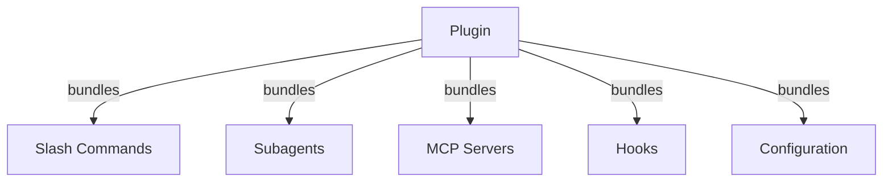
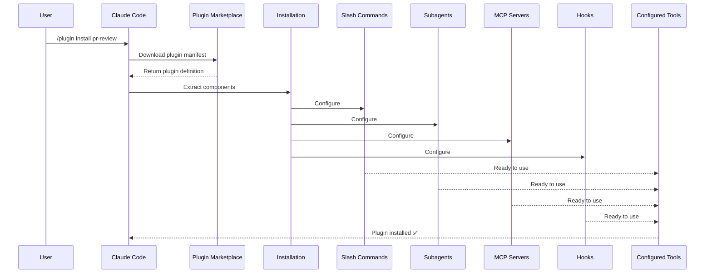

<picture>
  <source media="(prefers-color-scheme: dark)" srcset="../resources/logos/claude-howto-logo-dark.svg">
  
</picture>

# Claude Code 插件（Plugins）

本文件夹包含完整的插件示例，这些示例将多个 Claude Code 功能捆绑成内聚的、可安装的包。

## 概述

Claude Code 插件是自定义内容的集合包（斜杠命令、子代理、MCP 服务器和钩子），可以通过单个命令安装。它们代表最高级别的扩展机制——将多个功能组合成内聚的、可共享的包。

## 插件架构



## 插件加载过程



## 插件类型与分发

| 类型 | 作用域 | 可共享 | 权威 | 示例 |
|------|--------|--------|------|------|
| 官方 | 全局 | 所有用户 | Anthropic | PR Review、安全指南 |
| 社区 | 公开 | 所有用户 | 社区 | DevOps、Data Science |
| 组织 | 内部 | 团队成员 | 公司 | 内部标准、工具 |
| 个人 | 个体 | 单个用户 | 开发者 | 自定义工作流 |

## 插件定义结构

插件清单使用 `.claude-plugin/plugin.json` 中的 JSON 格式：

```json
{
  "name": "my-first-plugin",
  "description": "A greeting plugin",
  "version": "1.0.0",
  "author": {
    "name": "Your Name"
  },
  "homepage": "https://example.com",
  "repository": "https://github.com/user/repo",
  "license": "MIT"
}
```

## 插件结构示例

```
my-plugin/
├── .claude-plugin/
│   └── plugin.json       # 清单（名称、描述、版本、作者）
├── commands/             # 作为 Markdown 文件的技能
│   ├── task-1.md
│   ├── task-2.md
│   └── workflows/
├── agents/               # 自定义代理定义
│   ├── specialist-1.md
│   ├── specialist-2.md
│   └── configs/
├── skills/               # 带有技能.md 文件的代理技能
│   ├── skill-1.md
│   └── skill-2.md
├── hooks/                # hooks.json 中的事件处理器
│   └── hooks.json
├── .mcp.json             # MCP 服务器配置
├── .lsp.json             # 用于代码智能的 LSP 服务器配置
├── bin/                  # 在插件启用时添加到 Bash 工具 PATH 的可执行文件
├── settings.json         # 插件启用时应用的默认设置（目前仅支持 `agent` 键）
├── themes/               # 可选：提供自定义 Claude Code 主题（v2.1.118+）
├── templates/
│   └── issue-template.md
├── scripts/
│   ├── helper-1.sh
│   └── helper-2.py
├── docs/
│   ├── README.md
│   └── USAGE.md
└── tests/
    └── plugin.test.js
```

### LSP 服务器配置

插件可以包含语言服务器协议（LSP）支持，用于实时代码智能。LSP 服务器在您工作时提供诊断、代码导航和符号信息。

**配置位置**：
- 插件根目录中的 `.lsp.json` 文件
- `plugin.json` 中的内联 `lsp` 键

#### 字段参考

| 字段 | 必需 | 描述 |
|------|------|------|
| `command` | 是 | LSP 服务器二进制文件（必须在 PATH 中） |
| `extensionToLanguage` | 是 | 将文件扩展名映射到语言 ID |
| `args` | 否 | 服务器的命令行参数 |
| `transport` | 否 | 通信方法：`stdio`（默认）或 `socket` |
| `env` | 否 | 服务器进程的环境变量 |
| `initializationOptions` | 否 | LSP 初始化期间发送的选项 |
| `settings` | 否 | 传递给服务器的工作区配置 |
| `workspaceFolder` | 否 | 覆盖工作区文件夹路径 |
| `startupTimeout` | 否 | 等待服务器启动的最长时间（毫秒） |
| `shutdownTimeout` | 否 | 优雅关闭的最长时间（毫秒） |
| `restartOnCrash` | 否 | 服务器崩溃时自动重启 |
| `maxRestarts` | 否 | 放弃前的最大重启尝试次数 |

#### 示例配置

**Go (gopls)**:

```json
{
  "go": {
    "command": "gopls",
    "args": ["serve"],
    "extensionToLanguage": {
      ".go": "go"
    }
  }
}
```

**Python (pyright)**:

```json
{
  "python": {
    "command": "pyright-langserver",
    "args": ["--stdio"],
    "extensionToLanguage": {
      ".py": "python",
      ".pyi": "python"
    }
  }
}
```

**TypeScript**:

```json
{
  "typescript": {
    "command": "typescript-language-server",
    "args": ["--stdio"],
    "extensionToLanguage": {
      ".ts": "typescript",
      ".tsx": "typescriptreact",
      ".js": "javascript",
      ".jsx": "javascriptreact"
    }
  }
}
```

#### 可用的 LSP 插件

官方市场包含预配置的 LSP 插件：

| 插件 | 语言 | 服务器二进制文件 | 安装命令 |
|------|------|------------------|----------|
| `pyright-lsp` | Python | `pyright-langserver` | `pip install pyright` |
| `typescript-lsp` | TypeScript/JavaScript | `typescript-language-server` | `npm install -g typescript-language-server typescript` |
| `rust-lsp` | Rust | `rust-analyzer` | 通过 `rustup component add rust-analyzer` 安装 |

#### LSP 功能

一旦配置，LSP 服务器将提供：

- **即时诊断** — 编辑后立即显示错误和警告
- **代码导航** — 转到定义、查找引用、实现
- **悬停信息** — 悬停时的类型签名和文档
- **符号列表** — 浏览当前文件或工作区中的符号

## 插件选项（v2.1.83+）

插件可以在清单中通过 `userConfig` 声明用户可配置的选项。标记为 `sensitive: true` 的值存储在系统密钥链中而不是纯文本设置文件中：

```json
{
  "name": "my-plugin",
  "version": "1.0.0",
  "userConfig": {
    "apiKey": {
      "description": "API key for the service",
      "sensitive": true
    },
    "region": {
      "description": "Deployment region",
      "default": "us-east-1"
    }
  }
}
```

## 持久化插件数据（`${CLAUDE_PLUGIN_DATA}`）（v2.1.78+）

插件可以通过 `${CLAUDE_PLUGIN_DATA}` 环境变量访问持久化状态目录。该目录对于每个插件都是唯一的，并且在会话之间持久存在，适合用于缓存、数据库和其他持久化状态：

```json
{
  "hooks": {
    "PostToolUse": [
      {
        "command": "node ${CLAUDE_PLUGIN_DATA}/track-usage.js"
      }
    ]
  }
}
```

该目录在插件安装时自动创建。存储在此处的文件将持续存在，直到插件被卸载。

### 后台监控器（v2.1.105）

插件可以注册后台监控器，在会话开始或插件的技能被调用时自动启用。在插件清单中添加顶级 `monitors` 键：

```json
{
  "name": "my-plugin",
  "version": "1.0.0",
  "monitors": [
    {
      "command": "tail -f /var/log/app.log",
      "trigger": "session_start"
    }
  ]
}
```

`trigger` 字段接受：
- `"session_start"` — 会话开始时自动启用监控器
- `"skill_invoke"` — 当插件的技能被调用时启用监控器

监控器在底层使用相同的 Monitor 工具，将 stdout 行作为事件流传输，Claude 可以对这些事件做出反应。

## 通过设置内联插件（`source: 'settings'`）（v2.1.80+）

插件可以在设置文件中作为市场条目内联定义，使用 `source: 'settings'` 字段。这允许直接嵌入插件定义，而不需要单独的仓库或市场：

```json
{
  "pluginMarketplaces": [
    {
      "name": "inline-tools",
      "source": "settings",
      "plugins": [
        {
          "name": "quick-lint",
          "source": "./local-plugins/quick-lint"
        }
      ]
    }
  ]
}
```

## 插件设置

插件可以附带 `settings.json` 文件以提供默认配置。目前支持 `agent` 键，它设置插件的主线程代理：

```json
{
  "agent": "agents/specialist-1.md"
}
```

当插件包含 `settings.json` 时，其默认值将在安装时应用。用户可以在自己的项目或用户配置中覆盖这些设置。

## 独立方法 vs 插件方法

| 方法 | 命令名称 | 配置 | 最适合 |
|------|----------|------|--------|
| **独立** | `/hello` | CLAUDE.md 中的手动设置 | 个人、项目特定 |
| **插件** | `/plugin-name:hello` | 通过 plugin.json 自动化 | 共享、分发、团队使用 |

使用**独立斜杠命令**进行快速个人工作流。当您想要捆绑多个功能、与团队共享或发布以供分发时，请使用**插件**。

## 实际示例

### 示例 1：PR Review 插件

**文件：** `.claude-plugin/plugin.json`

```json
{
  "name": "pr-review",
  "version": "1.0.0",
  "description": "Complete PR review workflow with security, testing, and docs",
  "author": {
    "name": "Anthropic"
  },
  "repository": "https://github.com/your-org/pr-review",
  "license": "MIT"
}
```

**文件：** `commands/review-pr.md`

```markdown
---
name: Review PR
description: Start comprehensive PR review with security and testing checks
---

# PR Review

This command initiates a complete pull request review including:
- Security vulnerability scanning
- Test coverage analysis
- Documentation completeness check
- Code quality assessment
- Performance impact evaluation

## Review Process

1. **Security Analysis**
   - Check for common vulnerabilities (OWASP Top 10)
   - Review authentication and authorization patterns
   - Validate input sanitization
   - Assess dependency security

2. **Testing Review**
   - Verify test coverage for changed code
   - Check test quality and edge cases
   - Identify missing integration tests
   - Review mocking strategies

3. **Documentation Check**
   - Ensure API changes are documented
   - Verify README updates if needed
   - Check inline code comments
   - Review changelog entries

4. **Code Quality**
   - Apply linting rules
   - Check naming conventions
   - Review error handling patterns
   - Assess code complexity

## Output Format

Provide structured feedback in this format:

### 🔴 Critical Issues
[List any critical security or functionality issues]

### ⚠️ Warnings
[List warnings that should be addressed]

### 💡 Suggestions
[Optional improvements and best practices]

### ✅ Positive Aspects
[Highlight well-implemented features]
```

### 示例 2：DevOps 工具集插件

**文件：** `.claude-plugin/plugin.json`

```json
{
  "name": "devops-toolkit",
  "version": "1.0.0",
  "description": "DevOps automation tools for CI/CD, deployment, and infrastructure",
  "author": {
    "name": "DevOps Team"
  },
  "repository": "https://github.com/your-org/devops-toolkit"
}
```

**文件：** `commands/deploy.md`

```markdown
---
name: Deploy
description: Deploy application to specified environment with safety checks
---

# Deployment Assistant

Guides through safe deployment process with automated checks.

## Pre-deployment Checklist

- [ ] All tests passing
- [ ] No critical security vulnerabilities
- [ ] Database migrations prepared
- [ ] Rollback plan documented
- [ ] Monitoring alerts configured

## Deployment Steps

1. **Environment Selection**
   - Choose target environment (staging/production)
   - Verify configuration differences
   - Confirm maintenance window if needed

2. **Health Checks**
   - Run pre-deployment diagnostics
   - Verify service dependencies
   - Check resource availability

3. **Deployment Execution**
   - Execute deployment script
   - Monitor progress in real-time
   - Verify successful deployment

4. **Post-deployment Validation**
   - Run smoke tests
   - Check error rates
   - Verify user-facing functionality
   - Monitor performance metrics
```

## 插件开发指南

### 创建新插件

```bash
# 1. 创建插件目录结构
mkdir my-plugin && cd my-plugin
mkdir -p .claude-plugin commands agents skills hooks bin

# 2. 创建 plugin.json 清单
cat > .claude-plugin/plugin.json << 'EOF'
{
  "name": "my-plugin",
  "version": "1.0.0",
  "description": "My awesome Claude Code plugin"
}
EOF

# 3. 添加斜杠命令
cat > commands/hello.md << 'EOF'
---
name: Hello
description: Greet the user warmly
---

# Hello! 👋

Welcome to my plugin! This command demonstrates basic plugin functionality.
EOF

# 4. 测试本地插件
cd /path/to/your/project
claude --plugin-path /path/to/my-plugin
```

### 插件最佳实践

1. **清晰的命名约定**
   - 使用描述性插件名称（kebab-case）
   - 命令名称应该直观明了
   - 保持一致的术语

2. **模块化设计**
   - 将相关功能组合在一起
   - 避免过于复杂的单一插件
   - 考虑依赖关系

3. **全面的文档**
   - 为每个命令提供清晰描述
   - 包含使用示例
   - 记录配置选项

4. **错误处理**
   - 优雅地处理失败情况
   - 提供有用的错误消息
   - 支持重试机制

5. **安全考虑**
   - 验证所有输入
   - 使用最小权限原则
   - 敏感数据处理

### 发布插件

#### 到市场发布

```bash
# 1. 确保清单完整
# 更新 version、description、repository 等

# 2. 添加测试
mkdir tests
# 编写插件测试用例

# 3. 创建发布说明
cat > CHANGELOG.md << 'EOF'
# Changelog

## [1.0.0] - 2026-04-24

### Added
- Initial release
- Core functionality
EOF

# 4. 提交并推送
git add .
git commit -m "Release v1.0.0"
git tag v1.0.0
git push origin main --tags
```

#### 团队内部分发

```bash
# 内部 Git 仓库
git clone git@github.com:your-company/plugins.git
cd plugins
mkdir my-plugin
# 复制插件文件

# 或通过文件系统共享
cp -r my-plugin /shared/plugins/
#团队成员从共享位置安装
```

## 插件调试

### 启用调试模式

```bash
claude --debug --plugin-path ./my-plugin
```

### 常见问题

**问题：插件未加载**

检查：
1. `plugin.json` 格式是否正确
2. 目录结构是否符合要求
3. 必要的字段是否存在

**问题：命令不可用**

验证：
1. 命令文件是否在 `commands/` 目录中
2. frontmatter 是否包含 name 和 description
3. 文件格式是否为 Markdown

**问题：钩子未触发**

确认：
1. 钩子是否在 `hooks/hooks.json` 中正确定义
2. 事件名称是否正确
3. 命令是否有执行权限

## 插件安全模型

### 权限隔离

每个插件在自己的上下文中运行：
- **文件系统访问**：限制在插件目录
- **网络访问**：需要明确权限
- **环境变量**：仅暴露必要的变量
- **进程执行**：沙箱执行模式

### 安全最佳实践

1. **最小权限原则**
   ```yaml
   # 仅请求必需的权限
   permissions:
     - read
     # 避免使用:
     # - write
     # - execute
     # - network
   ```

2. **输入验证**
   ```python
   def validate_input(user_input):
       # 清理用户输入
       sanitized = sanitize(user_input)
       # 验证格式
       if not is_valid_format(sanitized):
           raise ValueError("Invalid input")
       return sanitized
   ```

3. **依赖管理**
   - 固定依赖版本
   - 定期更新安全补丁
   - 审计第三方代码

## 性能优化

### 减少启动时间

1. **延迟加载组件**
   ```json
   {
     "loading": "lazy",
     "components": ["commands", "hooks"]
   }
   ```

2. **缓存策略**
   ```javascript
   const cache = new Map();
   
   function getCachedData(key) {
     if (cache.has(key)) {
       return cache.get(key);
     }
     const data = fetchExpensiveData(key);
     cache.set(key, data);
     return data;
   }
   ```

3. **并行初始化**
   ```javascript
   await Promise.all([
     loadCommands(),
     loadHooks(),
     loadAgents()
   ]);
   ```

### 内存管理

1. **及时清理资源**
   ```javascript
   function cleanup() {
     // 清除定时器
     clearInterval(timer);
     
     // 关闭文件句柄
     fileHandle.close();
     
     // 释放内存
     cache.clear();
   }
   ```

2. **监控内存使用**
   ```javascript
   function monitorMemory() {
     const used = process.memoryUsage().heapUsed;
     const total = process.memoryUsage().heapTotal;
     console.log(`Memory: ${used}/${total} bytes`);
   }
   ```

## 插件测试策略

### 单元测试

```javascript
// tests/command.test.js
import { describe, it, expect } from 'vitest';
import { parseCommand } from '../commands/hello';

describe('Hello Command', () => {
  it('should parse command correctly', () => {
    const result = parseCommand({
      name: 'Hello',
      description: 'Greet user'
    });
    
    expect(result.name).toBe('Hello');
    expect(result.description).toContain('Greet');
  });

  it('should handle missing fields', () => {
    expect(() => parseCommand({})).toThrow();
  });
});
```

### 集成测试

```bash
#!/bin/bash
# tests/integration.test.sh

set -e

echo "Testing plugin installation..."
claude --plugin-path ./my-plugin --print "/hello" > output.txt

if grep -q "Welcome" output.txt; then
  echo "✅ Integration test passed"
else
  echo "❌ Integration test failed"
  exit 1
fi
```

### 性能测试

```javascript
// tests/performance.test.js
import { performance } from 'perf_hooks';

describe('Plugin Performance', () => {
  it('should load within time limit', () => {
    const start = performance.now();
    
    // 加载插件
    loadPlugin('./my-plugin');
    
    const duration = performance.now() - start;
    expect(duration).toBeLessThan(1000); // 小于 1 秒
  });
});
```

## 社区资源

### 官方资源

- **插件市场**: https://code.claude.com/plugins
- **API 文档**: https://docs.anthropic.com/en/docs/claude-code/plugins
- **示例插件**: https://github.com/anthropics/claude-code-plugins

### 社区插件

搜索社区创建的插件：
- GitHub: `claude-code-plugin`
- Discord: #plugins 频道
- Reddit: r/ClaudeCode

### 贡献指南

1. **Fork 官方插件仓库**
2. **创建特性分支**
3. **编写测试**
4. **提交 Pull Request**
5. **参与代码审查**

---

## 相关概念

- **[斜杠命令](../01-slash-commands/)** - 插件打包的基础
- **[子代理](../04-subagents/)** - 插件可以包含专业代理
- **[钩子](../06-hooks/)** - 自动化插件生命周期事件
- **[MCP 服务器](../05-mcp/)** - 扩展插件能力
- **[技能](../03-skills/)** - 可重用的能力包

---

**最后更新**: 2026年4月24日
**Claude Code 版本**: 2.1.119
**来源**:
- https://docs.anthropic.com/en/docs/claude-code/plugins
- https://docs.anthropic.com/en/docs/claude-code/plugin-marketplace
- https://github.com/anthropics/claude-code/releases/tag/v2.1.119
**兼容模型**: Claude Sonnet 4.6, Claude Opus 4.7, Claude Haiku 4.5
