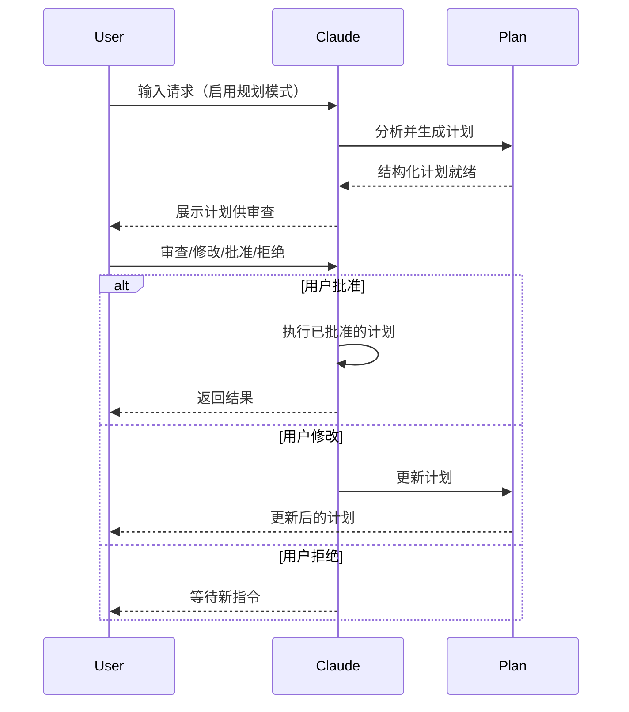
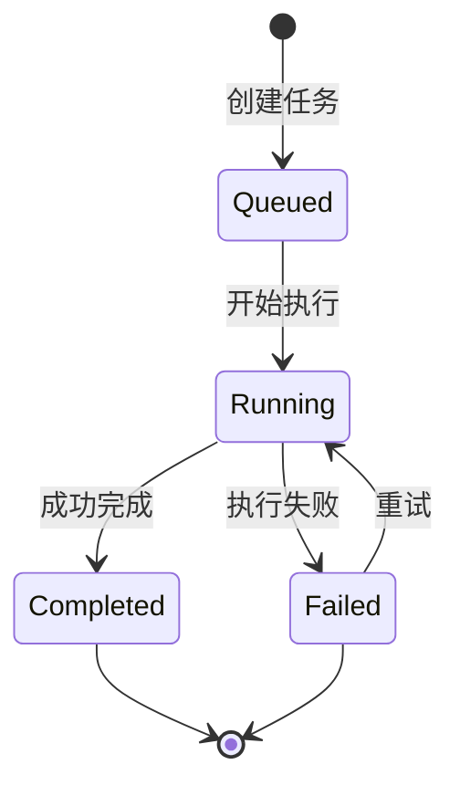

# Claude Code 高级功能

> 深入了解规划模式、扩展思考、后台任务、权限系统、会话管理、定时任务、Chrome 集成、远程控制、Web 会话、桌面应用等高级功能。

**详细指南 → [[Claude 概念指南]]**

---

## 目录

1. [规划模式](#规划模式)
2. [扩展思考](#扩展思考)
3. [后台任务](#后台任务)
4. [权限模式](#权限模式)
5. [会话管理](#会话管理)
6. [交互功能](#交互功能)
7. [配置](#配置)
8. [定时任务](#定时任务)
9. [Chrome 集成](#chrome-集成)
10. [频道](#频道)
11. [语音听写](#语音听写)
12. [内置技能](#内置技能)
13. [无头模式](#无头模式)
14. [自动记忆](#自动记忆)
15. [远程控制](#远程控制)
16. [Web 会话](#web-会话)
17. [桌面应用](#桌面应用)
18. [任务列表](#任务列表)
19. [提示建议](#提示建议)
20. [Git Worktree](#git-worktree)
21. [沙箱隔离](#沙箱隔离)
22. [托管设置(企业版)](#托管设置企业版)
23. [Agent Teams](#agent-teams)

---

## 规划模式

规划模式让 Claude 在执行前先生成一个结构化的计划。你可以审查、修改或拒绝计划，然后再执行。

### 启用规划模式

```bash
claude --plan
```

或在会话中使用斜杠命令：

```
/plan
```

### 工作原理



### 计划包含什么

1. **目标概述** — 要实现什么
2. **分步计划** — 具体操作步骤
3. **涉及文件** — 将被修改的文件列表
4. **依赖关系** — 外部依赖和前提条件
5. **风险点** — 可能的问题和回退方案

### 配置选项

| 设置 | 描述 |
|------|------|
| `planning.autoEnter` | 自动进入规划模式 |
| `planning.requireApproval` | 执行前需要用户确认 |

### 使用场景

- 大型重构项目 — 先看整体方案再动手
- 多人协作 — 团队成员可以审查计划
- 复杂 Bug 修复 — 分析根因后再修复
- 学习目的 — 了解 Claude 的解题思路

---

## 扩展思考

扩展思考让 Claude 在回答前进行更深入的推理，产生更高质量的输出。

### 启用扩展思考

```json
{
  "extendedThinking": {
    "enabled": true,
    "budgetTokens": 10000
  }
}
```

或使用命令行标志：

```bash
claude --thinking
```

### 思考预算

| 预算级别 | Token 数 | 适用场景 |
|---------|----------|---------|
| 低 | 1000-3000 | 简单问题 |
| 中 | 5000-10000 | 复杂推理 |
| 高 | 15000+ | 架构设计、复杂分析 |

### 何时使用

- ✅ 架构决策
- ✅ 复杂算法设计
- ✅ 代码审查中的深度分析
- ✅ 调试难以定位的问题
- ❌ 简单查询（浪费 token）

---

## 后台任务

后台任务允许 Claude 在后台长时间运行操作，不会阻塞你的终端。

### 创建后台任务

```bash
# 使用 /background 命令
/background "运行完整的测试套件"

# 或使用 --background 标志
claude -p "运行测试" --background
```

### 监控任务状态

```bash
# 列出所有后台任务
/task list

# 查看特定任务的输出
/task show <task-id>

# 停止正在运行的任务
/task stop <task-id>
```

### 任务生命周期



### 配置

| 设置 | 默认值 | 描述 |
|------|--------|------|
| `maxConcurrentTasks` | 5 | 最大并发任务数 |
| `taskTimeout` | 3600s | 单任务超时时间 |

---

## 权限模式

权限模式控制 Claude Code 可以执行哪些操作。

### 六种权限模式

| 模式 | 文件编辑 | Bash 命令 | MCP 工具 | 适用场景 |
|------|---------|-----------|---------|---------|
| **default** | 每次询问 | 每次询问 | 每次询问 | 日常开发，需要控制 |
| **plan** | 只读 | 禁止 | 只读 | 代码审查，只看不改 |
| **autoEdits** | 自动允许 | 每次询问 | 自动允许 | 快速迭代开发 |
| **acceptEdits** | 自动允许 | 每次询问 | 自动允许 | 自动化工作流 |
| **bypassPermissions** | 全部自动 | 全部自动 | 全部自动 | 高度信任环境 |
| **yolo** | 全部自动 | 全部自动 | 全部自动 + 无安全警告 | 完全自主（慎用）|

### 切换权限模式

```bash
# 命令行启动时指定
claude --permission-mode plan

# 会话中切换
/permissions plan
```

### 推荐用法

| 场景 | 推荐模式 | 原因 |
|------|---------|------|
| 日常编码 | `default` | 安全第一，可控 |
| 代码审查 | `plan` | 只读，防止误改 |
| 批量重构 | `autoEdits` | 编辑自动通过，命令仍需确认 |
| CI/CD 脚本 | `bypassPermissions` | 无人工干预环境 |
| 新手学习 | `default` | 了解每次操作的细节 |

---

## 会话管理

管理多个工作会话。

### 命令

```bash
/resume                # 恢复之前的对话
/rename "Feature"      # 命名当前会话
/fork                  # 分叉到新会话
claude -c              # 继续最近的对话
claude -r "Feature"    # 按名称/ID 恢复会话
```

### 会话持久化

- 会话历史保存在 `~/.claude/sessions/`
- 支持搜索历史对话
- 可导出/导入会话

### 最佳实践

- 为不同任务使用独立会话
- 定期清理旧会话释放空间
- 对重要会话命名便于后续查找

---

## 交互功能

### 键盘快捷键

| 快捷键 | 功能 |
|--------|------|
| `Ctrl + R` | 搜索命令历史 |
| `Tab` | 自动补全 |
| `↑ / ↓` | 命令历史 |
| `Ctrl + L` | 清屏 |
| `Ctrl + C` | 中断当前操作 |
| `Ctrl + D` | 退出 |

### 多行输入

```bash
user: \
> 长而复杂的提示词
> 跨越多行
> \end
```

### 输出格式化

- **Markdown 渲染** — 支持表格、代码块、列表
- **语法高亮** — 代码片段自动高亮
- **分页输出** — 长内容自动分页

---

## 配置

完整配置示例：

```json
{
  "planning": {
    "autoEnter": true,
    "requireApproval": true
  },
  "extendedThinking": {
    "enabled": true,
    "budgetTokens": 10000
  },
  "permissions": {
    "mode": "default"
  },
  "backgroundTasks": {
    "maxConcurrentTasks": 5
  }
}
```

**详见**：[[09-高级功能总览]] 获取完整指南

---

## 定时任务

使用 `/loop` 命令按计划重复运行任务。

**用法：**
```bash
/loop every 30m "Run tests and report failures"
/loop every 2h "Check for dependency updates"
/loop every 1d "Generate daily summary of code changes"
```

定时任务在后台运行，完成后报告结果。适用于持续监控、定期检查和自动化维护工作流。

---

## Chrome 集成

Claude Code 可以与 Chrome 浏览器集成以实现 Web 自动化任务。这支持在开发工作流中直接导航网页、填写表单、截图和从网站提取数据等功能。

---

## 频道

频道是组织 Claude Code 功能的命名空间，用于区分不同类型的工作负载。

### 可用频道

| 频道 | 用途 |
|------|------|
| `default` | 通用开发任务 |
| `code-review` | 代码审查专用 |
| `security` | 安全审计专用 |
| `testing` | 测试相关任务 |

### 切换频道

```bash
claude --channel code-review
```

---

## 语音听写

支持语音输入，将语音转换为文本提示词。

### 启用

```bash
claude --voice
```

或在会话中：
```
/voice on
```

### 支持的语言

- 英语
- 中文（简体/繁体）
- 日语
- 韩语
- 以及更多...

---

## 内置技能

Claude Code 内置了多个常用技能，无需额外配置即可使用。

### 技能列表

| 技能名称 | 功能 |
|---------|------|
| `code-reviewer` | 代码审查 |
| `debugger` | 问题调试 |
| `test-engineer` | 测试编写 |
| `refactor` | 代码重构 |
| `doc-generator` | 文档生成 |

### 使用内置技能

直接在对话中描述需求，Claude 会自动调用合适的技能：

```
请帮我审查 src/auth/ 目录下的所有文件的安全问题
```
→ 自动调用 code-reviewer 技能

---

## 无头模式

无头模式允许你在脚本和 CI/CD 流水线中使用 Claude Code，无需交互式终端。

### 基本用法

```bash
# 单次命令
claude -p "解释这个函数的作用" < source.py

# 管道输入
cat error.log | claude -p "分析这些错误"

# JSON 输出
claude -p --output-format json "列出所有公开函数" > result.json
```

### CI/CD 集成

```yaml
# GitHub Actions 示例
- name: AI Code Review
  run: |
    claude -p "Review PR ${{ github.event.pull_request.number }}" \
      --output-format json \
      > review.json
```

### 常用标志

| 标志 | 描述 |
|------|------|
| `-p, --prompt` | 非交互式提示模式 |
| `--output-format` | 输出格式 (text/json) |
| `--max-turns` | 最大轮数限制 |
| `--model` | 指定模型 |

---

## 自动记忆

自动记忆功能让 Claude Code 自动捕获和使用上下文信息，无需手动配置。

### 工作原理


### 存储位置

- 项目级：`.claude/local/memory/`
- 用户级：`~/.claude/memory/`

### 配置

```json
{
  "autoMemory": {
    "enabled": true,
    "maxEntries": 100,
    "retentionDays": 30
  }
}
```

---

## 远程控制

远程控制让你从其他设备（手机、平板、另一台电脑）连接到本地运行的 Claude Code 会话。

### 启动远程会话

```bash
claude --remote
```

### 连接方式

1. **Session URL** — 终端输出的链接，在任何浏览器打开
2. **QR 码** — 启动后按空格键显示二维码扫描
3. **按名称查找** — 在 claude.ai/code 或 Claude 移动应用中浏览

### 安全特性

- 不开放任何入站端口
- 仅通过 TLS 出站 HTTPS 连接
- 作用域凭证 — 多个短期、窄范围的令牌
- 会话隔离 — 每个远程会话独立运行

### 与 Web 版的区别

| 特性 | 远程控制 | Web 版 |
|------|---------|--------|
| 执行位置 | 你的机器 | Anthropic 云端 |
| 本地工具 | 完全访问 MCP/文件/CLI | 无本地依赖 |
| 适用场景 | 从其他设备继续本地工作 | 从任意浏览器开始新工作 |

---

## Web 会话

Web 会话允许你直接在浏览器中运行 Claude Code（claude.ai/code），或从 CLI 创建 Web 会话。

### 创建 Web 会话

```bash
claude --remote "实现新的 API 端点"
```

### 本地恢复 Web 会话

```bash
# 在本地终端恢复 Web 会话
claude --teleport

# 或在 REPL 中
/teleport
```

### 使用场景

- 在一台机器开始工作，在另一台继续
- 与团队成员共享会话 URL
- 用 Web UI 做视觉 diff 审查，然后切回终端执行

---

## 桌面应用

Claude Code 桌面应用提供独立的应用程序，具有视觉 diff 审查、并行会话和集成连接器。支持 macOS 和 Windows（Pro、Max、Team 和 Enterprise 方案）。

### 安装

从 [claude.ai](https://claude.ai) 下载对应平台版本：
- **macOS**: Universal 构建（Apple Silicon + Intel）
- **Windows**: x64 和 ARM64 安装包

### 核心功能

| 功能 | 描述 |
|------|------|
| **Diff 视图** | 逐文件视觉审查，内联评论；Claude 读取评论并修订 |
| **App 预览** | 自动启动开发服务器，内嵌浏览器实时验证 |
| **PR 监控** | GitHub CLI 集成，自动修复 CI 失败，检查通过后自动合并 |
| **并行会话** | 侧边栏多会话，自动 Git worktree 隔离 |
| **定时任务** | 循环任务（每小时/每天/工作日/每周）|
| **富渲染** | 代码、Markdown 和图表渲染，语法高亮 |

### 连接器

| 连接器 | 能力 |
|--------|------|
| **GitHub** | PR 监控、Issue 跟踪、代码审查 |
| **Slack** | 通知、频道上下文 |
| **Linear** | Issue 跟踪、Sprint 管理 |
| **Notion** | 文档、知识库访问 |
| **Asana** | 任务管理、项目跟踪 |
| **Calendar** | 日程感知、会议上下文 |

> **注意**：连接器对远程（云端）会话不可用。

---

## 任务列表

任务列表提供持久化的任务跟踪，能在上下文压缩后依然保留（当对话历史被裁剪以适应上下文窗口时）。

### 开关任务列表

按 `Ctrl+T` 在会话中开关任务列表视图。

### 持久化任务

任务在上下文压缩后仍然存在，确保长周期工作项在对话上下文被裁剪时不会丢失。这对复杂的、多步骤实现特别有用。

### 命名任务目录

使用 `CLAUDE_CODE_TASK_LIST_ID` 环境变量创建跨会话共享的命名任务目录：

```bash
export CLAUDE_CODE_TASK_LIST_ID=my-project-sprint-3
```

这让多个会话共享同一任务列表，适用于团队工作流或多会话项目。

---

## 提示建议

提示建议根据你的 git 历史和当前对话上下文显示灰色的示例命令。

### 工作方式

- 建议以灰色文本出现在输入提示下方
- 按 `Tab` 接受建议
- 按 `Enter` 接受并立即提交
- 建议具有上下文感知能力，来源于 git 历史和对话状态

### 禁用提示建议

```bash
export CLAUDE_CODE_ENABLE_PROMPT_SUGGESTION=false
```

---

## Git Worktree

Git Worktree 让你在隔离的 worktree 中启动 Claude Code，可以在不同分支上并行工作，无需 stash 或切换分支。

### 在 Worktree 中启动

```bash
claude --worktree
# 或
claude -w
```

### Worktree 位置

Worktree 创建在：
```
<repo>/.claude/worktrees/<name>
```

### Monorepo 稀疏检出

使用 `worktree.sparsePaths` 设置在 monorepo 中执行稀疏检出，减少磁盘占用和克隆时间：

```json
{
  "worktree": {
    "sparsePaths": ["packages/my-package", "shared/"]
  }
}
```

### Worktree 工具和钩子

| 项目 | 描述 |
|------|------|
| `ExitWorktree` | 退出并清理当前 worktree 的工具 |
| `WorktreeCreate` | 创建 worktree 时触发的钩子事件 |
| `WorktreeRemove` | 移除 worktree 时触发的钩子事件 |

### 自动清理

如果在 worktree 中没有做任何更改，会话结束时自动清理。

---

## 沙箱隔离

沙箱为 Claude Code 执行的 Bash 命令提供操作系统级别的文件系统和网络隔离。这是对权限规则的补充，提供额外的安全层。

### 启用沙箱

**斜杠命令：**
```
/sandbox
```

**CLI 标志：**
```bash
claude --sandbox       # 启用沙箱
claude --no-sandbox    # 禁用沙箱
```

### 配置设置

| 设置 | 描述 |
|------|------|
| `sandbox.enabled` | 启用或禁用沙箱 |
| `sandbox.failIfUnavailable` | 无法激活沙箱时失败 |
| `sandbox.filesystem.allowWrite` | 允许写入的路径 |
| `sandbox.filesystem.allowRead` | 允许读取的路径 |
| `sandbox.filesystem.denyRead` | 禁止读取的路径 |
| `sandbox.enableWeakerNetworkIsolation` | 在 macOS 上启用较弱网络隔离 |

### 配置示例

```json
{
  "sandbox": {
    "enabled": true,
    "failIfUnavailable": true,
    "filesystem": {
      "allowWrite": ["/Users/me/project"],
      "allowRead": ["/Users/me/project", "/usr/local/lib"],
      "denyRead": ["/Users/me/.ssh", "/Users/me/.aws"]
    },
    "enableWeakerNetworkIsolation": true
  }
}
```

### 使用场景

- 安全地运行不受信任或生成的代码
- 防止意外修改项目外的文件
- 在自动化任务期间限制网络访问

---

## 托管设置（企业版）

托管设置使企业管理员能够使用平台原生管理工具在整个组织中部署 Claude Code 配置。

### 部署方式

| 平台 | 方法 | 起始版本 |
|------|------|---------|
| macOS | 托管 plist 文件 (MDM) | v2.1.51+ |
| Windows | Windows 注册表 | v2.1.51+ |
| 跨平台 | 托管配置文件 | v2.1.51+ |
| 跨平台 | 托管放置件 (`managed-settings.d/` 目录) | v2.1.83+ |

### 托管放置件

自 v2.1.83 起，管理员可以在 `managed-settings.d/` 目录中部署多个托管设置文件。文件按字母顺序合并，支持团队模块化配置：

```
~/.claude/managed-settings.d/
  00-org-defaults.json
  10-team-policies.json
  20-project-overrides.json
```

### 可用的托管设置

| 设置 | 描述 |
|------|------|
| `disableBypassPermissionsMode` | 阻止用户启用绕过权限模式 |
| `availableModels` | 限制用户可选择哪些模型 |
| `allowedChannelPlugins` | 控制允许哪些频道插件 |
| `autoMode.environment` | 配置自动模式的可信基础设施 |
| 自定义策略 | 组织特定的权限和工具策略 |

---

## Agent Teams

Agent Teams 是实验性功能，允许多个 Claude Code 实例协作完成任务。默认禁用。

### 启用 Agent Teams

通过环境变量或设置启用：

```bash
export CLAUDE_CODE_EXPERIMENTAL_AGENT_TEAMS=1
```

### 工作原理

- **团队负责人** 印调整体任务并将子任务分配给队友
- **队友** 独立工作，各自拥有自己的上下文窗口
- **共享任务列表** 使团队成员之间能够自我协调
- 使用子代理定义（`.claude/agents/` 或 `--agents` 标志）定义队友角色和专业领域

### 显示模式

| 模式 | 描述 |
|------|------|
| `in-process`（默认）| 队友在同一终端进程中运行 |
| `tmux` | 每个队友获得专用的分屏面板（需要 tmux 或 iTerm2）|
| `auto` | 自动选择最佳显示模式 |

### 使用场景

- 大型重构任务，不同队友处理不同模块
- 并行代码审查和实现
- 跨代码库协调的多文件变更

> **注意**：Agent Teams 是实验性功能，未来版本可能变更。

---

## 最佳实践

### 规划模式
- ✅ 用于复杂的多步骤任务
- ✅ 执行前审查计划
- ✅ 必要时修改计划
- ❌ 不要用于简单任务

### 扩展思考
- ✅ 用于架构决策
- ✅ 用于复杂问题解决
- ✅ 审阅思考过程
- ❌ 不要用于简单查询

### 后台任务
- ✅ 用于长时间运行的操作
- ✅ 监控任务进度
- ✅ 优雅处理任务失败
- ❌ 不要启动过多并发任务

### 权限
- ✅ 使用 `plan` 进行代码审查（只读）
- ✅ 使用 `default` 进行交互式开发
- ✅ 使用 `acceptEdits` 进行自动化工作流
- ✅ 使用 `auto` 进行有安全护栏的自主工作
- ❌ 除非绝对必要，不要使用 `bypassPermissions`

### 会话
- ✅ 为不同任务使用独立会话
- ✅ 保存重要的会话状态
- ✅ 清理旧会话
- ❌ 不要在一个会话中混合不相关的工作

---

## 更多资源

关于 Claude Code 及相关功能的更多信息：

- [官方交互模式文档](https://code.claude.com/docs/en/interactive-mode)
- [官方无头模式文档](https://code.claude.com/docs/en/headless)
- [CLI 参考](https://code.claude.com/docs/en/cli-reference)
- [检查点指南](../08-checkpoints/) - 会话管理和回退
- [斜杠命令](../01-slash-commands/) - 命令参考
- [记忆指南](../02-memory/) - 持久化上下文
- [技能指南](../03-skills/) - 自主能力
- [子代理指南](../04-subagents/) - 委派任务执行
- [MCP 指南](../05-mcp/) - 外部数据访问
- [Hooks 指南](../06-hooks/) - 事件驱动自动化
- [插件指南](../07-plugins/) - 打包扩展
- [官方定时任务文档](https://code.claude.com/docs/en/scheduled-tasks)
- [官方 Chrome 集成文档](https://code.claude.com/docs/en/chrome)
- [官方远程控制文档](https://code.claude.com/docs/en/remote-control)
- [官方快捷键文档](https://code.claude.com/docs/en/keybindings)
- [官方桌面应用文档](https://code.claude.com/docs/en/desktop)
- [官方 Agent Teams 文档](https://code.claude.com/docs/en/agent-teams)

---

*最后更新: 2026 年 4 月*
*Claude Code 版本: 2.1+*
*兼容模型: Claude Sonnet 4.6, Claude Opus 4.6, Claude Haiku 4.5*
