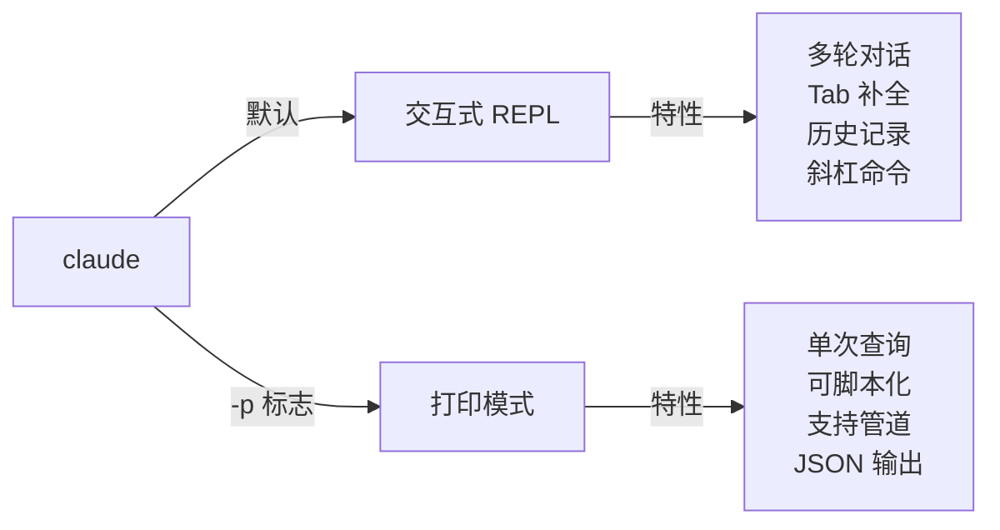

<picture>
  <source media="(prefers-color-scheme: dark)" srcset="../resources/logos/claude-howto-logo-dark.svg">
  
</picture>

# CLI Reference（命令行参考）

## 概览

Claude Code CLI（命令行界面）是与 Claude Code 交互的主要方式。它提供了强大的选项来运行查询、管理会话、配置模型以及将 Claude 集成到你的开发工作流中。

## 架构

```mermaid
graph TD
    A["用户终端"] -->|"claude [选项] [查询]"| B["Claude Code CLI"]
    B -->|交互模式| C["REPL 模式"]
    B -->|"--print"| D["打印模式 (SDK)"]
    B -->|"--resume"| E ["会话恢复"]
    C -->|对话| F["Claude API"]
    D -->|单次查询| F
    E -->|加载上下文| F
    F -->|响应| G["输出"]
    G -->|文本/json/流式JSON| H["终端/管道"]
```

## CLI 命令速查

| 命令 | 说明 | 示例 |
|------|--------|------|
| `claude` | 启动交互式 REPL | `claude` |
| `claude "query"` | 带初始提示启动 REPL | `claude "解释这个项目"` |
| `claude -p "query"` | 打印模式 — 查询后退出 | `claude -p "解释这个函数"` |
| `cat file \| claude -p "query"` | 处理管道输入的内容 | `cat logs.txt \| claude -p "解释"` |
| `claude -c` | 继续最近的对话 | `claude -c` |
| `claude -c -p "query"` | 以打印模式继续 | `claude -c -p "检查类型错误"` |
| `claude -r "<session>" "query"` | 按 ID 或名称恢复会话 | `claude -r "auth-refactor" "完成这个 PR"` |
| `claude update` | 更新到最新版本 | `claude update` |
| `claude mcp` | 配置 MCP 服务器 | 参见 [MCP 文档](../05-mcp/) |
| `claude mcp serve` | 将 Claude Code 作为 MCP 服务器运行 | `claude mcp serve` |
| `claude agents` | 列出所有已配置的子代理 | `claude agents` |
| `claude plugin` | 管理插件（安装、启用、禁用） | `claude plugin install my-plugin` |
| `claude auth login` | 登录（支持 `--email`、`--sso`） | `claude auth login --email user@example.com` |
| `claude auth logout` | 登出当前账户 | `claude auth logout` |

## 核心标志

| 标志 | 说明 | 示例 |
|------|--------|------|
| `-p, --print` | 打印响应而不进入交互模式 | `claude -p "查询"` |
| `-c, --continue` | 加载最近的对话 | `claude --continue` |
| `-r, --resume` | 按 ID 或名称恢复特定会话 | `claude --resume auth-refactor` |
| `-v, --version` | 输出版本号 | `claude -v` |
| `-w, --worktree` | 在隔离的 git worktree 中启动 | `claude -w` |
| `-n, --name` | 会话显示名称 | `claude -n "auth-refactor"` |
| `--from-pr <编号>` | 恢复关联到 GitHub PR 的会话 | `claude --from-pr 42` |
| `--bare` | 最小化模式（跳过 hooks、skills、plugins、MCP、auto memory、CLAUDE.md） | `claude --bare` |
| `--enable-auto-mode` | 解锁自动权限模式 | `claude --enable-auto-mode` |
| `--effort` | 设置思考努力级别 | `claude --effort high` |
| `--output-format` | 输出格式（text、json、stream-json） | `claude -p --output-format json "查询"` |
| `--max-turns` | 限制最大轮次 | `claude -p --max-turns 3 "查询"` |
| `--permission-mode` | 权限模式（default、plan、acceptEdits、auto、dontAsk、bypassPermissions） | `claude --permission-mode plan` |

### 交互模式 vs 打印模式



**交互模式**（默认）：
```bash
# 启动交互会话
claude

# 带初始提示启动
claude "解释认证流程"
```

**打印模式**（非交互式）：
```bash
# 单次查询，然后退出
claude -p "这个函数做什么？"

# 处理文件内容
cat error.log | claude -p "解释这个错误"

# JSON 输出用于脚本
claude -p --output-format json "列出所有函数" | jq '.content'
```

## CI/CD 集成

打印模式特别适合 CI/CD 流水线集成：

```bash
# 代码审查（非交互式）
claude -p "review all changed files in this PR"

# 带约束条件的自动化检查
claude -p --max-turns 3 --output-format json \
  --permission-mode plan "check for security issues"

# 批量处理
for file in src/**/*.ts; do
  claude -p --output-format json "add JSDoc comments to $file" >> docs.json
done
```

## 会话管理

| 操作 | 命令 | 说明 |
|------|--------|------|
| 列出会话 | `claude --list` 或 `/sessions` | 查看所有历史会话 |
| 重命名 | `/rename 新名称` | 重命名当前会话 |
| 恢复 | `claude -r "名称"` 或 `/resume 名称` | 恢复之前的会话 |
| 分叉 | `/fork` | 从当前点分叉一个新会话 |
| 后台任务 | `/tasks` | 查看和管理后台运行的任务 |

## 实际使用场景

### 场景 1：代码分析管道
```bash
# 分析错误日志
cat error.log | claude -p "分析这些错误并找出根因"

# 生成变更摘要
git diff HEAD~1 | claude -p "总结这次变更"
```

### 场景 2：CI/CD 代码审查
```yaml
# GitHub Actions 示例
- name: AI Code Review
  run: |
    claude -p --output-format json --max-turns 5 \
      "Review the changes in this PR for bugs, security issues, and best practices" \
      > review-result.json
```

### 场景 3：批量文档生成
```bash
for module in auth api users; do
  claude -p "Generate API documentation for src/${module}/index.ts" > docs/${module}.md
done
```

> 💡 **中文开发者提示**：CLI 的打印模式（`-p`）是将 Claude Code 引入自动化工作流的关键。建议先用交互模式熟悉 Claude 的能力，然后用打印模式将常用的分析、审查、文档生成等任务脚本化。配合 `--output-format json` 可以方便地与其他工具链集成。

---

**最后更新**：2026 年 3 月
