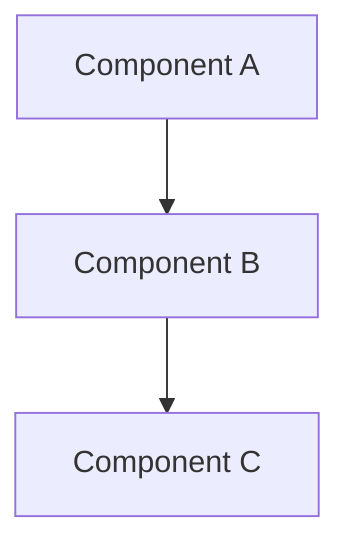

<picture>
  <source media="(prefers-color-scheme: dark)" srcset="resources/logos/claude-howto-logo-dark.svg">
  
</picture>

# Style 指南(风格指南)

> 贡献到 Claude How To 时的格式规范和排版规则。遵循本指南以保持内容一致、专业且易于维护。

---

## 目录

- [File and Folder Naming](#file-and-folder-naming)
- [Document Structure](#document-structure)
- [Headings](#headings)
- [Text Formatting](#text-formatting)
- [Lists](#lists)
- [Tables](#tables)
- [Code Blocks](#code-blocks)
- [Links and Cross-References](#links-and-cross-references)
- [Diagrams](#diagrams)
- [Emoji 使用方法](#emoji-使用方法)
- [YAML Frontmatter](#YAML-frontmatter)
- [Images and Media](#images-and-media)
- [Tone and Voice](#tone-and-voice)
- [提交 Messages](#提交-messages)
- [Checklist for Authors](#checklist-for-authors)

---

## File and Folder Naming

### Lesson Folders

Lesson 文件夹使用 **两位数字编号前缀** 加上 **kebab-case** 描述符:

```
01-slash-commands/
02-memory/
03-skills/
04-subagents/
05-mcp/
```

数字反映从初学者到高级的学习路径顺序。

### File Names

|  | 类型 | 约定 | 示例 |  |
|  | ------ | ------ | ------ |  |
|  | **Lesson README** | `README.md` | `01-slash-commands/README.md` |  |
|  | **功能 file** | Kebab-case `.md` | `code-reviewer.md`, `generate-API-docs.md` |  |
|  | **Shell script** | Kebab-case `.sh` | `格式-code.sh`, `validate-input.sh` |  |
|  | **Config file** | 标准名称 | `.mcp.JSON`, `settings.JSON` |  |
|  | **记忆 file** | 作用域前缀 | `项目-CLAUDE.md`, `personal-CLAUDE.md` |  |
|  | **Top-level docs** | UPPER_CASE `.md` | `CATALOG.md`, `QUICK_REFERENCE.md`, `CONTRIBUTING.md` |  |
|  | **Image assets** | Kebab-case | `pr-slash-command.png`, `claude-howto-logo.svg` |  |

### Rules

- 所有文件和文件夹名称使用**小写**(除顶层文档如 `README.md`、`CATALOG.md` 外)
- 使用**连字符**(`-`)作为单词分隔符,绝不使用下划线或空格
- 保持名称描述性但简洁

---

## Document Structure

### Root README

根 `README.md` 遵循此顺序:

1. Logo(`<picture>` 元素,支持深色/浅色变体)
2. H1 标题
3. 引言 blockquote(一行价值主张)
4. "Why This 指南?" 章节 + 对比表格
5. 水平分隔线(`---`)
6. 目录
7. 功能 Catalog
8. Quick Navigation
9. Learning Path
10. 功能 章节
11. 入门指南
12. 最佳实践 / 故障排除
13. Contributing / 许可证

### Lesson README

每个 lesson `README.md` 遵循此顺序:

1. H1 标题(例如 `# Slash Commands`)
2. 简短概述段落
3. 快速参考表(可选)
4. 架构图(Mermaid)
5. 详细章节(H2)
6. 实际示例(编号,4-6 个示例)
7. 最佳实践(Do's 和 Don'ts 表格)
8. 故障排除
9. 相关指南 / 官方文档
10. 文档元数据页脚

### 功能/示例 File

独立的功能文件(例如 `优化.md`、`pr.md`):

1. YAML frontmatter(如适用)
2. H1 标题
3. 目的 / 描述
4. 使用说明
5. 代码示例
6. 自定义提示

### Section Separators

使用水平分隔线(`---`)分隔主要的文档区域:

```markdown
---

# # New Major Section
```

将其放置在引言 blockquote 之后以及文档逻辑上不同的部分之间。

---

## Headings

### Hierarchy

|  | 级别 | 用途 | 示例 |  |
|  | ------- | ----- | --------- |  |
|  | `#` H1 | 页面标题(每文档一个) | `# Slash Commands` |  |
|  | `##` H2 | 主要章节 | `## 最佳实践` |  |
|  | `###` H3 | 子章节 | `### Adding a 技能` |  |
|  | `####` H4 | 子子章节(罕见) | `#### 配置 Options` |  |

### Rules

- **每文档只有一个 H1** -- 仅页面标题
- **永不跳级** -- 不要从 H2 直接跳到 H4
- **保持标题简洁** -- 目标 2-5 个词
- **使用句子大小写** -- 仅首单词和专有名词大写(例外:功能名称保持原样)
- **仅在根 README 章节标题上添加 emoji 前缀**(见 [Emoji 使用方法](#emoji-使用方法))

---

## Text Formatting

### Emphasis

|  | 样式 | 使用场景 | 示例 |  |
|  | ------- | ------------ | --------- |  |
|  | **Bold** (`**text**`) | 关键术语、表格标签、重要概念 | `**安装**:` |  |
|  | *Italic* (`*text*`) | 技术术语首次使用、书/文档标题 | `*frontmatter*` |  |
|  | `Code` (`` `text` ``) | 文件名、命令、配置值、代码引用 | `` `CLAUDE.md` `` |  |

### Blockquotes for Callouts

使用加粗前缀的 blockquote 表示重要说明:

```markdown
> **Note**: Custom slash commands have been merged into skills since v2.0.

> **Important**: Never commit API keys or credentials.

> **Tip**: Combine memory with skills for maximum effectiveness.
```

支持的 callout 类型:**注意**、**重要**、**提示**、**警告**。

### Paragraphs

- 保持段落简短(2-4 句)
- 段落之间添加空行
- 以关键点开头,然后提供上下文
- 解释"为什么"而不仅仅是"是什么"

---

## Lists

### Unordered Lists

使用连字符(`-`)配合 2 空格缩进进行嵌套:

```markdown
- First item
- Second item
  - Nested item
  - Another nested item
    - Deep nested(避免超过 3 层深度)
- Third item
```

### Ordered Lists

对顺序步骤、指令和排名项使用编号列表:

```markdown
1. First step
2. Second step
   - Sub-point detail
   - Another sub-point
3. Third step
```

### Descriptive Lists

对键值对风格的列表使用粗体标签:

```markdown
- **Performance bottlenecks** - identify O(n^2) operations, inefficient loops
- **Memory leaks** - find unreleased resources, circular references
- **Algorithm improvements** - suggest better algorithms or data structures
```

### Rules

- 保持一致的缩进(每级 2 空格)
- 列表前后各留一空行
- 保持列表项结构平行(都以动词开头,或都是名词等)
- 避免超过 3 层的嵌套

---

## Tables

### 标准 格式

```markdown
| Column 1 | Column 2 | Column 3 |
|----------|----------|----------|
| Data     | Data     | Data     |
```

### Common Table Patterns

**Feature comparison (3-4 columns):**

```markdown
| Feature | Invocation | Persistence | Best For |
|---------|-----------|------------|----------|
| **Slash Commands** | Manual (`/cmd`) | Session only | Quick shortcuts |
| **Memory** | Auto-loaded | Cross-session | Long-term learning |
```

**Do's and Don'ts:**

```markdown
| Do | Don't |
|----|-------|
| Use descriptive names | Use vague names |
| Keep files focused | Overload a single file |
```

**Quick reference:**

```markdown
| Aspect | Details |
|--------|---------|
| **Purpose** | Generate API documentation |
| **Scope** | Project-level |
| **Complexity** | Intermediate |
```

### Rules

- 当表格头是行标签(第一列)时使用**粗体**
- 对齐管道以提高源码可读性(可选但推荐)
- 保持单元格内容简洁;使用链接获取详情
- 在单元格中对命令和文件路径使用 `代码格式`

---

## Code Blocks

### Language Tags

始终指定语言标签以获得语法高亮:

|  | 语言 | 标签 | 用于 |  |
|  | ------ | ----- | --------- |  |
|  | Shell | `bash` | CLI 命令、脚本 |  |
|  | Python | `python` | Python 代码 |  |
|  | JavaScript | `javascript` | JS 代码 |  |
|  | TypeScript | `typescript` | TS 代码 |  |
|  | JSON | `JSON` | 配置文件 |  |
|  | YAML | `YAML` | Frontmatter、配置 |  |
|  | Markdown | `Markdown` | Markdown 示例 |  |
|  | SQL | `sql` | 数据库查询 |  |
|  | Plain text | (无标签) | 预期输出、目录树 |  |

### Conventions

```bash
#  Comment explaining what the command does
claude mcp add notion --transport http https://mcp.notion.com/mcp
```

- 在非显而易见的命令前添加**注释行**
- 使所有示例**可直接复制粘贴**
- 在相关时同时展示**简单版和高级版**
- 包含**预期输出**以辅助理解(使用无标签代码块)

### 安装 Blocks

使用此模式作为安装说明:

```bash
#  Copy files to your 项目
cp 01-slash-commands/*.md .claude/commands/
```

### Multi-step Workflows

```bash
#  Step 1: 创建 the directory
mkdir -p .claude/commands

#  Step 2: Copy the templates
cp 01-slash-commands/*.md .claude/commands/

#  Step 3: Verify 安装
ls .claude/commands/
```

---

## Links and Cross-References

### Internal Links(相对路径)

对所有内部链接使用相对路径:

```markdown
[Slash Commands](01-slash-commands/)
[Skills Guide](03-skills/)
[Memory Architecture](02-memory/# 记忆-架构)
```

从 lesson 文件夹返回根目录或同级目录:

```markdown
[Back to main guide](../README.md)
[Related: Skills](../03-skills/)
```

### External Links(绝对路径)

使用完整 URL 配合描述性锚文本:

```markdown
[Anthropic's official documentation](https://code.claude.com/docs/en/overview)
```

- 永远不要使用"click here"或"this link"作为锚文本
- 使用脱离上下文也有意义的描述性文本

### Section Anchors

使用 GitHub 风格锚点链接到同一文档内的章节:

```markdown
[Feature Catalog](# -功能-catalog)
[Best Practices](# best-practices)
```

### Related Guides 模式

Lesson 结尾处添加相关指南章节:

```markdown
# # Related Guides

- [Slash Commands](../01-slash-commands/) - Quick shortcuts
- [Memory](../02-memory/) - Persistent context
- [Skills](../03-skills/) - Reusable capabilities
```

---

## Diagrams

### Mermaid

所有图表使用 Mermaid。支持的类型:

- `graph TB` / `graph LR` -- 架构、层级、流程
- `sequenceDiagram` -- 交互流程
- `timeline` -- 时间序列

### Style Conventions

使用 style blocks 应用一致的颜色:



**Color palette:**

|  | 颜色 | Hex | 用于 |  |
|  | ------ | ----- | --------- |  |
|  | Light blue | `#e1f5fe` | 主要组件、输入 |  |
|  | Light pink | `#fce4ec` | 处理、中间件 |  |
|  | Light green | `#e8f5e9` | 输出、结果 |  |
|  | Light yellow | `#fff9c4` | 配置、可选 |  |
|  | Light purple | `#f3e5f5` | 面向用户、UI |  |

### Rules

- 使用 `["Label text"]` 作为节点标签(支持特殊字符)
- 使用空格代替 `<br/>` 作为标签内的换行(GitHub 兼容性)
- 保持图表简洁(最多 10-12 个节点)
- 在图表下方添加简要文字描述以提高可访问性
- 层级结构使用从上到下(`TB`),工作流使用从左到右(`LR`)

---

## Emoji 使用方法

### Emoji 使用位置

Emoji **谨慎且有目的地使用** -- 仅在特定场景下:

|  | 场景 | Emoji | 示例 |  |
|  | ------ | ------- | --------- |  |
|  | Root README 章节标题 | 分类图标 | `## 📚 Learning Path` |  |
|  | 技能等级指示器 | 彩色圆圈 | 🟢 Beginner, 🔵 Intermediate, 🔴 Advanced |  |
|  | Do's and Don'ts | 勾选/叉号标记 | ✅ Do this, ❌ Don't do this |  |
|  | 复杂度评级 | 星星 | ⭐⭐⭐ |  |

### 标准 Emoji Set

|  | Emoji | 含义 |  |
|  | ------- | --------- |  |
|  | 📚 | 学习、指南、文档 |  |
|  | ⚡ | 入门、快速参考 |  |
|  | 🎯 | 功能、快速参考 |  |
|  | 🎓 | 学习路径 |  |
|  | 📊 | 统计、比较 |  |
|  | 🚀 | 安装、快速命令 |  |
|  | 🟢 | 初学者级别 |  |
|  | 🔵 | 中级级别 |  |
|  | 🔴 | 高级级别 |  |
|  | ✅ | 推荐做法 |  |
|  | ❌ | 避免 / 反模式 |  |
|  | ⭐ | 复杂度评级单位 |  |

### Rules

- **正文中永不使用 emoji** 或段落
- **仅在根 README 的标题中使用 emoji**(不在 lesson README 中)
- **不要添加装饰性 emoji** -- 每个 emoji 都应有意义
- 保持 emoji 使用与上表一致

---

## YAML Frontmatter

### 功能 Files(技能、Commands、Agents)

```yaml
---
name: unique-identifier
description: What this feature does and when to use it
allowed-tools: Bash, Read, Grep
---
```

### 可选 Fields

```yaml
---
name: my-feature
description: Brief description
argument-hint: "[file-path] [options]"
allowed-tools: Bash, Read, Grep, Write, Edit
model: opus                        #  opus, sonnet, or haiku
disable-model-invocation: true     #  用户-only invocation
user-invocable: false              #  Hidden from 用户 menu
context: fork                      #  Run in isolated 子代理
agent: Explore                     #  代理 类型 for context: fork
---
```

### Rules

- 将 frontmatter 放在文件最顶部
- `name` 字段使用 **kebab-case**
- 保持 `描述` 为一句话
- 只包含需要的字段

---

## Images and Media

### Logo 模式

所有以 logo 开头的文档都使用 `<picture>` 元素以支持深色/浅色模式:

```html
<picture>
  <source media="(prefers-color-scheme: dark)" srcset="resources/logos/claude-howto-logo-dark.svg">
  
</picture>
```

### Screenshots

- 存储在对应的 lesson 文件夹中(例如 `01-slash-commands/pr-slash-command.png`)
- 使用 kebab-case 文件名
- 包含描述性 alt text
- 图表优先使用 SVG,截图使用 PNG

### Rules

- 始终为图片提供 alt text
- 保持图片文件大小合理(PNG 小于 500KB)
- 图片引用使用相对路径
- 将图片存储在引用文档所在目录,或使用 `assets/` 存放共享图片

---

## Tone and Voice

### Writing Style

- **专业但亲切** -- 技术准确但不堆砌术语
- **主动语态** -- "创建 a file" 而非 "A file should be created"
- **直接指令** -- "Run this command" 而非 "You might want to run this command"
- **新手友好** -- 假设读者对 Claude Code 新手,但对编程不陌生

### Content Principles

|  | 原则 | 示例 |  |
|  | ----------- | ----------- |  |
|  | **Show, don't tell** | 提供可工作的示例,而非抽象描述 |  |
|  | **渐进式复杂性** | 从简单开始,在后续章节增加深度 |  |
|  | **解释"为什么"** | "Use 记忆 for... because..." 而不仅仅是 "Use 记忆 for..." |  |
|  | **可直接复制粘贴** | 每个代码块粘贴后即可运行 |  |
|  | **真实世界场景** | 使用实际场景,而非刻意构造的例子 |  |

### Vocabulary

- 使用 "Claude Code"(不用 "Claude CLI" 或 "the tool")
- 使用 "技能"(不用 "自定义 command" -- 旧称)
- 使用 "lesson" 或 "指南" 指代编号章节
- 使用 "示例" 指代独立的功能文件

---

## 提交 Messages

遵循 [Conventional Commits](https://www.conventionalcommits.org/):

```
type(scope): description
```

### Types

|  | 类型 | 用于 |  |
|  | ------ | --------- |  |
|  | `feat` | 新功能、示例或指南 |  |
|  | `fix` | Bug 修复、修正、损坏的链接 |  |
|  | `docs` | 文档改进 |  |
|  | `refactor` | 重构而不改变行为 |  |
|  | `style` | 仅格式变更 |  |
|  | `测试` | 测试添加或修改 |  |
|  | `chore` | 构建、依赖、CI |  |

### Scopes

使用 lesson 名称或文件区域作为 作用域:

```
feat(slash-commands): Add API documentation generator
docs(memory): Improve personal preferences example
fix(README): Correct table of contents link
docs(skills): Add comprehensive code review skill
```

---

## Document Metadata Footer

Lesson README 以元数据块结尾:

```markdown
---
**Last Updated**: March 2026
**Claude Code Version**: 2.1+
**Compatible Models**: Claude Sonnet 4.6, Claude Opus 4.6, Claude Haiku 4.5
```

- 使用月份+年份格式(例如 "March 2026")
- 功能变更时更新版本
- 列出所有兼容模型

---

## Checklist for Authors

提交内容之前,请验证:

- [ ] 文件/文件夹名称使用 kebab-case
- [ ] 文档以 H1 标题开头(每文件一个)
- [ ] 标题层级正确(无跳级)
- [ ] 所有代码块都有语言标签
- [ ] 代码示例可直接复制粘贴
- [ ] 内部链接使用相对路径
- [ ] 外部链接具有描述性锚文本
- [ ] 表格格式正确
- [ ] Emoji 遵循标准集(如果使用的话)
- [ ] Mermaid 图表使用标准调色板
- [ ] 无敏感信息(API 密钥、凭据)
- [ ] YAML frontmatter 有效(如适用)
- [ ] 图片有 alt text
- [ ] 段落简短且聚焦
- [ ] 相关指南章节链接到相关 lesson
- [ ] 提交 message 遵循 conventional commits 格式
