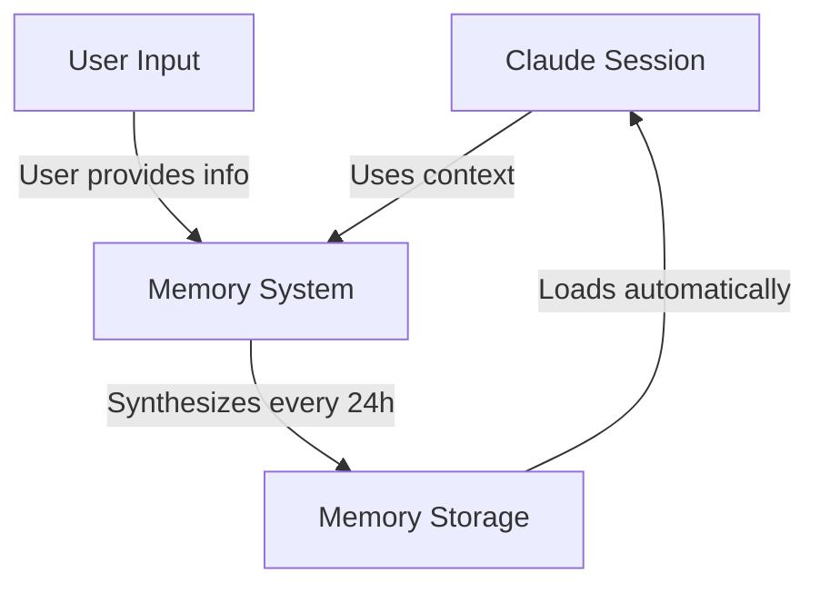
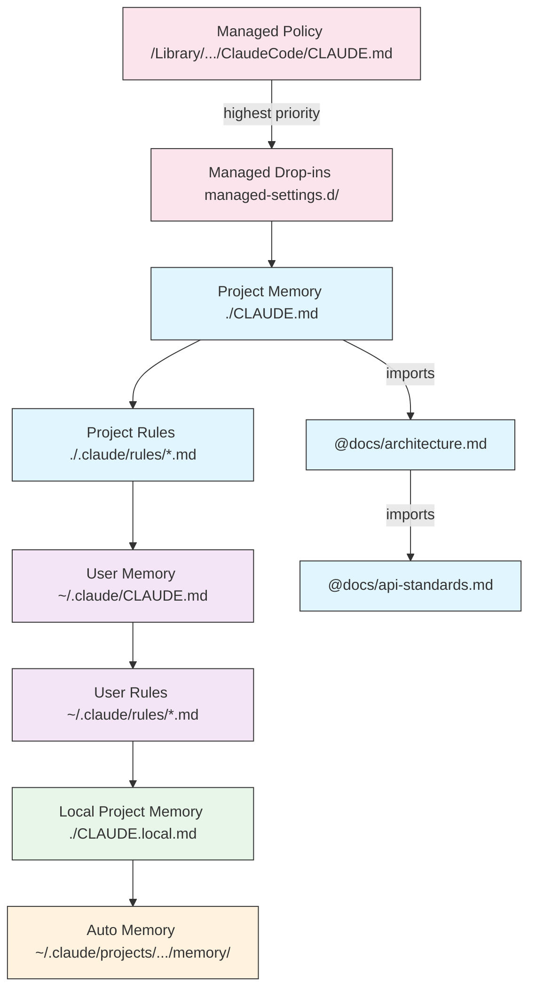
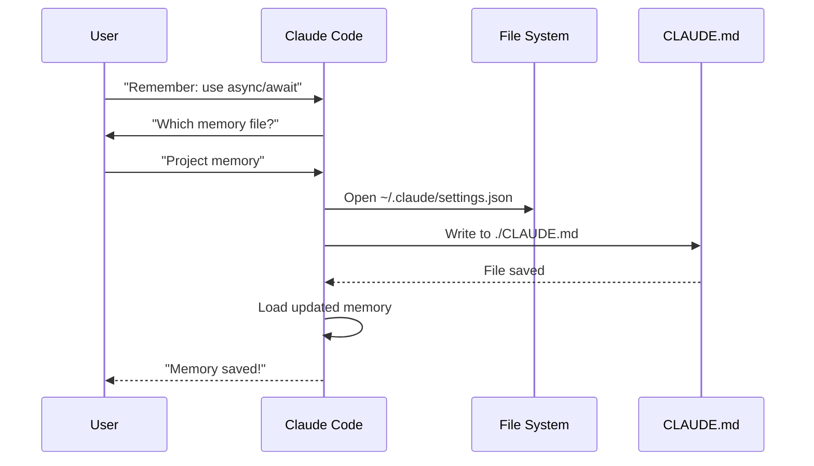
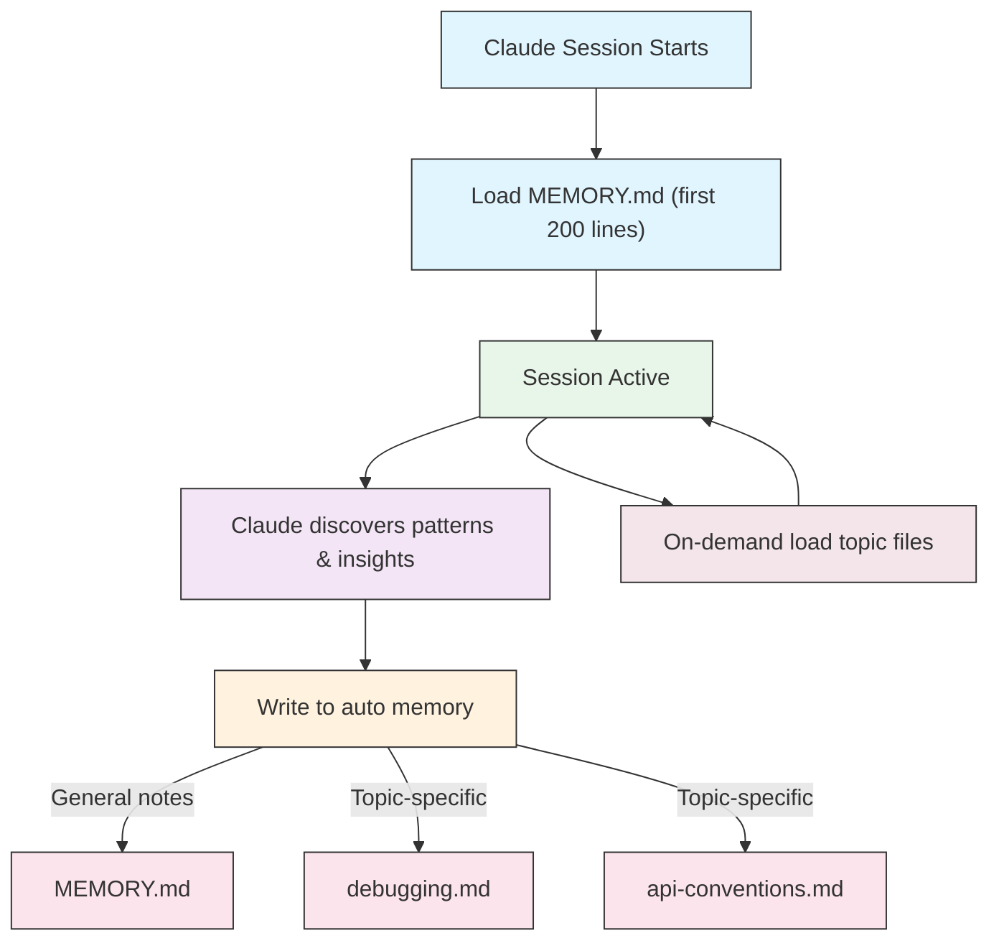
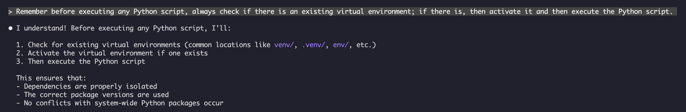

<picture>
  <source media="(prefers-color-scheme: dark)" srcset="../resources/logos/claude-howto-logo-dark.svg">
  
</picture>

# Memory（记忆）指南

Memory 使 Claude 能够在多个会话和对话之间保留上下文。它以两种形式存在：claude.ai 中的自动合成，以及 Claude Code 中基于文件系统的 CLAUDE.md。

## 概览

Claude Code 中的 Memory 提供跨多个会话和对话的持久化上下文。与临时的上下文窗口不同，记忆文件允许你：

- 在团队中共享项目标准
- 存储个人开发偏好
- 维护目录特定的规则和配置
- 导入外部文档
- 将记忆作为项目的一部分进行版本控制

记忆系统在多个层级上运行，从全局个人偏好到特定子目录，允许精细控制 Claude 记忆的内容以及如何应用这些知识。

## Memory 命令快速参考

| 命令 | 用途 | 用法 | 使用场景 |
|------|------|------|----------|
| `/init` | 初始化项目记忆 | `/init` | 开始新项目，首次设置 CLAUDE.md |
| `/memory` | 在编辑器中编辑记忆文件 | `/memory` | 大规模更新、重新组织、审查内容 |
| `#` 前缀 | 快速单行记忆添加 | `# Your rule here` | 在对话中添加快速规则 |
| `# new rule into memory` | 显式记忆添加 | `# new rule into memory<br/>Your detailed rule` | 添加复杂的多行规则 |
| `# remember this` | 自然语言记忆 | `# remember this<br/>Your instruction` | 对话式记忆更新 |
| `@path/to/file` | 导入外部内容 | `@README.md` 或 `@docs/api.md` | 在 CLAUDE.md 中引用现有文档 |

## 快速入门：初始化记忆

### `/init` 命令

`/init` 命令是在 Claude Code 中设置项目记忆的最快方式。它会初始化一个包含基础项目文档的 CLAUDE.md 文件。

**用法：**

```bash
/init
```

**它的作用：**

- 在项目中创建新的 CLAUDE.md 文件（通常位于 `./CLAUDE.md` 或 `./.claude/CLAUDE.md`）
- 建立项目约定和准则
- 为跨会话的上下文持久化奠定基础
- 提供记录项目标准的模板结构

**增强的交互模式：** 设置 `CLAUDE_CODE_NEW_INIT=true` 以启用多阶段交互流程，引导你逐步完成项目设置：

```bash
CLAUDE_CODE_NEW_INIT=true claude
/init
```

**何时使用 `/init`：**

- 使用 Claude Code 开始新项目
- 建立团队编码标准和约定
- 创建关于代码库结构的文档
- 为协作开发设置记忆层级

**示例工作流：**

```markdown
# 在你的项目目录中
/init

# Claude 创建结构如下的 CLAUDE.md：
# Project Configuration
## Project Overview
- Name: Your Project
- Tech Stack: [Your technologies]
- Team Size: [Number of developers]

## Development Standards
- Code style preferences
- Testing requirements
- Git workflow conventions
```

### 使用 `#` 快速更新记忆

你可以在任何对话中通过以 `#` 开头消息来快速向记忆添加信息：

**语法：**

```markdown
# Your memory rule or instruction here
```

**示例：**

```markdown
# Always use TypeScript strict mode in this project

# Prefer async/await over promise chains

# Run npm test before every commit

# Use kebab-case for file names
```

**工作原理：**

1. 以 `#` 开头消息，后跟你的规则
2. Claude 识别这是一个记忆更新请求
3. Claude 询问要更新哪个记忆文件（项目或个人）
4. 规则被添加到相应的 CLAUDE.md 文件
5. 后续会话自动加载此上下文

**替代模式：**

```markdown
# new rule into memory
Always validate user input with Zod schemas

# remember this
Use semantic versioning for all releases

# add to memory
Database migrations must be reversible
```

### `/memory` 命令

`/memory` 命令提供对 CLAUDE.md 记忆文件进行直接编辑的能力，可在 Claude Code 会话内打开你的系统默认编辑器进行全面编辑。

**用法：**

```bash
/memory
```

**它的作用：**

- 在系统默认编辑器中打开你的记忆文件
- 允许进行大量的添加、修改和重新组织
- 提供对层级结构中所有记忆文件的直接访问
- 使你能够管理跨会话的持久化上下文

**何时使用 `/memory`：**

- 审查现有记忆内容
- 对项目标准进行大规模更新
- 重新组织记忆结构
- 添加详细的文档或指南
- 随着项目的演进维护和更新记忆

**对比：`/memory` vs `/init`**

| 方面 | `/memory` | `/init` |
|------|-----------|---------|
| **用途** | 编辑现有记忆文件 | 初始化新的 CLAUDE.md |
| **何时使用** | 更新/修改项目上下文 | 开始新项目 |
| **操作** | 打开编辑器进行修改 | 生成初始模板 |
| **工作流** | 持续维护 | 一次性设置 |

**示例工作流：**

```markdown
# 打开记忆进行编辑
/memory

# Claude 显示选项：
# 1. Managed Policy Memory
# 2. Project Memory (./CLAUDE.md)
# 3. User Memory (~/.claude/CLAUDE.md)
# 4. Local Project Memory

# 选择选项 2 (Project Memory)
# 你的默认编辑器打开 ./CLAUDE.md 内容

# 进行修改、保存并关闭编辑器
# Claude 自动重新加载更新的记忆
```

**使用记忆导入：**

CLAUDE.md 文件支持 `@path/to/file` 语法来包含外部内容：

```markdown
# 项目文档
参见 @README.md 了解项目概览
参见 @package.json 了解可用的 npm 命令
参见 @docs/architecture.md 了解系统设计

# 使用绝对路径从主目录导入
@~/.claude/my-project-instructions.md
```

**导入功能：**

- 支持相对路径和绝对路径（例如 `@docs/api.md` 或 `@~/.claude/my-project-instructions.md`）
- 支持递归导入，最大深度为 5 层
- 从外部位置首次导入时会触发安全审批对话框
- 导入指令不会在 markdown 代码 span 或代码块内被求值（因此在示例中记录它们是安全的）
- 通过引用现有文档帮助避免重复
- 自动将引用的内容包含到 Claude 的上下文中

## 记忆架构

Claude Code 中的记忆遵循分层系统，不同的作用域服务于不同目的：



## Claude Code 中的记忆层级

Claude Code 使用多级分层记忆系统。当 Claude Code 启动时，记忆文件会自动加载，较高级别的文件优先。

**完整的记忆层级（按优先级顺序）：**

1. **Managed Policy（托管策略）** — 组织范围的指令
   - macOS: `/Library/Application Support/ClaudeCode/CLAUDE.md`
   - Linux/WSL: `/etc/claude-code/CLAUDE.md`
   - Windows: `C:\Program Files\ClaudeCode\CLAUDE.md`

2. **Managed Drop-ins（托管插件）** — 按字母顺序合并的策略文件（v2.1.83+）
   - 托管策略 CLAUDE.md 旁边的 `managed-settings.d/` 目录
   - 文件按字母顺序合并用于模块化策略管理

3. **Project Memory（项目记忆）** — 团队共享的上下文（版本控制）
   - `./.claude/CLAUDE.md` 或 `./CLAUDE.md`（在仓库根目录）

4. **Project Rules（项目规则）** — 模块化的、针对特定主题的项目指令
   - `./.claude/rules/*.md`

5. **User Memory（用户记忆）** — 个人偏好（所有项目）
   - `~/.claude/CLAUDE.md`

6. **User-Level Rules（用户级规则）** — 个人规则（所有项目）
   - `~/.claude/rules/*.md`

7. **Local Project Memory（本地项目记忆）** — 个人项目特定偏好
   - `./CLAUDE.local.md`

> **注意**：截至 2026 年 3 月，[官方文档](https://code.claude.com/docs/en/memory)未提及 `CLAUDE.local.md`。它可能仍作为遗留功能工作。对于新项目，建议改用 `~/.claude/CLAUDE.md`（用户级别）或 `.claude/rules/`（项目级别，路径范围）。

8. **Auto Memory（自动记忆）** — Claude 的自动笔记和学习记录
   - `~/.claude/projects/<project>/memory/`

**记忆发现行为：**

Claude 按此顺序搜索记忆文件，较早的位置优先：



## 使用 `claudeMdExcludes` 排除 CLAUDE.md 文件

在大型 monorepo 中，某些 CLAUDE.md 文件可能与当前工作无关。`claudeMdExcludes` 设置允许你跳过特定的 CLAUDE.md 文件，使它们不会被加载到上下文中：

```jsonc
// 在 ~/.claude/settings.json 或 .claude/settings.json 中
{
  "claudeMdExcludes": [
    "packages/legacy-app/CLAUDE.md",
    "vendors/**/CLAUDE.md"
  ]
}
```

模式会相对于项目根路径进行匹配。这特别适用于：

- 包含许多子项目的 monorepo，其中只有部分与当前工作相关
- 包含第三方或供应商提供的 CLAUDE.md 文件的仓库
- 通过排除过时或无关的指令来减少 Claude 上下文窗口中的噪音

## 设置文件层级

Claude Code 的设置（包括 `autoMemoryDirectory`、`claudeMdExcludes` 和其他配置）从五级层级解析，较高的级别优先：

| 级别 | 位置 | 作用域 |
|------|------|--------|
| 1（最高） | Managed policy（系统级） | 组织范围强制执行 |
| 2 | `managed-settings.d/`（v2.1.83+） | 模块化策略插件，按字母顺序合并 |
| 3 | `~/.claude/settings.json` | 用户偏好 |
| 4 | `.claude/settings.json` | 项目级别（提交到 git） |
| 5（最低） | `.claude/settings.local.json` | 本地覆盖（git 忽略） |

**平台特定配置（v2.1.51+）：**

设置也可以通过以下方式配置：
- **macOS**: Property list (plist) 文件
- **Windows**: Windows Registry

这些平台原生机制与 JSON 设置文件一起读取，遵循相同的优先级规则。

## 模块化规则系统

使用 `.claude/rules/` 目录结构创建有组织的、路径特定的规则。规则可以在项目级别和用户级别定义：

```
your-project/
├── .claude/
│   ├── CLAUDE.md
│   └── rules/
│       ├── code-style.md
│       ├── testing.md
│       ├── security.md
│       └── api/                  # 支持子目录
│           ├── conventions.md
│           └── validation.md

~/.claude/
├── CLAUDE.md
└── rules/                        # 用户级规则（所有项目）
    ├── personal-style.md
    └── preferred-patterns.md
```

规则会在 `rules/` 目录内递归发现，包括任何子目录。`~/.claude/rules/` 处的用户级规则会在项目级规则之前加载，允许个人默认值被项目覆盖。

### 使用 YAML Frontmatter 定义路径特定规则

定义仅适用于特定文件路径的规则：

```markdown
---
paths: src/api/**/*.ts
---

# API 开发规则

- 所有 API 端点必须包含输入验证
- 使用 Zod 进行 schema 验证
- 文档化所有参数和响应类型
- 所有操作必须包含错误处理
```

**Glob 模式示例：**

- `**/*.ts` - 所有 TypeScript 文件
- `src/**/*` - src/ 下的所有文件
- `src/**/*.{ts,tsx}` - 多种扩展名
- `{src,lib}/**/*.ts, tests/**/*.test.ts` - 多种模式

### 子目录和符号链接

`.claude/rules/` 中的规则支持两种组织功能：

- **子目录**：规则会被递归发现，因此你可以将它们组织到基于主题的文件夹中（如 `rules/api/`、`rules/testing/`、`rules/security/`）
- **符号链接**：支持符号链接以便在多个项目间共享规则。例如，你可以从中心位置将共享规则文件符号链接到每个项目的 `.claude/rules/` 目录

## 记忆位置表

| 位置 | 作用域 | 优先级 | 共享对象 | 访问方式 | 最适合 |
|------|-------|--------|----------|----------|--------|
| `/Library/Application Support/ClaudeCode/CLAUDE.md` (macOS) | Managed Policy | 1（最高） | 组织 | 系统 | 公司范围策略 |
| `/etc/claude-code/CLAUDE.md` (Linux/WSL) | Managed Policy | 1（最高） | 组织 | 系统 | 组织标准 |
| `C:\Program Files\ClaudeCode\CLAUDE.md` (Windows) | Managed Policy | 1（最高） | 组织 | 系统 | 企业指南 |
| `managed-settings.d/*.md`（策略旁） | Managed Drop-ins | 1.5 | 组织 | 系统 | 模块化策略文件（v2.1.83+） |
| `./CLAUDE.md` 或 `./.claude/CLAUDE.md` | Project Memory | 2 | 团队 | Git | 团队标准、共享架构 |
| `./.claude/rules/*.md` | Project Rules | 3 | 团队 | Git | 路径特定的、模块化规则 |
| `~/.claude/CLAUDE.md` | User Memory | 4 | 个人 | 文件系统 | 个人偏好（所有项目） |
| `~/.claude/rules/*.md` | User Rules | 5 | 个人 | 文件系统 | 个人规则（所有项目） |
| `./CLAUDE.local.md` | Project Local | 6 | 个人 | Git（忽略） | 个人项目特定偏好 |
| `~/.claude/projects/<project>/memory/` | Auto Memory | 7（最低） | 个人 | 文件系统 | Claude 的自动笔记和学习记录 |

## 记忆更新生命周期

以下是记忆更新在你的 Claude Code 会话中的流转过程：



## 自动记忆

自动记忆是一个持久化目录，Claude 在处理你的项目时自动记录学习到的模式、规律和见解。与由你手动编写和维护的 CLAUDE.md 文件不同，自动记忆是由 Claude 自身在会话期间写入的。

### 自动记忆如何工作

- **位置**：`~/.claude/projects/<project>/memory/`
- **入口点**：`MEMORY.md` 作为自动记忆目录中的主要文件
- **主题文件**：可选的附加文件用于特定主题（如 `debugging.md`、`api-conventions.md`）
- **加载行为**：`MEMORY.md` 的前 200 行在会话启动时被加载到系统提示词中。主题文件按需加载，不在启动时加载。
- **读写操作**：Claude 在会话期间读写记忆文件，因为它发现了模式和项目特定知识

### 自动记忆架构



### 自动记忆目录结构

```
~/.claude/projects/<project>/memory/
├── MEMORY.md              # 入口点（启动时加载前 200 行）
├── debugging.md           # 主题文件（按需加载）
├── api-conventions.md     # 主题文件（按需加载）
└── testing-patterns.md    # 主题文件（按需加载）
```

### 版本要求

自动记忆需要 **Claude Code v2.1.59 或更高版本**。如果你使用的是旧版本，请先升级：

```bash
npm install -g @anthropic-ai/claude-code@latest
```

### 自定义自动记忆目录

默认情况下，自动记忆存储在 `~/.claude/projects/<project>/memory/` 中。你可以使用 `autoMemoryDirectory` 设置更改此位置（自 **v2.1.74** 起可用）：

```jsonc
// 在 ~/.claude/settings.json 或 .claude/settings.local.json 中（仅限用户/本地设置）
{
  "autoMemoryDirectory": "/path/to/custom/memory/directory"
}
```

> **注意**：`autoMemoryDirectory` 只能在用户级（`~/.claude/settings.json`）或本地设置（`.claude/settings.local.json`）中设置，不能在项目或托管策略设置中使用。

这在以下情况下很有用：
- 将自动记忆存储在共享或同步位置
- 将自动记忆与默认 Claude 配置目录分离
- 使用默认层级之外的项目特定路径

### Worktree 和仓库共享

同一 git 仓库内的所有 worktree 和子目录共享一个自动记忆目录。这意味着在同一仓库的不同 worktree 之间切换或在同一仓库的不同子目录中工作时，将会读写相同的记忆文件。

### 子代理记忆

子代理（通过 Task 等工具或并行执行生成的）可以拥有自己的记忆上下文。在子代理定义中使用 `memory` frontmatter 字段来指定要加载的记忆作用域：

```yaml
memory: user      # 仅加载用户级记忆
memory: project   # 仅加载项目级记忆
memory: local     # 仅加载本地记忆
```

这允许子代理使用聚焦的上下文运行，而不是继承完整的记忆层级。

### 控制自动记忆

可以通过 `CLAUDE_CODE_DISABLE_AUTO_MEMORY` 环境变量控制自动记忆：

| 值 | 行为 |
|-----|------|
| `0` | 强制开启自动记忆 |
| `1` | 强制关闭自动记忆 |
| *(未设置)* | 默认行为（启用自动记忆） |

```bash
# 为单个会话禁用自动记忆
CLAUDE_CODE_DISABLE_AUTO_MEMORY=1 claude

# 显式强制开启自动记忆
CLAUDE_CODE_DISABLE_AUTO_MEMORY=0 claude
```

## 使用 `--add-dir` 添加额外目录

`--add-dir` 标志允许 Claude Code 从当前工作目录之外的额外目录加载 CLAUDE.md 文件。这对于其他目录的上下文相关的 monorepo 或多项目设置很有用。

要启用此功能，设置环境变量：

```bash
CLAUDE_CODE_ADDITIONAL_DIRECTORIES_CLAUDE_MD=1
```

然后使用该标志启动 Claude Code：

```bash
claude --add-dir /path/to/other/project
```

Claude 会从指定的额外目录加载 CLAUDE.md，同时也会加载当前工作目录的记忆文件。

## 实际示例

### 示例 1：项目记忆结构

**文件：** `./CLAUDE.md`

```markdown
# 项目配置

## 项目概览
- **名称**：电商平台
- **技术栈**：Node.js、PostgreSQL、React 18、Docker
- **团队规模**：5 名开发者
- **截止日期**：2025 Q4

## 架构
@docs/architecture.md
@docs/api-standards.md
@docs/database-schema.md

## 开发标准

### 代码风格
- 使用 Prettier 格式化
- 使用 ESLint 并配合 airbnb 配置
- 最大行长度：100 字符
- 使用 2 空格缩进

### 命名约定
- **文件**：kebab-case (user-controller.js)
- **类**：PascalCase (UserService)
- **函数/变量**：camelCase (getUserById)
- **常量**：UPPER_SNAKE_CASE (API_BASE_URL)
- **数据库表**：snake_case (user_accounts)

### Git 工作流
- 分支命名：`feature/description` 或 `fix/description`
- 提交消息：遵循 Conventional Commits
- 合并前需要 PR
- 所有 CI/CD 检查必须通过
- 至少需要 1 个审批

### 测试要求
- 最低 80% 代码覆盖率
- 所有关键路径必须有测试
- 使用 Jest 进行单元测试
- 使用 Cypress 进行端到端测试
- 测试文件名：`*.test.ts` 或 `*.spec.ts`

### API 标准
- 仅 RESTful 端点
- JSON 请求/响应
- 正确使用 HTTP 状态码
- API 端点版本化：`/api/v1/`
- 用示例文档化所有端点

### 数据库
- 使用迁移进行 schema 变更
- 绝不硬编码凭据
- 使用连接池
- 开发环境启用查询日志
- 定期备份

### 部署
- 基于 Docker 的部署
- Kubernetes 编排
- 蓝绿部署策略
- 失败时自动回滚
- 部署前运行数据库迁移

## 常用命令

| 命令 | 用途 |
|------|------|
| `npm run dev` | 启动开发服务器 |
| `npm test` | 运行测试套件 |
| `npm run lint` | 检查代码风格 |
| `npm run build` | 生产构建 |
| `npm run migrate` | 运行数据库迁移

## 团队联系人
- 技术负责人：Sarah Chen (@sarah.chen)
- 产品经理：Mike Johnson (@mike.j)
- DevOps：Alex Kim (@alex.k)

## 已知问题 & 解决方案
- PostgreSQL 连接池高峰期限制为 20
- 解决方案：实现查询队列
- Safari 14 与异步生成器的兼容性问题
- 解决方案：使用 Babel 转译器

## 相关项目
- 分析仪表板：`/projects/analytics`
- 移动应用：`/projects/mobile`
- 管理面板：`/projects/admin`
```

### 示例 2：目录特定记忆

**文件：** `./src/api/CLAUDE.md`

```markdown
# API 模块标准

此文件覆盖 /src/api/ 目录下所有内容的根 CLAUDE.md

## API 特定标准

### 请求验证
- 使用 Zod 进行 schema 验证
- 始终验证输入
- 返回 400 及验证错误详情
- 包含字段级别的错误详情

### 身份验证
- 所有端点都需要 JWT token
- Token 位于 Authorization header
- Token 24 小时过期
- 实现刷新 token 机制

### 响应格式

所有响应必须遵循此结构：

```json
{
  "success": true,
  "data": { /* actual data */ },
  "timestamp": "2025-11-06T10:30:00Z",
  "version": "1.0"
}
```

错误响应：
```json
{
  "success": false,
  "error": {
    "code": "VALIDATION_ERROR",
    "message": "User message",
    "details": { /* field errors */ }
  },
  "timestamp": "2025-11-06T10:30:00Z"
}
```

### 分页
- 使用基于游标的分页（非偏移量）
- 包含 `hasMore` 布尔值
- 最大页大小限制为 100
- 默认页大小：20

### 速率限制
- 已认证用户每小时 1000 次请求
- 公共端点每小时 100 次请求
- 超出时返回 429
- 包含 retry-after header

### 缓存
- 使用 Redis 进行会话缓存
- 缓存时长：默认 5 分钟
- 写入操作时失效
- 用资源类型标记缓存 key
```

### 示例 3：个人记忆

**文件：** `~/.claude/CLAUDE.md`

```markdown
# 我的开发偏好

## 关于我
- **经验水平**：8 年全栈开发经验
- **首选语言**：TypeScript、Python
- **沟通方式**：直接，附带示例
- **学习风格**：可视化图表 + 代码

## 代码偏好

### 错误处理
我偏好使用 try-catch 块和有意义错误消息的显式错误处理。
避免通用错误。始终记录错误以便调试。

### 注释
注释解释 WHY 而不是 WHAT。代码应该自我文档化。
注释应该解释业务逻辑或不明显的决策。

### 测试
我偏好 TDD（测试驱动开发）。
先写测试，再写实现。
关注行为而非实现细节。

### 架构
我偏好模块化的、松耦合的设计。
使用依赖注入提高可测试性。
分离关注点（控制器、服务、仓储）。

## 调试偏好
- 使用 console.log 并带前缀：`[DEBUG]`
- 包含上下文：函数名、相关变量
- 可用时使用堆栈跟踪
- 日志始终包含时间戳

## 沟通
- 用图表解释复杂概念
- 先展示具体示例再解释理论
- 包含修改前后的代码片段
- 最后总结要点

## 项目组织
我将我的项目组织为：

   project/
   ├── src/
   │   ├── api/
   │   ├── services/
   │   ├── models/
   │   └── utils/
   ├── tests/
   ├── docs/
   └── docker/

## 工具
- **IDE**：VS Code 配合 vim 快捷键
- **终端**：Zsh 配合 Oh-My-Zsh
- **格式化**：Prettier（100 字符行长度）
- **Linter**：ESLint 配合 airbnb 配置
- **测试框架**：Jest 配合 React Testing Library
```

_我的测试_
让 Claude 保存一条新规则


Claude 没有保存规则因为我没有任何 `Claude.md` 文件。然后让 Claude 确认位置。


### 示例 4：会话期间的记忆更新

你可以在活跃的 Claude Code 会话期间向记忆添加新规则。有两种方法可以实现：

#### 方法 1：直接请求

```markdown
User: 记住我偏好对所有新组件使用 React hooks 而不是 class components。

Claude: 我正在将此添加到你的记忆。这个规则应该放入哪个记忆文件？
        1. Project memory (./CLAUDE.md)
        2. Personal memory (~/.claude/CLAUDE.md)

User: Project memory

Claude: ✅ Memory saved!

Added to ./CLAUDE.md:
---

### Component Development
- Use functional components with React Hooks
- Prefer hooks over class components
- Custom hooks for reusable logic
- Use useCallback for event handlers
- Use useMemo for expensive computations
```

#### 方法 2：使用 "# new rule into memory" 模式

你也可以使用显式模式 "# new rule into memory" 来触发记忆更新：

```markdown
User: # new rule into memory
      Always validate user input with Zod schemas before processing.

Claude: I'm saving this rule to memory. Which memory file should I use?
        1. Project memory (./CLAUDE.md)
        2. Personal memory (~/.claude/CLAUDE.md)

User: Project memory

Claude: ✅ Memory saved!

Added to ./CLAUDE.md:
---

### Input Validation
- Always validate user input with Zod schemas before processing
- Define schemas at the top of each API handler file
- Return 400 status with validation errors
```

#### 添加记忆的技巧

- 规则要具体且可操作
- 将相关规则分组到章节标题下
- 更新现有部分而不是复制内容
- 选择合适的记忆作用域（项目 vs 个人）

## 记忆功能对比

| 功能 | Claude Web/Desktop | Claude Code (CLAUDE.md) |
|------|-------------------|------------------------|
| 自动合成 | 每 24h | 手动 |
| 跨项目 | 共享 | 项目特定 |
| 团队访问 | 共享项目 | Git 追踪 |
| 可搜索 | 内置 | 通过 `/memory` |
| 可编辑 | 在聊天中 | 直接文件编辑 |
| 导入/导出 | 是 | 复制/粘贴 |
| 持久化 | 24h+ | 无限期 |

### Claude Web/Desktop 中的记忆

#### 记忆合成时间线


**示例记忆摘要：**

```markdown
## Claude 对用户的记忆

### 专业背景
- 拥有 8 年经验的资深全栈开发者
- 专注于 TypeScript/Node.js 后端和 React 前端
- 活跃的开源贡献者
- 对 AI 和机器学习感兴趣

### 项目上下文
- 当前构建电商平台
- 技术栈：Node.js、PostgreSQL、React 18、Docker
- 与 5 名开发者的团队合作
- 使用 CI/CD 和蓝绿部署

### 沟通偏好
- 偏好直接、简洁的解释
- 喜欢可视图表和示例
- 欣赏代码片段
- 在注释中解释业务逻辑

### 当前目标
- 提高 API 性能
- 将测试覆盖率提升至 90%
- 实现缓存策略
- 文档化架构
```

## 最佳实践

### 应该做的 - 要包含什么

- **具体且详细**：使用清晰、详细的指令而非模糊的指导
  - 好："所有 JavaScript 文件使用 2 空格缩进"
  - 避免："遵循最佳实践"

- **保持条理**：使用清晰的 markdown 章节和标题组织记忆文件

- **使用适当的层级级别**：
  - **Managed policy**：公司范围策略、安全标准、合规要求
  - **Project memory**：团队标准、架构、编码约定（提交到 git）
  - **User memory**：个人偏好、沟通风格、工具选择
  - **Directory memory**：模块特定规则和覆盖

- **利用导入**：使用 `@path/to/file` 语法引用现有文档
  - 支持最多 5 层递归嵌套
  - 避免跨记忆文件重复
  - 示例：`See @README.md for project overview`

- **文档化常用命令**：包含你反复使用的命令以节省时间

- **版本控制项目记忆**：将项目级 CLAUDE.md 文件提交到 git 以便团队受益

- **定期审查**：随着项目的演进和需求的变化定期更新记忆

- **提供具体示例**：包含代码片段和特定场景

### 不应该做的 - 要避免什么

- **不要存储机密**：永远不要包含 API 密钥、密码、token 或凭据

- **不要包含敏感数据**：无 PII、私人信息或专有机密

- **不要重复内容**：使用导入 (`@path`) 引用现有文档

- **不要模糊**：避免像"遵循最佳实践"或"编写好代码"这样的通用陈述

- **不要过长**：保持单个记忆文件聚焦且在 500 行以内

- **不要过度组织**：策略性地使用层级；不要创建过多的子目录覆盖

- **不要忘记更新**：过时的记忆可能导致混淆和过时的做法

- **不要超过嵌套限制**：记忆导入支持最多 5 层嵌套

### 记忆管理技巧

**选择正确的记忆级别：**

| 使用场景 | 记忆级别 | 理由 |
|----------|----------|------|
| 公司安全策略 | Managed Policy | 组织范围内适用于所有项目 |
| 团队代码风格指南 | Project | 通过 git 与团队共享 |
| 你偏好的编辑器快捷键 | User | 个人偏好，不共享 |
| API 模块标准 | Directory | 仅对该模块适用 |

**快速更新工作流：**

1. 单条规则：在对话中使用 `#` 前缀
2. 多项更改：使用 `/memory` 打开编辑器
3. 初始设置：使用 `/init` 创建模板

**导入最佳实践：**

```markdown
# 好：引用现有文档
@README.md
@docs/architecture.md
@package.json

# 避免：复制已存在的内容
# 不要将 README 内容复制到 CLAUDE.md，只需导入它
```

## 安装说明

### 设置项目记忆

#### 方法 1：使用 `/init` 命令（推荐）

设置项目记忆的最快方法：

1. **导航到你的项目目录：**
   ```bash
   cd /path/to/your/project
   ```

2. **在 Claude Code 中运行 init 命令：**
   ```bash
   /init
   ```

3. **Claude 将创建并填充 CLAUDE.md**，包含模板结构

4. **自定义生成的文件**以满足你的项目需求

5. **提交到 git：**
   ```bash
   git add CLAUDE.md
   git commit -m "Initialize project memory with /init"
   ```

#### 方法 2：手动创建

如果你偏好手动设置：

1. **在项目根目录创建 CLAUDE.md：**
   ```bash
   cd /path/to/your/project
   touch CLAUDE.md
   ```

2. **添加项目标准：**
   ```bash
   cat > CLAUDE.md << 'EOF'
   # 项目配置

   ## 项目概览
   - **名称**：你的项目名称
   - **技术栈**：列出你的技术栈
   - **团队规模**：开发者数量

   ## 开发标准
   - 你的编码标准
   - 命名约定
   - 测试要求
   EOF
   ```

3. **提交到 git：**
   ```bash
   git add CLAUDE.md
   git commit -m "Add project memory configuration"
   ```

#### 方法 3：使用 `#` 快速更新

一旦 CLAUDE.md 存在，可以在对话中快速添加规则：

```markdown
# 所有发布使用语义化版本

# 提交前始终运行测试

# 优先使用组合而非继承
```

Claude 会提示你选择要更新哪个记忆文件。

### 设置个人记忆

1. **创建 ~/.claude 目录：**
   ```bash
   mkdir -p ~/.claude
   ```

2. **创建个人 CLAUDE.md：**
   ```bash
   touch ~/.claude/CLAUDE.md
   ```

3. **添加你的偏好：**
   ```bash
   cat > ~/.claude/CLAUDE.md << 'EOF'
   # 我的开发偏好

   ## 关于我
   - 经验水平：[你的水平]
   - 首选语言：[你的语言]
   - 沟通方式：[你的风格]

   ## 代码偏好
   - [你的偏好]
   EOF
   ```

### 设置目录特定记忆

1. **为特定目录创建记忆：**
   ```bash
   mkdir -p /path/to/directory/.claude
   touch /path/to/directory/CLAUDE.md
   ```

2. **添加目录特定规则：**
   ```bash
   cat > /path/to/directory/CLAUDE.md << 'EOF'
   # [目录名] 标准

   此文件覆盖此目录下的根 CLAUDE.md

   ## [特定标准]
   EOF
   ```

3. **提交到版本控制：**
   ```bash
   git add /path/to/directory/CLAUDE.md
   git commit -m "Add [directory] memory configuration"
   ```

### 验证设置

1. **检查记忆位置：**
   ```bash
   # 项目根目录记忆
   ls -la ./CLAUDE.md

   # 个人记忆
   ls -la ~/.claude/CLAUDE.md
   ```

2. **Claude Code 启动时会自动加载** 这些文件

3. **在项目中启动新会话来测试 Claude Code**

## 官方文档

获取最新信息，请参阅官方 Claude Code 文档：

- **[Memory Documentation](https://code.claude.com/docs/en/memory)** — 完整的记忆系统参考
- **[Slash Commands Reference](https://code.claude.com/docs/en/interactive-mode)** — 所有内置命令包括 `/init` 和 `/memory`
- **[CLI Reference](https://code.claude.com/docs/en/cli-reference)** — 命令行接口文档

### 来自官方文档的关键技术细节

**记忆加载：**

- 所有记忆文件在 Claude Code 启动时自动加载
- Claude 从当前工作目录向上遍历以发现 CLAUDE.md 文件
- 子树文件在访问那些目录时会被上下文地发现和加载

**导入语法：**

- 使用 `@path/to/file` 来包含外部内容（例如 `@~/.claude/my-project-instructions.md`）
- 支持相对路径和绝对路径
- 支持递归导入，最大深度为 5
- 首次外部导入会触发审批对话框
- 不会在 markdown 代码 span 或代码块内被求值
- 自动将引用的内容包含到 Claude 的上下文中

**记忆层级优先级：**

1. Managed Policy（最高优先级）
2. Managed Drop-ins（`managed-settings.d/`，v2.1.83+）
3. Project Memory
4. Project Rules（`.claude/rules/`）
5. User Memory
6. User-Level Rules（`~/.claude/rules/`）
7. Local Project Memory
8. Auto Memory（最低优先级）

## 相关概念链接

### 集成点
- [MCP Protocol](../05-mcp/) — 与记忆配合的实时数据访问
- [Slash Commands](../01-slash-commands/) — 会话特定快捷方式
- [Skills](../03-skills/) — 带记忆上下文的自动化工作流

### 相关 Claude 功能
- [Claude Web Memory](https://claude.ai) — 自动合成
- [Official Memory Docs](https://code.claude.com/docs/en/memory) — Anthropic 文档
