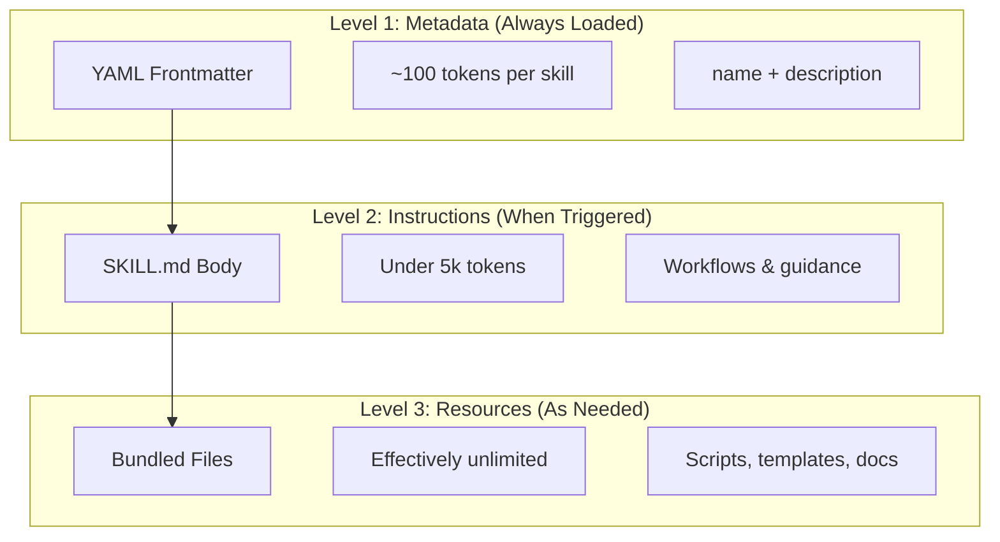
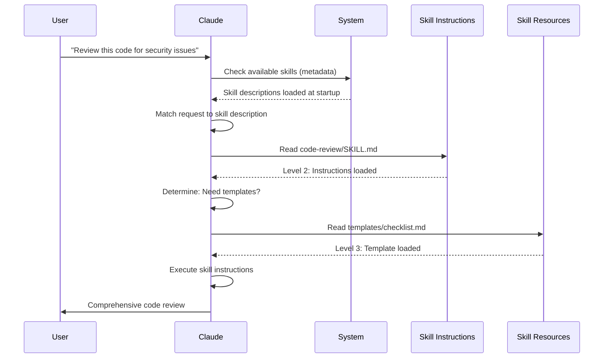

<picture>
  <source media="(prefers-color-scheme: dark)" srcset="../resources/logos/claude-howto-logo-dark.svg">
  
</picture>

# 代理 技能 指南

代理 技能 are reusable, filesystem-based capabilities that extend Claude's functionality. They package domain-specific expertise, workflows, and 最佳实践 into discoverable components that Claude automatically uses when relevant.

## 概览

**Agent Skills** are modular capabilities that transform general-purpose agents into specialists. Unlike prompts (conversation-level instructions for one-off tasks), Skills load on-demand and eliminate the need to repeatedly provide the same guidance across multiple conversations.

### 核心优势

- **Specialize Claude**: Tailor capabilities for domain-specific tasks
- **Reduce repetition**: 创建 once, use automatically across conversations
- **Compose capabilities**: Combine 技能 to 构建 complex workflows
- **Scale workflows**: Reuse 技能 across multiple projects and teams
- **Maintain 质量**: Embed 最佳实践 directly into your workflow

技能 follow the [代理 技能](https://agentskills.io) open 标准, which works across multiple AI tools. Claude Code extends the 标准 with additional features like invocation control, 子代理 execution, and dynamic context injection.

> **Note**: Custom slash commands have been merged into skills. `.claude/commands/` files still work and support the same frontmatter fields. Skills are recommended for new development. When both exist at the same path (e.g., `.claude/commands/review.md` and `.claude/skills/review/SKILL.md`), the skill takes precedence.

## How 技能 Work: Progressive Disclosure

技能 leverage a **progressive disclosure** 架构—Claude loads information in stages as needed, rather than consuming context upfront. This enables efficient context management while maintaining unlimited 可扩展性.

### Three Levels of Loading



|  | Level | When Loaded | Token Cost | Content |  |
|  | ------- | ------------ | ------------ | --------- |  |
|  | **Level 1: Metadata** | Always (at startup) | ~100 tokens per 技能 | `name` and `描述` from YAML frontmatter |  |
|  | **Level 2: Instructions** | When 技能 is triggered | Under 5k tokens | 技能.md body with instructions and guidance |  |
|  | **Level 3+: 资源** | As needed | Effectively unlimited | Bundled files executed via bash without loading contents into context |  |

This means you can 安装 many 技能 without context penalty—Claude only knows each 技能 exists and 何时使用 it until actually triggered.

## 技能 Loading Process



## 技能 Types & Locations

|  | 类型 | 位置 | 作用域 | Shared | Best For |  |
|  | ------ | ---------- | ------- | -------- | ---------- |  |
|  | **Enterprise** | Managed settings | All org users | Yes | Organization-wide standards |  |
|  | **Personal** | `~/.claude/技能/<技能-name>/技能.md` | Individual | No | Personal workflows |  |
|  | **项目** | `.claude/技能/<技能-name>/技能.md` | 团队 | Yes (via git) | 团队 standards |  |
|  | **插件** | `<插件>/技能/<技能-name>/技能.md` | Where enabled | Depends | Bundled with 插件 |  |

When 技能 share the same name across levels, higher-priority locations win: **enterprise > personal > 项目**. 插件 技能 use a `插件-name:技能-name` namespace, so they cannot conflict.

### Automatic Discovery

**Nested directories**: When you work with files in subdirectories, Claude Code automatically discovers skills from nested `.claude/skills/` directories. For example, if you're editing a file in `packages/frontend/`, Claude Code also looks for skills in `packages/frontend/.claude/skills/`. This supports monorepo setups where packages have their own skills.

**`--add-dir` directories**: Skills from directories added via `--add-dir` are loaded automatically with live change detection. Any edits to skill files in those directories take effect immediately without restarting Claude Code.

**Description budget**: Skill descriptions (Level 1 metadata) are capped at **1% of the context window** (fallback: **8,000 characters**). If you have many skills installed, descriptions may be shortened. All skill names are always included, but descriptions are trimmed to fit. Front-load the key use case in descriptions. Override the budget with the `SLASH_COMMAND_TOOL_CHAR_BUDGET` environment variable.

## 创建 自定义 技能

### Basic Directory Structure

```
my-skill/
├── SKILL.md           #  Main instructions (必需)
├── template.md        #  Template for Claude to fill in
├── examples/
│   └── sample.md      #  示例 output showing expected 格式
└── scripts/
    └── validate.sh    #  Script Claude can execute
```

### 技能.md 格式

```yaml
---
name: your-skill-name
description: Brief description of what this Skill does and when to use it
---

#  Your 技能 Name

# # Instructions
Provide clear, step-by-step guidance for Claude.

# # 示例
Show concrete examples of using this Skill.
```

### 必需 Fields

- **name**: lowercase letters, numbers, hyphens only (max 64 characters). Cannot contain "anthropic" or "claude".
- **描述**: what the 技能 does AND 何时使用 it (max 1024 characters). This is critical for Claude to know when to activate the 技能.

### 可选 Frontmatter Fields

```yaml
---
name: my-skill
description: What this skill does and when to use it
argument-hint: "[filename] [format]"        #  Hint for autocomplete
disable-model-invocation: true              #  Only 用户 can invoke
user-invocable: false                       #  Hide from slash menu
allowed-tools: Read, Grep, Glob             #  Restrict tool access
model: opus                                 #  Specific model to use
effort: high                                #  Effort level override (low, medium, high, max)
context: fork                               #  Run in isolated 子代理
agent: Explore                              #  Which 代理 类型 (with context: fork)
shell: bash                                 #  Shell for commands: bash (默认) or powershell
hooks:                                      #  技能-scoped 钩子
  PreToolUse:
    - matcher: "Bash"
      hooks:
        - type: command
          command: "./scripts/validate.sh"
paths: "src/api/**/*.ts"               #  Glob patterns limiting when 技能 activates
---
```

|  | Field | 描述 |  |
|  | ------- | ------------- |  |
|  | `name` | Lowercase letters, numbers, hyphens only (max 64 chars). Cannot contain "anthropic" or "claude". |  |
|  | `描述` | What the 技能 does AND 何时使用 it (max 1024 chars). Critical for auto-invocation matching. |  |
|  | `argument-hint` | Hint shown in the `/` autocomplete menu (e.g., `"[filename] [格式]"`). |  |
|  | `禁用-model-invocation` | `true` = only the 用户 can invoke via `/name`. Claude will never auto-invoke. |  |
|  | `用户-invocable` | `false` = hidden from the `/` menu. Only Claude can invoke it automatically. |  |
|  | `allowed-tools` | Comma-separated list of tools the 技能 may use without permission prompts. |  |
|  | `model` | Model override while the 技能 is active (e.g., `opus`, `sonnet`). |  |
|  | `effort` | Effort level override while the 技能 is active: `low`, `medium`, `high`, or `max`. |  |
|  | `context` | `fork` to run the 技能 in a forked 子代理 context with its own 上下文窗口. |  |
|  | `代理` | 子代理 类型 when `context: fork` (e.g., `Explore`, `Plan`, `general-purpose`). |  |
|  | `shell` | Shell used for `!`command`` substitutions and scripts: `bash` (默认) or `powershell`. |  |
|  | `钩子` | 钩子 scoped to this 技能's lifecycle (same 格式 as global 钩子). |  |
|  | `paths` | Glob patterns that limit when the 技能 is auto-activated. Comma-separated string or YAML list. Same 格式 as path-specific rules. |  |

## 技能 Content Types

技能 can contain two types of content, each suited for different purposes:

### 参考 Content

Adds knowledge Claude applies to your current work—conventions, patterns, style guides, domain knowledge. Runs inline with your conversation context.

```yaml
---
name: api-conventions
description: API design patterns for this codebase
---

When writing API endpoints:
- Use RESTful naming conventions
- Return consistent error formats
- Include request validation
```

### Task Content

Step-by-step instructions for specific actions. Often invoked directly with `/技能-name`.

```yaml
---
name: deploy
description: Deploy the application to production
context: fork
disable-model-invocation: true
---

Deploy the application:
1. Run the test suite
2. Build the application
3. Push to the deployment target
```

## Controlling 技能 Invocation

By 默认, both you and Claude can invoke any 技能. Two frontmatter fields control the three invocation modes:

|  | Frontmatter | You can invoke | Claude can invoke |  |
|  | --- | --- | --- |  |
|  | (默认) | Yes | Yes |  |
|  | `禁用-model-invocation: true` | Yes | No |  |
|  | `用户-invocable: false` | No | Yes |  |

**Use `disable-model-invocation: true`** for workflows with side effects: `/commit`, `/deploy`, `/send-slack-message`. You don't want Claude deciding to deploy because your code looks ready.

**Use `user-invocable: false`** for background knowledge that isn't actionable as a command. A `legacy-system-context` skill explains how an old system works—useful for Claude, but not a meaningful action for users.

## String Substitutions

技能 支持 dynamic values that are resolved before the 技能 content reaches Claude:

|  | Variable | 描述 |  |
|  | ---------- | ------------- |  |
|  | `$ARGUMENTS` | All arguments passed when invoking the 技能 |  |
|  | `$ARGUMENTS[N]` or `$N` | Access specific argument by index (0-based) |  |
|  | `${CLAUDE_SESSION_ID}` | Current session ID |  |
|  | `${CLAUDE_SKILL_DIR}` | Directory containing the 技能's 技能.md file |  |
|  | `` !`command` `` | Dynamic context injection — runs a shell command and inlines the output |  |

**Example:**

```yaml
---
name: fix-issue
description: Fix a GitHub issue
---

Fix GitHub issue $ARGUMENTS following our coding standards.
1. Read the issue description
2. Implement the fix
3. Write tests
4. Create a commit
```

Running `/fix-问题 123` replaces `$ARGUMENTS` with `123`.

## Injecting Dynamic Context

The `!`command`` syntax runs shell commands before the 技能 content is sent to Claude:

```yaml
---
name: pr-summary
description: Summarize changes in a pull request
context: fork
agent: Explore
---

# # Pull request context
- PR diff: !`gh pr diff`
- PR comments: !`gh pr view --comments`
- Changed files: !`gh pr diff --name-only`

# # Your task
Summarize this pull request...
```

Commands execute immediately; Claude only sees the final output. By 默认, commands run in `bash`. Set `shell: powershell` in frontmatter to use PowerShell instead.

## Running 技能 in 子代理（子代理）

Add `context: fork` to run a 技能 in an isolated 子代理 context. The 技能 content becomes the task for a dedicated 子代理 with its own 上下文窗口, keeping the main conversation uncluttered.

The `代理` field specifies which 代理 类型 to use:

|  | 代理 类型 | Best For |  |
|  | --- | --- |  |
|  | `Explore` | Read-only research, codebase analysis |  |
|  | `Plan` | 创建 implementation plans |  |
|  | `general-purpose` | Broad tasks requiring all tools |  |
|  | 自定义 agents | Specialized agents defined in your 配置 |  |

**Example frontmatter:**

```yaml
---
context: fork
agent: Explore
---
```

**Full skill example:**

```yaml
---
name: deep-research
description: Research a topic thoroughly
context: fork
agent: Explore
---

Research $ARGUMENTS thoroughly:
1. Find relevant files using Glob and Grep
2. Read and analyze the code
3. Summarize findings with specific file references
```

## Practical 示例

### 示例 1: Code Review 技能

**Directory Structure:**

```
~/.claude/skills/code-review/
├── SKILL.md
├── templates/
│   ├── review-checklist.md
│   └── finding-template.md
└── scripts/
    ├── analyze-metrics.py
    └── compare-complexity.py
```

**File:** `~/.claude/skills/code-review/SKILL.md`

```yaml
---
name: code-review-specialist
description: Comprehensive code review with security, performance, and quality analysis. Use when users ask to review code, analyze code quality, evaluate pull requests, or mention code review, security analysis, or performance optimization.
---

#  Code Review 技能

This skill provides comprehensive code review capabilities focusing on:

1. **Security Analysis**
   - Authentication/authorization issues
   - Data exposure risks
   - Injection vulnerabilities
   - Cryptographic weaknesses

2. **Performance Review**
   - Algorithm efficiency (Big O analysis)
   - Memory optimization
   - Database query optimization
   - Caching opportunities

3. **Code Quality**
   - SOLID principles
   - Design patterns
   - Naming conventions
   - Test coverage

4. **Maintainability**
   - Code readability
   - Function size (should be < 50 lines)
   - Cyclomatic complexity
   - Type safety

# # Review Template

For each piece of code reviewed, provide:

# ## Summary
- Overall quality assessment (1-5)
- Key findings count
- Recommended priority areas

# ## Critical Issues (if any)
- **Issue**: Clear description
- **Location**: File and line number
- **Impact**: Why this matters
- **Severity**: Critical/High/Medium
- **Fix**: Code example

For detailed checklists, see [templates/review-checklist.md](templates/review-checklist.md).
```

### 示例 2: Codebase Visualizer 技能

A 技能 that generates interactive HTML visualizations:

**Directory Structure:**

```
~/.claude/skills/codebase-visualizer/
├── SKILL.md
└── scripts/
    └── visualize.py
```

**File:** `~/.claude/skills/codebase-visualizer/SKILL.md`

````yaml
---
name: codebase-visualizer
description: Generate an interactive collapsible tree visualization of your codebase. Use when exploring a new repo, understanding project structure, or identifying large files.
allowed-tools: Bash(python *)
---

#  Codebase Visualizer

Generate an interactive HTML tree view showing your project's file structure.

# # 使用方法

Run the visualization script from your project root:

```bash
python ~/.claude/技能/codebase-visualizer/scripts/visualize.py .
```

This creates `codebase-map.html` and opens it in your default browser.

# # What the visualization shows

- **Collapsible directories**: Click folders to expand/collapse
- **File sizes**: Displayed next to each file
- **Colors**: Different colors for different file types
- **Directory totals**: Shows aggregate size of each folder
````

The bundled Python script does the heavy lifting while Claude handles orchestration.

### 示例 3: 部署 技能 (用户-Invoked Only)

```yaml
---
name: deploy
description: Deploy the application to production
disable-model-invocation: true
allowed-tools: Bash(npm *), Bash(git *)
---

Deploy $ARGUMENTS to production:

1. Run the test suite: `npm test`
2. Build the application: `npm run build`
3. Push to the deployment target
4. Verify the deployment succeeded
5. Report deployment status
```

### 示例 4: Brand Voice 技能 (Background Knowledge)

```yaml
---
name: brand-voice
description: Ensure all communication matches brand voice and tone guidelines. Use when creating marketing copy, customer communications, or public-facing content.
user-invocable: false
---

# # Tone of Voice
- **Friendly but professional** - approachable without being casual
- **Clear and concise** - avoid jargon
- **Confident** - we know what we're doing
- **Empathetic** - understand user needs

# # Writing Guidelines
- Use "you" when addressing readers
- Use active voice
- Keep sentences under 20 words
- Start with value proposition

For templates, see [templates/](templates/).
```

### 示例 5: CLAUDE.md Generator 技能

```yaml
---
name: claude-md
description: Create or update CLAUDE.md files following best practices for optimal AI agent onboarding. Use when users mention CLAUDE.md, project documentation, or AI onboarding.
---

# # Core Principles

**LLMs are stateless**: CLAUDE.md is the only file automatically included in every conversation.

# ## The Golden Rules

1. **Less is More**: Keep under 300 lines (ideally under 100)
2. **Universal Applicability**: Only include information relevant to EVERY session
3. **Don't Use Claude as a Linter**: Use deterministic tools instead
4. **Never Auto-Generate**: Craft it manually with careful consideration

# # Essential Sections

- **Project Name**: Brief one-line description
- **Tech Stack**: Primary language, frameworks, database
- **Development Commands**: Install, test, build commands
- **Critical Conventions**: Only non-obvious, high-impact conventions
- **Known Issues / Gotchas**: Things that trip up developers
```

### 示例 6: Refactoring 技能 with Scripts

**Directory Structure:**

```
refactor/
├── SKILL.md
├── references/
│   ├── code-smells.md
│   └── refactoring-catalog.md
├── templates/
│   └── refactoring-plan.md
└── scripts/
    ├── analyze-complexity.py
    └── detect-smells.py
```

**File:** `refactor/SKILL.md`

```yaml
---
name: code-refactor
description: Systematic code refactoring based on Martin Fowler's methodology. Use when users ask to refactor code, improve code structure, reduce technical debt, or eliminate code smells.
---

#  Code Refactoring 技能

A phased approach emphasizing safe, incremental changes backed by tests.

# # Workflow

Phase 1: Research & Analysis → Phase 2: Test Coverage Assessment →
Phase 3: Code Smell Identification → Phase 4: Refactoring Plan Creation →
Phase 5: Incremental Implementation → Phase 6: Review & Iteration

# # Core Principles

1. **Behavior Preservation**: External behavior must remain unchanged
2. **Small Steps**: Make tiny, testable changes
3. **Test-Driven**: Tests are the safety net
4. **Continuous**: Refactoring is ongoing, not a one-time event

For code smell catalog, see [references/code-smells.md](references/code-smells.md).
For refactoring techniques, see [references/refactoring-catalog.md](references/refactoring-catalog.md).
```

## Supporting Files

技能 can include multiple files in their directory beyond `技能.md`. These supporting files (templates, 示例, scripts, 参考 documents) let you keep the main 技能 file focused while providing Claude with additional 资源 it can load as needed.

```
my-skill/
├── SKILL.md              #  Main instructions (必需, keep under 500 lines)
├── templates/            #  Templates for Claude to fill in
│   └── output-format.md
├── examples/             #  示例 outputs showing expected 格式
│   └── sample-output.md
├── references/           #  Domain knowledge and specifications
│   └── api-spec.md
└── scripts/              #  Scripts Claude can execute
    └── validate.sh
```

Guidelines for supporting files:

- Keep `技能.md` under **500 lines**. Move detailed 参考 material, large 示例, and specifications to separate files.
- 参考 additional files from `技能.md` 使用 **relative paths** (e.g., `[API 参考](references/API-spec.md)`).
- Supporting files are loaded at Level 3 (as needed), so they do not consume context until Claude actually reads them.

## 管理 技能

### Viewing Available 技能

Ask Claude directly:
```
What Skills are available?
```

Or check the filesystem:
```bash
#  List personal 技能
ls ~/.claude/skills/

#  List 项目 技能
ls .claude/skills/
```

### Testing a 技能

Two ways to 测试:

**Let Claude invoke it automatically** by asking something that matches the description:
```
Can you help me review this code for security issues?
```

**Or invoke it directly** with the skill name:
```
/code-review src/auth/login.ts
```

### Updating a 技能

Edit the `技能.md` file directly. Changes take effect on next Claude Code startup.

```bash
#  Personal 技能
code ~/.claude/skills/my-skill/SKILL.md

#  项目 技能
code .claude/skills/my-skill/SKILL.md
```

### Restricting Claude's 技能 Access

Three ways to control which 技能 Claude can invoke:

**Disable all skills** in `/permissions`:
```
#  Add to deny rules:
Skill
```

**Allow or deny specific skills**:
```
#  Allow only specific 技能
Skill(commit)
Skill(review-pr *)

#  Deny specific 技能
Skill(deploy *)
```

**Hide individual skills** by adding `disable-model-invocation: true` to their frontmatter.

## 最佳实践

### 1. Make Descriptions Specific

- **Bad (Vague)**: "Helps with documents"
- **Good (Specific)**: "Extract text and tables from PDF files, fill forms, merge documents. Use when working with PDF files or when the 用户 mentions PDFs, forms, or document extraction."

### 2. Keep 技能 Focused

- One 技能 = one capability
- ✅ "PDF form filling"
- ❌ "Document processing" (too broad)

### 3. Include Trigger Terms

Add keywords in descriptions that match 用户 requests:
```yaml
description: Analyze Excel spreadsheets, generate pivot tables, create charts. Use when working with Excel files, spreadsheets, or .xlsx files.
```

### 4. Keep 技能.md Under 500 Lines

Move detailed 参考 material to separate files that Claude loads as needed.

### 5. 参考 Supporting Files

```markdown
# # Additional 资源

- For complete API details, see [reference.md](reference.md)
- For usage examples, see [examples.md](examples.md)
```

### Do's

- Use clear, descriptive names
- Include comprehensive instructions
- Add concrete 示例
- Package related scripts and templates
- 测试 with real scenarios
- Document dependencies

### Don'ts

- Don't 创建 技能 for one-time tasks
- Don't duplicate existing functionality
- Don't make 技能 too broad
- Don't skip the 描述 field
- Don't 安装 技能 from untrusted sources without auditing

## 故障排除

### Quick 参考

|  | 问题 | Solution |  |
|  | ------- | ---------- |  |
|  | Claude doesn't use 技能 | Make 描述 more specific with trigger terms |  |
|  | 技能 file not found | Verify path: `~/.claude/技能/name/技能.md` |  |
|  | YAML errors | Check `---` markers, indentation, no tabs |  |
|  | 技能 conflict | Use distinct trigger terms in descriptions |  |
|  | Scripts not running | Check permissions: `chmod +x scripts/*.py` |  |
|  | Claude doesn't see all 技能 | Too many 技能; check `/context` for warnings |  |

### 技能 Not Triggering

If Claude doesn't use your 技能 when expected:

1. Check the 描述 includes keywords users would naturally say
2. Verify the 技能 appears when asking "What 技能 are available?"
3. Try rephrasing your request to match the 描述
4. Invoke directly with `/技能-name` to 测试

### 技能 Triggers Too Often

If Claude uses your 技能 when you don't want it:

1. Make the 描述 more specific
2. Add `禁用-model-invocation: true` for 手册-only invocation

### Claude Doesn't See All 技能

技能 descriptions are loaded at **1% of the 上下文窗口** (fallback: **8,000 characters**). Each entry is capped at 250 characters regardless of budget. Run `/context` to check for warnings about excluded 技能. Override the budget with the `SLASH_COMMAND_TOOL_CHAR_BUDGET` environment variable.

## 安全性 Considerations

**Only use Skills from trusted sources.** Skills provide Claude with capabilities through instructions and code—a malicious Skill can direct Claude to invoke tools or execute code in harmful ways.

**Key security considerations:**

- **Audit thoroughly**: Review all files in the 技能 directory
- **External sources are risky**: 技能 that fetch from external URLs can be compromised
- **Tool misuse**: Malicious 技能 can invoke tools in harmful ways
- **Treat like installing software**: Only use 技能 from trusted sources

### Disabling shell substitution in 技能

技能 支持 the `` !`command` `` syntax to inject the output of shell commands into the prompt before Claude sees it. In 安全性-sensitive environments (shared enterprise deployments, locked-down CI runners) you can 禁用 this substitution entirely via the `disableSkillShellExecution` setting (added in **v2.1.91**):

```jsonc
// ~/.claude/settings.json or managed policy
{
  "disableSkillShellExecution": true
}
```

When `disableSkillShellExecution` is `true`, any `` !`command` `` markers in a 技能 are left as literal text instead of being executed — removing the 技能-level shell-injection attack surface without disabling 技能 themselves. Consider combining this with an `allowedTools` allowlist for defense in depth.

## 技能 vs Other Features

|  | 功能 | Invocation | Best For |  |
|  | --------- | ------------ | ---------- |  |
|  | **技能** | Auto or `/name` | Reusable expertise, workflows |  |
|  | **Slash Commands** | 用户-initiated `/name` | Quick shortcuts (merged into 技能) |  |
|  | **子代理（子代理）** | Auto-delegated | Isolated task execution |  |
|  | **记忆 (CLAUDE.md)** | Always loaded | Persistent 项目 context |  |
|  | **MCP** | Real-time | External data/service access |  |
|  | **钩子** | Event-driven | Automated side effects |  |

## Bundled 技能

Claude Code ships with several 内置 技能 that are always available without 安装:

|  | 技能 | 描述 |  |
|  | ------- | ------------- |  |
|  | `/simplify` | Review changed files for reuse, 质量, and efficiency; spawns 3 parallel review agents |  |
|  | `/batch <instruction>` | Orchestrate large-scale parallel changes across codebase 使用 git worktrees |  |
|  | `/调试 [描述]` | Troubleshoot current session by reading 调试 log |  |
|  | `/loop [interval] <prompt>` | Run prompt repeatedly on interval (e.g., `/loop 5m check the 部署`) |  |
|  | `/claude-API` | Load Claude API/SDK 参考; auto-activates on `anthropic`/`@anthropic-ai/sdk` imports |  |

These 技能 are available out-of-the-box and do not need to be installed or configured. They follow the same 技能.md 格式 as 自定义 技能.

## Sharing 技能

### 项目 技能 (团队 Sharing)

1. 创建 技能 in `.claude/技能/`
2. 提交 to git
3. 团队 members pull changes — 技能 available immediately

### Personal 技能

```bash
#  Copy to personal directory
cp -r my-skill ~/.claude/skills/

#  Make scripts executable
chmod +x ~/.claude/skills/my-skill/scripts/*.py
```

### 插件 Distribution

Package 技能 in a 插件's `技能/` directory for broader distribution.

## Going Further: A 技能 Collection and a 技能 Manager

Once you 启动 building 技能 seriously, two things become essential: a library of proven 技能 and a tool to manage them.

**[luongnv89/skills](https://github.com/luongnv89/skills)** — A collection of skills I use daily across almost all my projects. Highlights include `logo-designer` (generates project logos on the fly) and `ollama-optimizer` (tunes local LLM performance for your hardware). Great starting point if you want ready-to-use skills.

**[luongnv89/asm](https://github.com/luongnv89/asm)** — Agent Skill Manager. Handles skill development, duplicate detection, and testing. The `asm link` command lets you test a skill in any project without copying files around — essential once you have more than a handful of skills.

## Additional 资源

- [Official 技能 文档](https://code.claude.com/docs/en/技能)
- [代理 技能 架构 Blog](https://claude.com/blog/equipping-agents-for-the-real-world-with-代理-技能)
- [技能 仓库](https://github.com/luongnv89/技能) - Collection of ready-to-use 技能
- [Slash Commands 指南](../01-slash-commands/) - 用户-initiated shortcuts
- [子代理（子代理） 指南](../04-子代理（子代理）/) - Delegated AI agents
- [记忆 指南](../02-记忆/) - Persistent context
- [MCP (Model Context 协议)](../05-mcp/) - Real-time external data
- [钩子 指南](../06-钩子/) - Event-driven automation

---
**Last Updated**: April 24, 2026
**Claude Code Version**: 2.1.119
**Sources**:
- https://code.claude.com/docs/en/技能
- https://code.claude.com/docs/en/settings
- https://code.claude.com/docs/en/changelog
**Compatible Models**: Claude Sonnet 4.6, Claude Opus 4.7, Claude Haiku 4.5
