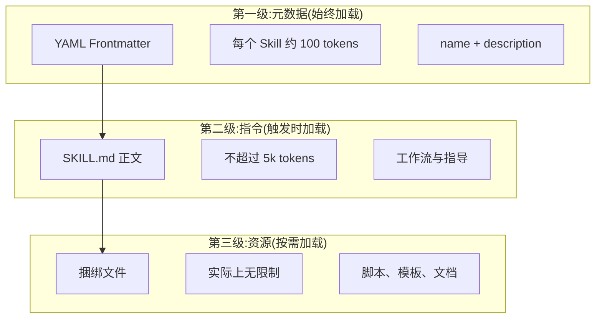
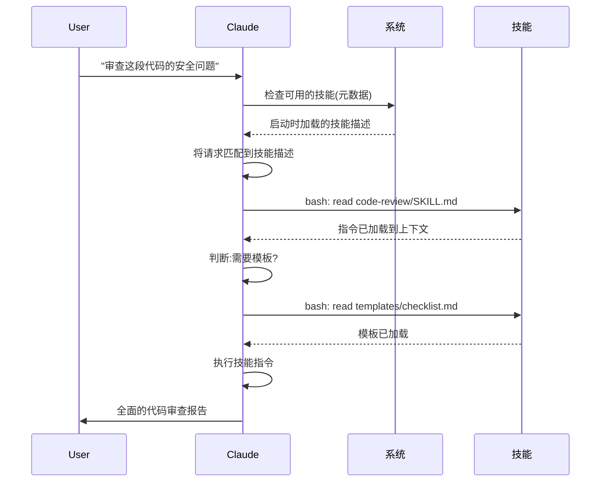

<picture>
  <source media="(prefers-color-scheme: dark)" srcset="../resources/logos/claude-howto-logo-dark.svg">
  
</picture>

# Agent Skills（技能）指南

Agent Skills 是可复用的、基于文件系统的能力扩展，它们将领域专业知识、工作流和最佳实践打包成 Claude 在相关场景下自动使用的可发现组件。

## 概览

**Agent Skills（代理技能）** 是将通用代理转化为领域专家的模块化能力。与 Prompt（用于一次性任务的对话级指令）不同，Skills 按需加载，无需在多个对话中反复提供相同的指导。

### 核心优势

- **专业化定制**：为特定领域的任务量身定制能力
- **减少重复**：一次创建，跨对话自动使用
- **组合能力**：将多个 Skills 组合构建复杂工作流
- **规模化复用**：在多个项目和团队间共享 Skills
- **质量保障**：将最佳实践直接嵌入工作流

Skills 遵循 [Agent Skills](https://agentskills.io) 开放标准，该标准适用于多种 AI 工具。Claude Code 在标准基础上扩展了调用控制、子代理执行和动态上下文注入等附加功能。

> **注意**：自定义斜杠命令已合并到 Skills 中。`.claude/commands/` 文件仍然可用且支持相同的 frontmatter 字段。推荐新开发使用 Skills。当两者同时存在于同一路径时（如 `.claude/commands/review.md` 和 `.claude/skills/review/SKILL.md`），Skill 优先。

## Skills 工作原理：渐进式加载

Skills 采用**渐进式披露（Progressive Disclosure）**架构——Claude 按需分阶段加载信息，而非预先消耗全部上下文。这实现了高效的上下文管理，同时保持无限的可扩展性。

### 三级加载机制



| 级别 | 加载时机 | Token 开销 | 内容 |
|------|----------|-----------|------|
| **第一级：元数据** | 始终（启动时） | 每个 Skill 约 100 tokens | YAML frontmatter 中的 `name` 和 `description` |
| **第二级：指令** | Skill 被触发时 | 不超过 5k tokens | SKILL.md 正文中的指令和指导 |
| **第三级+：资源** | 按需 | 实际上无限制 | 通过 bash 执行的捆绑文件，不加载内容到上下文 |

这意味着你可以安装大量 Skills 而不会产生上下文开销——在被实际触发之前，Claude 只知道每个 Skill 的存在和使用时机。

## Skill 加载流程



## Skill 类型与位置

| 类型 | 位置 | 作用域 | 是否共享 | 最适用于 |
|------|--------|-------|---------|----------|
| **企业级** | 托管设置 | 所有组织用户 | 是 | 组织范围的标准 |
| **个人级** | `~/.claude/skills/<skill-name>/SKILL.md` | 个人 | 否 | 个人工作流 |
| **项目级** | `.claude/skills/<skill-name>/SKILL.md` | 团队 | 是（通过 git） | 团队规范 |
| **插件级** | `<plugin>/skills/<skill-name>/SKILL.md` | 启用处 | 取决于插件 | 随插件捆绑 |

当不同层级存在同名 Skill 时，高优先级位置获胜：**企业 > 个人 > 项目**。Plugin Skills 使用 `plugin-name:skill-name` 命名空间，不会冲突。

### 自动发现

**嵌套目录**：当你在子目录中工作时，Claude Code 会自动从嵌套的 `.claude/skills/` 目录中发现技能。例如，如果你正在编辑 `packages/frontend/` 中的文件，Claude Code 也会在 `packages/frontend/.claude/skills/` 中查找技能。这支持了 monorepo 中各包拥有自己技能的场景。

**`--add-dir` 目录**：通过 `--add-dir` 添加的目录中的技能会自动加载，并支持实时变更检测。对这些目录中技能文件的任何修改都会立即生效，无需重启 Claude Code。

**描述预算**：Skill 描述（第一级元数据）上限为**上下文窗口的 2%**（回退值：**16,000 字符**）。如果安装了很多 Skill，部分可能会被排除。运行 `/context` 检查是否有警告。可通过 `SLASH_COMMAND_TOOL_CHAR_BUDGET` 环境变量覆盖此预算。

## 创建自定义 Skills

### 基本目录结构

```
my-skill/
├── SKILL.md           # 主指令文件（必需）
├── template.md        # Claude 填写的模板
├── examples/
│   └── sample.md      # 展示预期格式的示例输出
└── scripts/
    └── validate.sh    # Claude 可执行的脚本
```

### SKILL.md 格式

SKILL.md 使用 YAML frontmatter 定义元数据，后跟 Markdown 指令正文：

```yaml
---
name: code-review
description: 全面代码审查，检查质量、安全性和性能
autoInvoke:
  - "review this code"
  - "check for bugs"
  - "code quality"
effort: high
shell: bash
---

# 代码审查技能

你是一个专业的代码审查专家...

## 审查流程
...
```

### 可用的 Frontmatter 字段

| 字段 | 类型 | 说明 |
|------|------|------|
| `name` | string | 技能显示名称 |
| `description` | string | 功能描述（用于自动匹配） |
| `autoInvoke` | array | 自动触发的关键词列表 |
| `effort` | string | 推理努力级别：`low`、`medium`、`high`、`max` |
| `shell` | string | 脚本使用的 Shell：`bash`、`zsh`、`sh` |

> 💡 **中文开发者提示**：Skills 是实现团队自动化工作流的核心机制。建议从 code-review 这个最实用的技能开始尝试，熟悉 SKILL.md 的编写方式后再创建自定义技能。注意 `autoInvoke` 字段中的关键词决定了 Claude 何时自动调用你的技能，要精心设计这些触发词。

---

**最后更新**：2026 年 3 月
