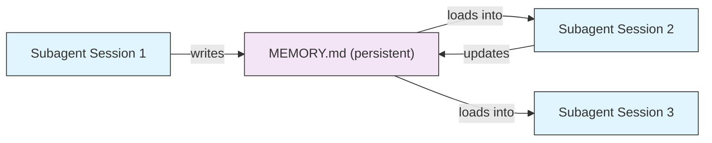
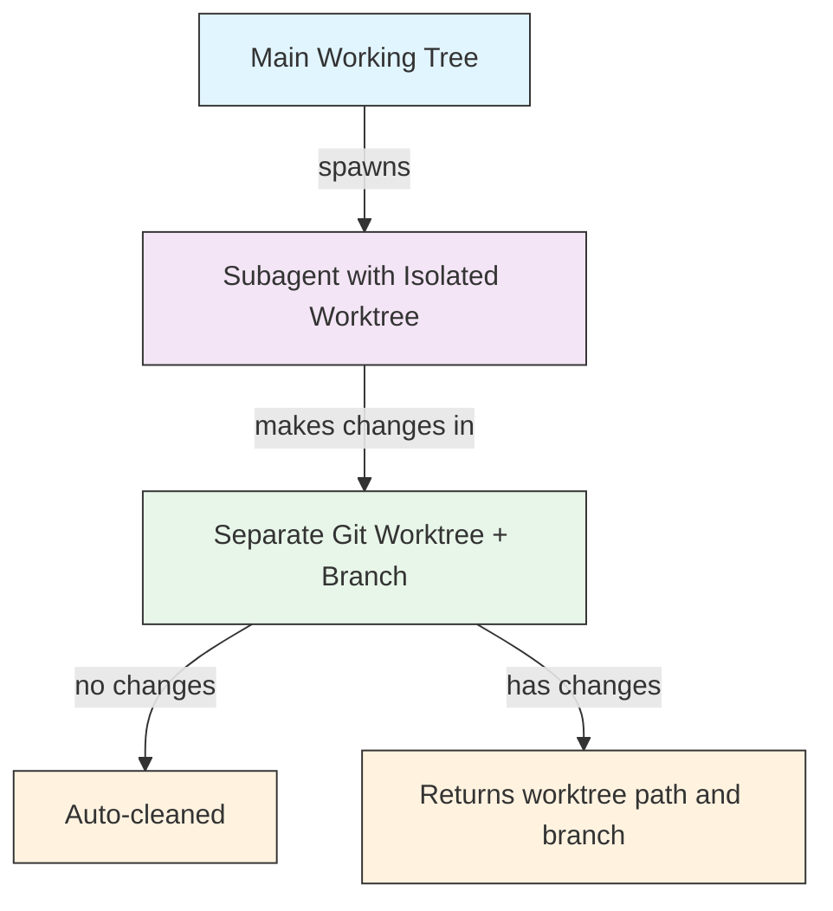
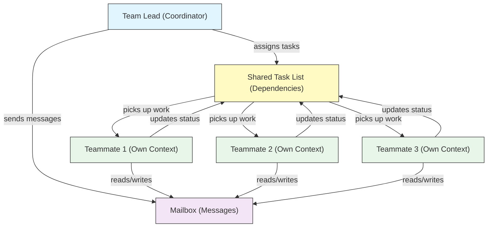
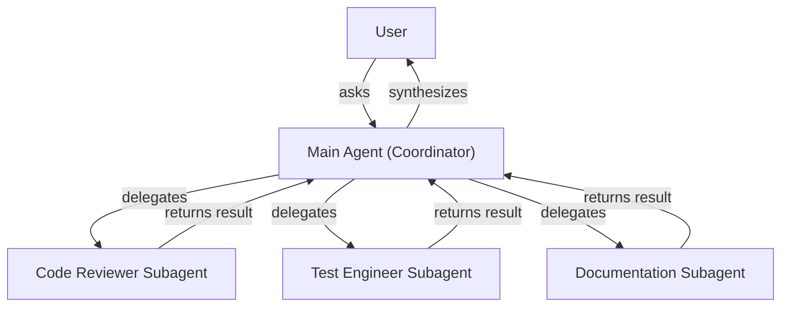
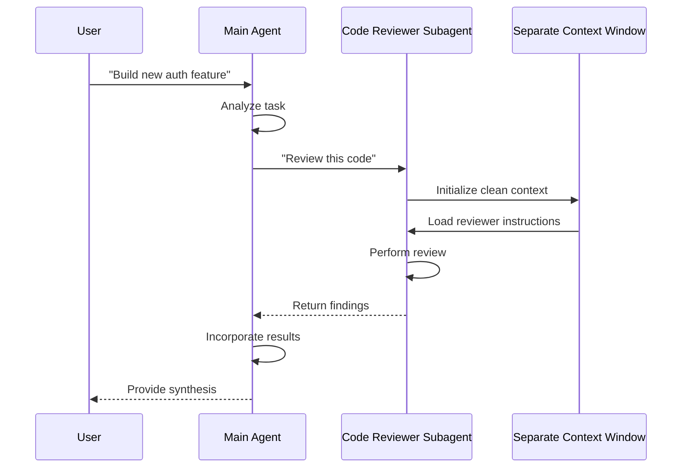
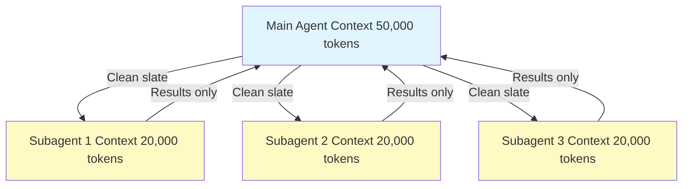
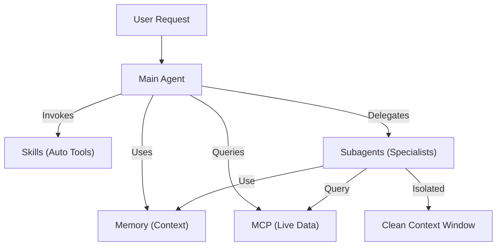

<picture>
  <source media="(prefers-color-scheme: dark)" srcset="../resources/logos/claude-howto-logo-dark.svg">
  
</picture>

# Subagents（子代理）— 完整参考指南

Subagents 是 Claude Code 可以委派任务给它的专用 AI 助手。每个子代理都有特定用途，使用独立于主对话的上下文窗口，并可配置特定的工具和自定义系统提示词。

## 目录

1. [概览](#概览)
2. [核心优势](#核心优势)
3. [文件位置](#文件位置)
4. [配置](#配置)
5. [内置子代理](#内置子代理)
6. [管理子代理](#管理子代理)
7. [使用子代理](#使用子代理)
8. [可恢复代理](#可恢复代理)
9. [链式子代理](#链式子代理)
10. [子代理持久化记忆](#子代理持久化记忆)
11. [后台子代理](#后台子代理)
12. [Worktree 隔离](#worktree-隔离)
13. [限制可生成的子代理](#限制可生成的子代理)
14. [`claude agents` CLI 命令](#claude-agents-cli-命令)
15. [Agent Teams（实验性）](#agent-teams实验性)
16. [插件子代理安全](#插件子代理安全)
17. [架构](#架构)
18. [上下文管理](#上下文管理)
19. [何时使用子代理](#何时使用子代理)
20. [最佳实践](#最佳实践)
21. [本文件夹中的示例子代理](#本文件夹中的示例子代理)
22. [安装说明](#安装说明)
23. [相关概念](#相关概念)

---

## 概览

Subagents 通过以下方式实现 Claude Code 中的委派式任务执行：

- 创建具有**独立上下文窗口**的隔离 AI 助手
- 提供用于**专业化能力的定制系统提示词**
- 强制执行**工具访问控制**以限制能力
- 防止复杂任务造成的**上下文污染**
- 实现**多个专业任务的并行执行**

每个子代理以干净的状态独立运行，仅接收其任务所需的特定上下文，然后将结果返回给主代理进行综合。

**快速开始**：使用 `/agents` 命令以交互方式创建、查看、编辑和管理你的子代理。

---

## 核心优势

| 优势 | 说明 |
|------|------|
| **上下文隔离** | 在独立的上下文中运行，避免污染主对话 |
| **专业化能力** | 针对特定领域微调，成功率更高 |
| **可复用性** | 跨不同项目使用并与团队共享 |
| **灵活权限** | 不同子代理类型可配置不同的工具访问级别 |
| **可扩展性** | 多个代理可同时处理不同方面的工作 |

---

## 文件位置

子代理文件可存储在多个位置，对应不同的作用域：

| 优先级 | 类型 | 位置 | 作用域 |
|--------|------|--------|-------|
| 1（最高） | **CLI 定义** | 通过 `--agents` 标志（JSON 格式） | 仅当前会话 |
| 2 | **项目子代理** | `.claude/agents/` | 当前项目 |
| 3 | **用户子代理** | `~/.claude/agents/` | 所有项目 |
| 4（最低） | **插件代理** | 插件的 `agents/` 目录 | 通过插件 |

当存在重名时，高优先级的源优先。

---

## 配置

### 文件格式

子代理通过 YAML frontmatter 定义元数据，后跟 Markdown 格式的系统提示词：

```yaml
---
name: your-sub-agent-name
description: 该子代理被调用场景的描述
tools: tool1, tool2, tool3  # 可选 - 省略时继承所有工具
disallowedTools: tool4  # 可选 - 明确禁止的工具
model: sonnet  # 可选 - sonnet, opus, haiku, 或继承当前模型
permissionMode: default  # 可选 - 权限模式
maxTurns: 20  # 可选 - 限制代理轮次
skills: skill1, skill2  # 可选 - 预加载到上下文的技能
mcpServers: server1  # 可选 - 使其可用的 MCP 服务器
memory: user  # 可选 - 持久化记忆范围（user, project, local）
background: false  # 可选 - 作为后台任务运行
effort: high  # 可选 - 推理努力级别（low, medium, high, max）
isolation: worktree  # 可选 - git worktree 隔离
initialPrompt: "Start by analyzing the codebase"  # 可选 - 自动提交的第一轮
hooks:  # 可选 - 组件级钩子
  PreToolUse:
    - matcher: "Bash"
      hooks:
        - type: command
          command: "./scripts/security-check.sh"
---

你的子代理的系统提示词写在这里。可以是多段内容，
应明确定义子代理的角色、能力和解决问题的方法。
```

### 配置字段说明

| 字段 | 必填 | 说明 |
|------|------|------|
| `name` | 是 | 唯一标识符（小写字母和连字符） |
| `description` | 是 | 功能的自然语言描述。包含 "use PROACTIVELY" 以鼓励自动调用 |
| `tools` | 否 | 特定工具的逗号分隔列表。省略则继承所有工具。支持 `Agent(agent_name)` 语法来限制可生成的子代理 |
| `disallowedTools` | 否 | 子代理不得使用的工具的逗号分隔列表 |
| `model` | 否 | 使用的模型：`sonnet`、`opus`、`haiku`、完整模型 ID 或 `inherit`。默认为配置的子代理模型 |
| `permissionMode` | 否 | `default`、`acceptEdits`、`dontAsk`、`bypassPermissions`、`plan` |
| `maxTurns` | 否 | 子代理可执行的最大代理轮次数 |
| `skills` | 否 | 预加载技能的逗号分隔列表。在启动时将完整技能内容注入子代理上下文 |
| `mcpServers` | 否 | 对子代理可用的 MCP 服务器 |
| `hooks` | 否 | 组件级钩子（PreToolUse, PostToolUse, Stop） |
| `memory` | 否 | 持久化记忆目录范围：`user`、`project` 或 `local` |
| `background` | 否 | 设为 `true` 使此子代理始终作为后台任务运行 |
| `effort` | 否 | 推理努力级别：`low`、`medium`、`high` 或 `max` |
| `isolation` | 否 | 设为 `worktree` 以给予子代理自己的 git worktree |
| `initialPrompt` | 否 | 当子代理作为主代理运行时自动提交的第一轮 |

### 工具配置选项

**选项 1：继承所有工具（省略该字段）**
```yaml
---
name: full-access-agent
description: 拥有所有可用工具的代理
---
```

**选项 2：指定单个工具**
```yaml
---
name: limited-agent
description: 仅拥有特定工具的代理
tools: Read, Grep, Glob, Bash
---
```

**选项 3：条件性工具访问**
```yaml
---
name: conditional-agent
description: 具有过滤工具访问的代理
tools: Read, Bash(npm:*), Bash(test:*)
---
```

### 基于 CLI 的配置

使用 `--agents` 标志配合 JSON 格式为单个会话定义子代理：

```bash
claude --agents '{
  "code-reviewer": {
    "description": "Expert code reviewer. Use proactively after code changes.",
    "prompt": "You are a senior code reviewer. Focus on code quality, security, and best practices.",
    "tools": ["Read", "Grep", "Glob", "Bash"],
    "model": "sonnet"
  }
}'
```

**`--agents` 标志的 JSON 格式：**

```json
{
  "agent-name": {
    "description": "Required: when to invoke this agent",
    "prompt": "Required: system prompt for the agent",
    "tools": ["Optional", "array", "of", "tools"],
    "model": "optional: sonnet|opus|haiku"
  }
}
```

**代理定义的优先级：**

代理定义按以下优先级顺序加载（首次匹配生效）：
1. **CLI 定义** — `--agents` 标志（仅当前会话，JSON）
2. **项目级** — `.claude/agents/`（当前项目）
3. **用户级** — `~/.claude/agents/`（所有项目）
4. **插件级** — 插件的 `agents/` 目录

这允许 CLI 定义在单个会话中覆盖所有其他源。

---

## 内置子代理

Claude Code 包含多个始终可用的内置子代理：

| 代理 | 模型 | 用途 |
|------|------|------|
| **general-purpose** | 继承 | 复杂的多步骤任务 |
| **Plan** | 继承 | Plan 模式下的研究工作 |
| **Explore** | Haiku | 只读代码库探索（快速/中等/非常彻底） |
| **Bash** | 继承 | 在独立上下文中执行终端命令 |
| **statusline-setup** | Sonnet | 配置状态栏 |
| **Claude Code Guide** | Haiku | 回答 Claude Code 功能问题 |

### 通用子代理

| 属性 | 值 |
|------|-----|
| **模型** | 继承父代理 |
| **工具** | 所有工具 |
| **用途** | 复杂研究任务、多步骤操作、代码修改 |

**使用时机**：需要同时进行探索和修改且涉及复杂推理的任务。

### Plan 子代理

| 属性 | 值 |
|------|-----|
| **模型** | 继承父代理 |
| **工具** | Read, Glob, Grep, Bash |
| **用途** | 在 plan 模式中自动用于研究代码库 |

**使用时机**：当 Claude 需要在呈现计划之前理解代码库时。

### Explore 子代理

| 属性 | 值 |
|------|-----|
| **模型** | Haiku（快速、低延迟） |
| **模式** | 严格只读 |
| **工具** | Glob, Grep, Read, Bash（仅只读命令） |
| **用途** | 快速代码库搜索和分析 |

**使用时机**：在不做修改的情况下搜索或理解代码时。

**探索深度级别** — 指定探索的深度：
- **"quick"** — 快速搜索，最小探索度，适合查找特定模式
- **"medium"** — 中等探索度，平衡速度和完整性，默认方法
- **"very thorough"** — 跨多个位置和命名规范的全面分析，可能耗时较长

### Bash 子代理

| 属性 | 值 |
|------|-----|
| **模型** | 继承父代理 |
| **工具** | Bash |
| **用途** | 在独立的上下文窗口中执行终端命令 |

**使用时机**：当运行的 shell 命令受益于隔离的上下文时。

### Statusline Setup 子代理

| 属性 | 值 |
|------|-----|
| **模型** | Sonnet |
| **工具** | Read, Write, Bash |
| **用途** | 配置 Claude Code 状态栏显示 |

**使用时机**：在设置或自定义状态栏时。

### Claude Code Guide 子代理

| 属性 | 值 |
|------|-----|
| **模型** | Haiku（快速、低延迟） |
| **工具** | 只读 |
| **用途** | 回答关于 Claude Code 功能和用法的问题 |

**使用时机**：当用户询问 Claude Code 如何工作或如何使用特定功能时。

---

## 管理子代理

### 使用 `/agents` 命令（推荐）

```bash
/agents
```

这提供了一个交互式菜单用于：
- 查看所有可用子代理（内置、用户和项目级）
- 通过引导设置创建新子代理
- 编辑现有自定义子代理和工具访问权限
- 删除自定义子代理
- 查看存在重名时哪些子代理处于活跃状态

### 直接文件管理

```bash
# 创建项目子代理
mkdir -p .claude/agents
cat > .claude/agents/test-runner.md << 'EOF'
---
name: test-runner
description: Use proactively to run tests and fix failures
---

You are a test automation expert. When you see code changes, proactively
run the appropriate tests. If tests fail, analyze the failures and fix
them while preserving the original test intent.
EOF

# 创建用户子代理（在所有项目中可用）
mkdir -p ~/.claude/agents
```

---

## 使用子代理

### 自动委派

Claude 根据以下因素主动委派任务：
- 你请求中的任务描述
- 子代理配置中的 `description` 字段
- 当前上下文和可用工具

要鼓励主动使用，在 `description` 字段中包含 "use PROACTIVELY" 或 "MUST BE USED"：

```yaml
---
name: code-reviewer
description: Expert code review specialist. Use PROACTIVELY after writing or modifying code.
---
```

### 显式调用

你可以显式请求特定的子代理：

```
> Use the test-runner subagent to fix failing tests
> Have the code-reviewer subagent look at my recent changes
> Ask the debugger subagent to investigate this error
```

### @提及调用

使用 `@` 前缀保证调用特定子代理（绕过自动委派启发式规则）：

```
> @"code-reviewer (agent)" review the auth module
```

### 会话级代理

使用特定代理作为主代理运行整个会话：

```bash
# 通过 CLI 标志
claude --agent code-reviewer

# 通过 settings.json
{
  "agent": "code-reviewer"
}
```

### 列出可用代理

使用 `claude agents` 命令列出所有来源中已配置的代理：

```bash
claude agents
```

---

## 可恢复代理

子代理可以继续之前的对话，完整保留上下文：

```bash
# 初始调用
> Use the code-analyzer agent to start reviewing the authentication module
# 返回 agentId: "abc123"

# 之后恢复代理
> Resume agent abc123 and now analyze the authorization logic as well
```

**适用场景**：
- 跨多个会话的长时间研究
- 迭代优化而不丢失上下文
- 维持上下文的多步骤工作流

---

## 链式子代理

按顺序执行多个子代理：

```bash
> First use the code-analyzer subagent to find performance issues,
  then use the optimizer subagent to fix them
```

这支持复杂的工作流，其中一个子代理的输出可以传递给另一个。

---

## 子代理持久化记忆

`memory` 字段为子代理提供一个跨对话持久化的目录。这使子代理能够随时间积累知识，存储笔记、发现和跨会话持续的上下文。

### 记忆范围

| 范围 | 目录 | 使用场景 |
|------|------|----------|
| `user` | `~/.claude/agent-memory/<name>/` | 跨所有项目的个人笔记和偏好 |
| `project` | `.claude/agent-memory/<name>/` | 与团队共享的项目特定知识 |
| `local` | `.claude/agent-memory-local/<name>/` | 不提交到版本控制的本地项目知识 |

### 工作原理

- 记忆目录中 `MEMORY.md` 的前 200 行会自动加载到子代理的系统提示词中
- `Read`、`Write` 和 `Edit` 工具会自动启用，供子代理管理其记忆文件
- 子代理可以根据需要在其记忆目录中创建额外文件

### 示例配置

```yaml
---
name: researcher
memory: user
---

You are a research assistant. Use your memory directory to store findings,
track progress across sessions, and build up knowledge over time.

Check your MEMORY.md file at the start of each session to recall previous context.
```



---

## 后台子代理

子代理可以在后台运行，释放主对话以处理其他任务。

### 配置

在 frontmatter 中设置 `background: true` 使此子代理始终作为后台任务运行：

```yaml
---
name: long-runner
background: true
description: Performs long-running analysis tasks in the background
---
```

### 键盘快捷键

| 快捷键 | 操作 |
|--------|------|
| `Ctrl+B` | 将当前运行的子代理任务转入后台 |
| `Ctrl+F` | 终止所有后台代理（按两次确认） |

### 禁用后台任务

设置环境变量以完全禁用后台任务支持：

```bash
export CLAUDE_CODE_DISABLE_BACKGROUND_TASKS=1
```

---

## Worktree 隔离

`isolation: worktree` 设置给予子代理自己的 git worktree，使其能够独立进行修改而不影响主工作树。

### 配置

```yaml
---
name: feature-builder
isolation: worktree
description: Implements features in an isolated git worktree
tools: Read, Write, Edit, Bash, Grep, Glob
---
```

### 工作原理



- 子代理在自己的 git worktree 和单独分支上运行
- 如果子代理未做任何修改，worktree 会自动清理
- 如果存在修改，worktree 路径和分支名称会返回给主代理以供审查或合并

---

## 限制可生成的子代理

你可以通过在 `tools` 字段中使用 `Agent(agent_type)` 语法来控制给定子代理被允许生成哪些子代理。这提供了一种白名单机制来指定可用于委派的子代理。

> **注意**：在 v2.1.63 中，`Task` 工具被重命名为 `Agent`。现有的 `Task(...)` 引用仍可作为别名使用。

### 示例

```yaml
---
name: coordinator
description: Coordinates work between specialized agents
tools: Agent(worker, researcher), Read, Bash
---

You are a coordinator agent. You can delegate work to the "worker" and
"researcher" subagents only. Use Read and Bash for your own exploration.
```

在此示例中，`coordinator` 子代理只能生成 `worker` 和 `researcher` 子代理。它不能生成任何其他子代理，即使它们在其他地方有定义。

---

## `claude agents` CLI 命令

`claude agents` 命令按源分组列出所有已配置的代理（内置、用户级、项目级）：

```bash
claude agents
```

此命令：
- 显示来自所有源的可用代理
- 按源位置对代理进行分组
- 当高优先级的代理遮蔽了低优先级的同名代理时指示**覆盖**情况（例如，与用户级代理同名的项目级代理）

---

## Agent Teams（实验性）

Agent Teams 协调多个协同工作的 Claude Code 实例来完成复杂任务。与子代理（委派子任务并返回结果）不同，团队成员拥有自己的上下文并直接通过共享邮箱系统通信。

> **注意**：Agent Teams 是实验性功能，需要 Claude Code v2.1.32+。使用前需先启用。

### 子代理 vs Agent Teams

| 方面 | 子代理 | Agent Teams |
|------|--------|-------------|
| **委派模式** | 父代理委派子任务，等待结果 | 团队负责人分配工作，团队成员独立执行 |
| **上下文** | 每个子任务获得全新上下文，结果经提炼后返回 | 每个团队成员维护自己持久的上下文 |
| **协调方式** | 串行或并行，由父代理管理 | 共享任务列表，带自动依赖管理 |
| **通信方式** | 仅返回值 | 通过邮箱进行代理间消息传递 |
| **会话恢复** | 支持 | 进程内 teammate 不支持 |
| **适用场景** | 聚焦的、明确定义的子任务 | 需要并行处理的大型多文件项目 |

### 启用 Agent Teams

设置环境变量或将其添加到你的 `settings.json`：

```bash
export CLAUDE_CODE_EXPERIMENTAL_AGENT_TEAMS=1
```

或在 `settings.json` 中：

```json
{
  "env": {
    "CLAUDE_CODE_EXPERIMENTAL_AGENT_TEAMS": "1"
  }
}
```

### 启动团队

一旦启用，在你的提示词中要求 Claude 与 teammates 协作：

```
User: Build the authentication module. Use a team — one teammate for the API endpoints,
      one for the database schema, and one for the test suite.
```

Claude 将创建团队、分配任务并自动协调工作。

### 显示模式

控制 teammate 活动的显示方式：

| 模式 | 标志 | 说明 |
|------|------|------|
| **Auto** | `--teammate-mode auto` | 自动选择最适合你终端的显示模式 |
| **In-process** | `--teammate-mode in-process` | 在当前终端内联显示 teammate 输出（默认） |
| **Split-panes** | `--teammate-mode tmux` | 在单独的 tmux 或 iTerm2 面板中打开每个 teammate |

```bash
claude --teammate-mode tmux
```

你也可以在 `settings.json` 中设置显示模式：

```json
{
  "teammateMode": "tmux"
}
```

> **注意**：分屏模式需要 tmux 或 iTerm2。在 VS Code 终端、Windows Terminal 或 Ghostty 中不可用。

### 导航

在分屏模式下使用 `Shift+Down` 在 teammates 之间导航。

### 团队配置

团队配置存储在 `~/.claude/teams/{team-name}/config.json`。

### 架构



**核心组件**：

- **Team Lead**：创建团队、分配任务并进行协调的主 Claude Code 会话
- **Shared Task List**：带自动依赖跟踪的同步任务列表
- **Mailbox**：用于 teammates 通信状态和协调的代理间消息系统
- **Teammates**：独立的 Claude Code 实例，各自拥有自己的上下文窗口

### 任务分配和消息传递

团队负责人将工作分解为任务并分配给 teammates。共享任务列表负责处理：

- **自动依赖管理** — 任务等待其依赖项完成
- **状态跟踪** — teammates 在工作时更新任务状态
- **代理间消息传递** — teammates 通过邮箱发送消息进行协调（例如："数据库架构已就绪，你可以开始编写查询了"）

### 计划审批工作流

对于复杂任务，团队负责人会在 teammates 开始工作之前创建执行计划。用户审查并批准该计划，确保在进行任何代码更改之前团队的方法符合预期。

### 团队的 Hook 事件

Agent Teams 引入了两个额外的 [hook 事件](../06-hooks/)：

| 事件 | 触发时机 | 使用场景 |
|------|----------|----------|
| `TeammateIdle` | Teammate 完成当前任务且无待办工作 | 触发通知、分配后续任务 |
| `TaskCompleted` | 共享任务列表中的任务标记为完成 | 运行验证、更新仪表板、链接后续工作 |

### 最佳实践

- **团队规模**：保持团队在 3-5 个 teammates 以达到最佳协调效果
- **任务粒度**：将工作分解为每个 5-15 分钟的任务 — 小到足以并行化，大到有意义
- **避免文件冲突**：将不同的文件或目录分配给不同的 teammates 以防止合并冲突
- **从简单开始**：第一个团队使用 in-process 模式；熟悉后再切换到分屏模式
- **清晰的任务描述**：提供具体、可操作的任务描述，以便 teammates 能够独立工作

### 局限性

- **实验性**：功能行为可能在未来的版本中发生变化
- **无法恢复会话**：进程内的 teammates 在会话结束后无法恢复
- **每会话一个团队**：无法在单个会话中创建嵌套团队或多个团队
- **固定领导角色**：团队负责人角色无法转移给 teammate
- **分屏限制**：需要 tmux/iTerm2；在 VS Code 终端、Windows Terminal 或 Ghostty 中不可用
- **无跨会话团队**：Teammates 仅存在于当前会话内

> **警告**：Agent Teams 是实验性功能。请先用非关键工作进行测试，并监控 teammate 协调是否出现意外行为。

---

## 插件子代理安全

插件提供的子代理出于安全考虑具有受限的 frontmatter 能力。以下字段在插件子代理定义中**不允许**使用：

- `hooks` — 无法定义生命周期钩子
- `mcpServers` — 无法配置 MCP 服务器
- `permissionMode` — 无法覆盖权限设置

这可以防止插件通过子代理钩子提升权限或执行任意命令。

---

## 架构

### 高层架构



### 子代理生命周期



---

## 上下文管理



### 要点

- 每个子代理获得一个**全新的上下文窗口**，不包含主对话历史
- 只有**相关上下文**会被传递给子代理以完成其特定任务
- 结果会被**提炼**后返回给主代理
- 这防止了长项目中的**上下文 token 耗尽**

### 性能考量

- **上下文效率** — 代理保护主上下文，支持更长的会话
- **延迟** — 子代理从空白状态启动，可能会增加收集初始上下文的延迟

### 关键行为

- **禁止嵌套生成** — 子代理不能生成其他子代理
- **后台权限** — 后台子代理自动拒绝任何未预先批准的权限请求
- **后台化** — 按 `Ctrl+B` 将当前运行的任务转入后台
- **转录记录** — 子代理转录记录存储在 `~/.claude/projects/{project}/{sessionId}/subagents/agent-{agentId}.jsonl`
- **自动压缩** — 子代理上下文在约 95% 容量时自动压缩（可通过 `CLAUDE_AUTOCOMPACT_PCT_OVERRIDE` 环境变量覆盖）

---

## 何时使用子代理

| 场景 | 是否使用子代理 | 原因 |
|------|--------------|------|
| 包含许多步骤的复杂功能 | 是 | 分离关注点，防止上下文污染 |
| 快速代码审查 | 否 | 不必要的开销 |
| 并行任务执行 | 是 | 每个子代理有自己的上下文 |
| 需要专业化能力 | 是 | 自定义系统提示词 |
| 长时间分析 | 是 | 防止主上下文耗尽 |
| 单个任务 | 否 | 不必要地增加延迟 |

---

## 最佳实践

### 设计原则

**应该做的：**
- 从 Claude 生成的代理开始 — 先用 Claude 生成初始子代理，然后迭代定制
- 设计聚焦的子代理 — 单一、明确的职责而不是包揽一切
- 编写详细的提示词 — 包含具体指令、示例和约束
- 限制工具访问 — 只授予子代理目的所需的必要工具
- 版本控制 — 将项目子代理纳入版本控制以支持团队协作

**不应该做的：**
- 创建角色重叠的子代理
- 给予子代理不必要的工具访问权限
- 为简单的单步骤任务使用子代理
- 在一个子代理的提示词中混合关注点
- 忘记传递必要的上下文

### 系统提示词最佳实践

1. **明确指定角色**
   ```
   You are an expert code reviewer specializing in [specific areas]
   ```

2. **清晰定义优先级**
   ```
   Review priorities (in order):
   1. Security Issues
   2. Performance Problems
   3. Code Quality
   ```

3. **指定输出格式**
   ```
   For each issue provide: Severity, Category, Location, Description, Fix, Impact
   ```

4. **包含操作步骤**
   ```
   When invoked:
   1. Run git diff to see recent changes
   2. Focus on modified files
   3. Begin review immediately
   ```

### 工具访问策略

1. **从严格开始**：最初只提供必要的工具
2. **按需扩展**：仅在需求提出时添加工具
3. **尽可能只读**：对分析类代理使用 Read/Grep
4. **沙箱执行**：将 Bash 命令限制为特定模式

---

## 本文件夹中的示例子代理

本文件夹包含即开即用的示例子代理：

### 1. Code Reviewer (`code-reviewer.md`)

**用途**：全面的代码质量和可维护性分析

**工具**：Read, Grep, Glob, Bash

**专长**：
- 安全漏洞检测
- 性能优化识别
- 代码可维护性评估
- 测试覆盖率分析

**使用场景**：当你需要专注于质量和安全的自动化代码审查时

---

### 2. Test Engineer (`test-engineer.md`)

**用途**：测试策略、覆盖率分析和自动化测试

**工具**：Read, Write, Bash, Grep

**专长**：
- 单元测试创建
- 集成测试设计
- 边缘情况识别
- 覆盖率分析（目标 >80%）

**使用场景**：当你需要全面的测试套件创建或覆盖率分析时

---

### 3. Documentation Writer (`documentation-writer.md`)

**用途**：技术文档、API 文档和用户指南

**工具**：Read, Write, Grep

**专长**：
- API 端点文档
- 用户指南创建
- 架构文档
- 代码注释改进

**使用场景**：当你需要创建或更新项目文档时

---

### 4. Secure Reviewer (`secure-reviewer.md`)

**用途**：具有最小权限的安全聚焦代码审查

**工具**：Read, Grep

**专长**：
- 安全漏洞检测
- 身份验证/授权问题
- 数据暴露风险
- 注入攻击识别

**使用场景**：当你需要在没有修改能力的情况下进行安全审计时

---

### 5. Implementation Agent (`implementation-agent.md`)

**用途**：功能开发的完整实现能力

**工具**：Read, Write, Edit, Bash, Grep, Glob

**专长**：
- 功能实现
- 代码生成
- 构建和测试执行
- 代码库修改

**使用场景**：当你需要一个端到端实现功能的子代理时

---

### 6. Debugger (`debugger.md`)

**用途**：针对错误、测试失败和异常行为的调试专家

**工具**：Read, Edit, Bash, Grep, Glob

**专长**：
- 根因分析
- 错误调查
- 测试失败解决
- 最小修复实施

**使用场景**：当你遇到 bug、错误或异常行为时

---

### 7. Data Scientist (`data-scientist.md`)

**用途**：SQL 查询和数据洞察的数据分析专家

**工具**：Bash, Read, Write

**专长**：
- SQL 查询优化
- BigQuery 操作
- 数据分析和可视化
- 统计洞察

**使用场景**：当你需要数据分析、SQL 查询或 BigQuery 操作时

---

## 安装说明

### 方法 1：使用 /agents 命令（推荐）

```bash
/agents
```

然后：
1. 选择 'Create New Agent'
2. 选择项目级或用户级
3. 详细描述你的子代理
4. 选择要授权访问的工具（或留空以继承所有工具）
5. 保存并使用

### 方法 2：复制到项目

将代理文件复制到你项目的 `.claude/agents/` 目录：

```bash
# 导航到你的项目
cd /path/to/your/project

# 如果不存在则创建 agents 目录
mkdir -p .claude/agents

# 从此文件夹复制所有代理文件
cp /path/to/04-subagents/*.md .claude/agents/

# 删除 README（.claude/agents 中不需要）
rm .claude/agents/README.md
```

### 方法 3：复制到用户目录

对于在所有项目中都可用的代理：

```bash
# 创建用户 agents 目录
mkdir -p ~/.claude/agents

# 复制代理
cp /path/to/04-subagents/code-reviewer.md ~/.claude/agents/
cp /path/to/04-subagents/debugger.md ~/.claude/agents/
# ... 按需复制其他代理
```

### 验证

安装后，验证代理已被识别：

```bash
/agents
```

你应该看到已安装的代理与内置代理一起列出。

---

## 文件结构

```
project/
├── .claude/
│   └── agents/
│       ├── code-reviewer.md
│       ├── test-engineer.md
│       ├── documentation-writer.md
│       ├── secure-reviewer.md
│       ├── implementation-agent.md
│       ├── debugger.md
│       └── data-scientist.md
└── ...
```

---

## 相关概念

### 相关功能

- **[Slash Commands](../01-slash-commands/)** — 用户触发的快捷方式
- **[Memory](../02-memory/)** — 持久化的跨会话上下文
- **[Skills](../03-skills/)** — 可复用的自主能力
- **[MCP Protocol](../05-mcp/)** — 实时外部数据访问
- **[Hooks](../06-hooks/)** — 事件驱动的 Shell 命令自动化
- **[Plugins](../07-plugins/)** — 打包的扩展包

### 与其他功能的对比

| 功能 | 用户触发 | 自动触发 | 持久化 | 外部访问 | 隔离上下文 |
|---------|--------------|--------------|-----------|------------------|------------------|
| **Slash Commands** | 是 | 否 | 否 | 否 | 否 |
| **Subagents** | 是 | 是 | 否 | 否 | 是 |
| **Memory** | 自动 | 自动 | 是 | 否 | 否 |
| **MCP** | 自动 | 是 | 否 | 是 | 否 |
| **Skills** | 是 | 是 | 否 | 否 | 否 |

### 集成模式



---

## 其他资源

- [Official Subagents Documentation](https://code.claude.com/docs/en/sub-agents)
- [CLI Reference](https://code.claude.com/docs/en/cli-reference) — `--agents` 标志和其他 CLI 选项
- [Plugins Guide](../07-plugins/) — 关于将代理与其他功能打包
- [Skills Guide](../03-skills/) — 关于自动调用能力
- [Memory Guide](../02-memory/) — 关于持久化上下文
- [Hooks Guide](../06-hooks/) — 关于事件驱动自动化

---

*Last updated: March 2026*

*本指南涵盖 Claude Code 的完整子代理配置、委派模式和最佳实践。*
