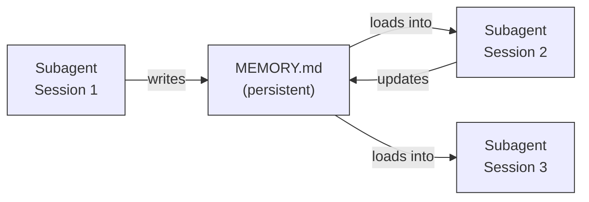
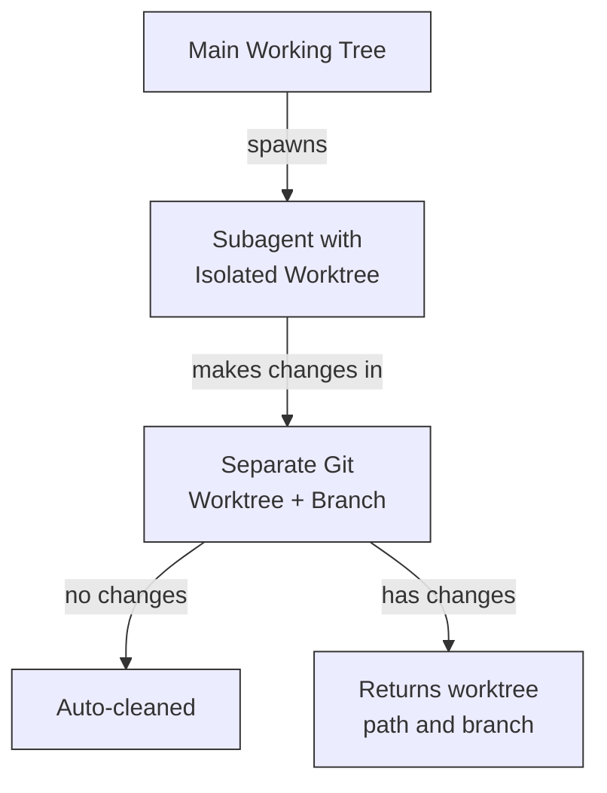
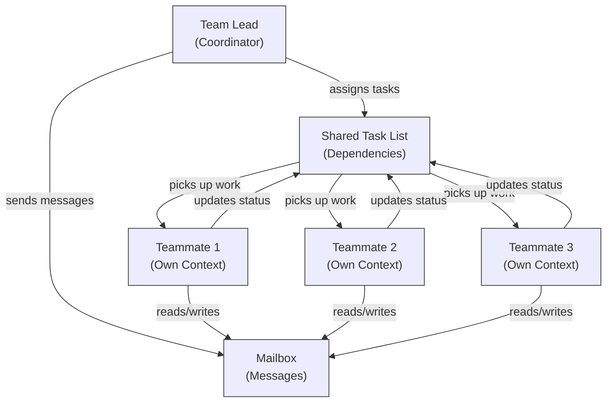
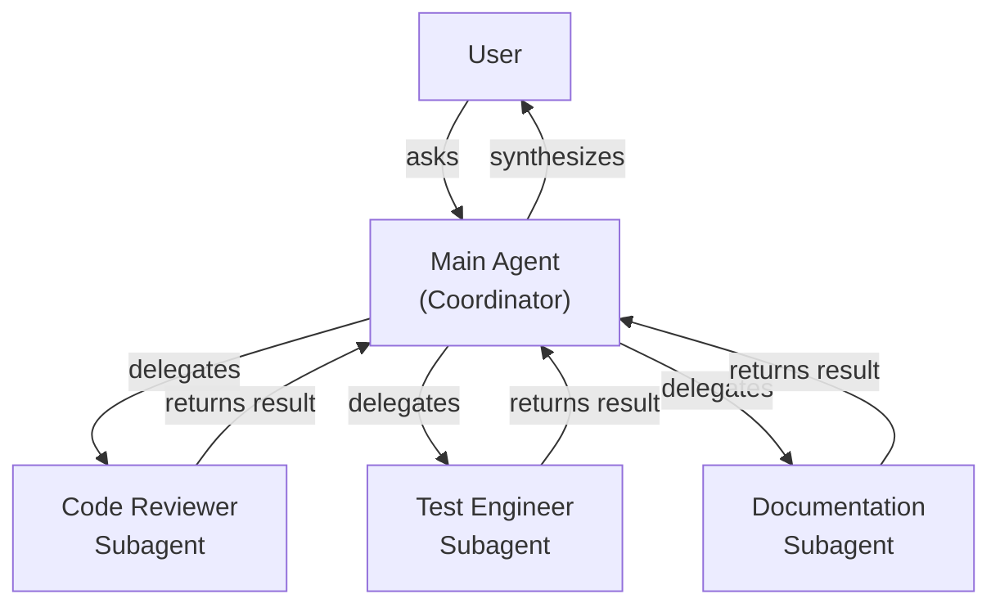
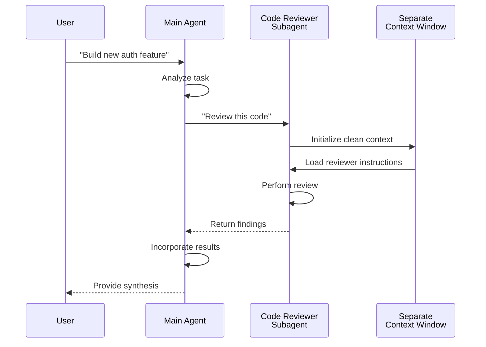
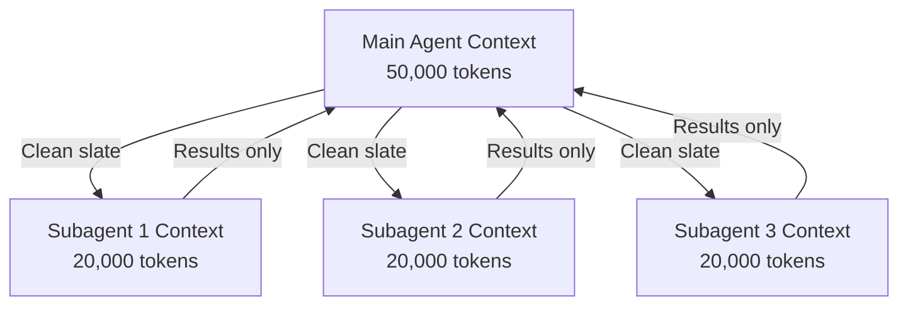
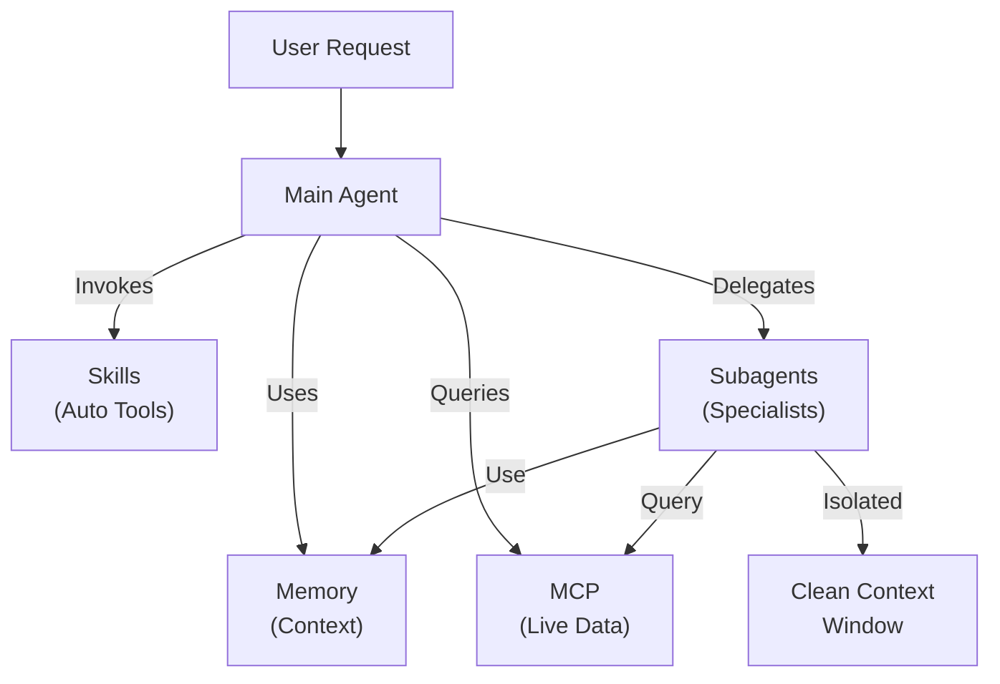

<picture>
  <source media="(prefers-color-scheme: dark)" srcset="../resources/logos/claude-howto-logo-dark.svg">
  
</picture>

# 子代理（子代理） - 完整参考指南 指南

子代理（子代理） are specialized AI assistants that Claude Code can delegate tasks to. Each 子代理 has a specific purpose, uses its own 上下文窗口 separate from the main conversation, and can be configured with specific tools and a 自定义 系统提示词.

## 目录

1. [概览](#概览)
2. [核心优势](#key-benefits)
3. [文件位置](#file-locations)
4. [配置](#配置)
5. [内置 子代理（子代理）](#内置-子代理（子代理）)
6. [管理 子代理（子代理）](#管理-子代理（子代理）)
7. [使用 子代理（子代理）](#使用-子代理（子代理）)
8. [Resumable Agents](#resumable-agents)
9. [Chaining 子代理（子代理）](#chaining-子代理（子代理）)
10. [Persistent 记忆 for 子代理（子代理）](#persistent-记忆-for-子代理（子代理）)
11. [Background 子代理（子代理）](#background-子代理（子代理）)
12. [Worktree Isolation](#worktree-isolation)
13. [Restrict Spawnable 子代理（子代理）](#restrict-spawnable-子代理（子代理）)
14. [`claude agents` CLI Command](#claude-agents-CLI-command)
15. [代理团队 (Experimental)](#代理-teams-experimental)
16. [插件 子代理 安全性](#插件-子代理-安全性)
17. [架构](#架构)
18. [Context Management](#context-management)
19. [何时使用 子代理（子代理）](#when-to-use-子代理（子代理）)
20. [最佳实践](#best-practices)
21. [示例 子代理（子代理） in This Folder](#示例-子代理（子代理）-in-this-folder)
22. [安装 Instructions](#安装-instructions)
23. [相关概念](#related-concepts)

---

## 概览

子代理（子代理） 启用 delegated task execution in Claude Code by:

- 创建 **isolated AI assistants** with separate context windows
- Providing **customized system prompts** for specialized expertise
- Enforcing **tool access control** to limit capabilities
- Preventing **context pollution** from complex tasks
- Enabling **parallel execution** of multiple specialized tasks

Each 子代理 operates independently with a clean slate, receiving only the specific context necessary for their task, then returning results to the main 代理 for synthesis.

**Quick Start**: Use the `/agents` command to create, view, edit, and manage your subagents interactively.

---

## 核心优势

|  | Benefit | 描述 |  |
|  | --------- | ------------- |  |
|  | **Context preservation** | Operates in separate context, preventing pollution of main conversation |  |
|  | **Specialized expertise** | Fine-tuned for specific domains with higher success rates |  |
|  | **Reusability** | Use across different projects and share with teams |  |
|  | **Flexible permissions** | Different tool access levels for different 子代理 types |  |
|  | **可扩展性** | Multiple agents work on different aspects simultaneously |  |

---

## 文件位置

子代理 files can be stored in multiple locations with different scopes:

|  | Priority | 类型 | 位置 | 作用域 |  |
|  | ---------- | ------ | ---------- | ------- |  |
|  | 1 (highest) | **CLI-defined** | Via `--agents` flag (JSON) | Session only |  |
|  | 2 | **项目 子代理（子代理）** | `.claude/agents/` | Current 项目 |  |
|  | 3 | **用户 子代理（子代理）** | `~/.claude/agents/` | All projects |  |
|  | 4 (lowest) | **插件 agents** | 插件 `agents/` directory | Via 插件 |  |

When duplicate names exist, higher-priority sources take precedence.

---

## 配置

### 文件格式

子代理（子代理） are defined in YAML frontmatter followed by the 系统提示词 in Markdown:

```yaml
---
name: your-sub-agent-name
description: Description of when this subagent should be invoked
tools: tool1, tool2, tool3  #  可选 - inherits all tools if omitted
disallowedTools: tool4  #  可选 - explicitly disallowed tools
model: sonnet  #  可选 - sonnet, opus, haiku, or inherit
permissionMode: default  #  可选 - 权限模式
maxTurns: 20  #  可选 - limit agentic turns
skills: skill1, skill2  #  可选 - 技能 to preload into context
mcpServers: server1  #  可选 - MCP servers to make available
memory: user  #  可选 - persistent 记忆 作用域 (用户, 项目, local)
background: false  #  可选 - run as 后台任务
effort: high  #  可选 - reasoning effort (low, medium, high, max)
isolation: worktree  #  可选 - git worktree isolation
initialPrompt: "Start by analyzing the codebase"  #  可选 - auto-submitted first turn
hooks:  #  可选 - component-scoped 钩子
  PreToolUse:
    - matcher: "Bash"
      hooks:
        - type: command
          command: "./scripts/security-check.sh"
---

Your subagent's system prompt goes here. This can be multiple paragraphs
and should clearly define the subagent's role, capabilities, and approach
to solving problems.
```

### 配置 Fields

|  | Field | 必需 | 描述 |  |
|  | ------- | ---------- | ------------- |  |
|  | `name` | Yes | Unique identifier (lowercase letters and hyphens) |  |
|  | `描述` | Yes | Natural language 描述 of purpose. Include "use PROACTIVELY" to encourage automatic invocation |  |
|  | `tools` | No | Comma-separated list of specific tools. Omit to inherit all tools. Supports `代理(agent_name)` syntax to restrict spawnable 子代理（子代理） |  |
|  | `disallowedTools` | No | Comma-separated list of tools the 子代理 must not use |  |
|  | `model` | No | Model to use: `sonnet`, `opus`, `haiku`, full model ID, or `inherit`. Defaults to configured 子代理 model |  |
|  | `permissionMode` | No | `默认`, `acceptEdits`, `dontAsk`, `bypassPermissions`, `plan` |  |
|  | `maxTurns` | No | Maximum number of agentic turns the 子代理 can take |  |
|  | `技能` | No | Comma-separated list of 技能 to preload. Injects full 技能 content into the 子代理's context at startup |  |
|  | `mcpServers` | No | MCP servers to make available to the 子代理 |  |
|  | `钩子` | No | Component-scoped 钩子 (PreToolUse, PostToolUse, 停止) |  |
|  | `记忆` | No | Persistent 记忆 directory 作用域: `用户`, `项目`, or `local` |  |
|  | `background` | No | Set to `true` to always run this 子代理 as a 后台任务 |  |
|  | `effort` | No | Reasoning effort level: `low`, `medium`, `high`, or `max` |  |
|  | `isolation` | No | Set to `worktree` to give the 子代理 its own git worktree |  |
|  | `initialPrompt` | No | Auto-submitted first turn when the 子代理 runs as the main 代理 |  |

### Main-Thread 代理 Frontmatter Honoring (v2.1.117+/v2.1.119+)

When an 代理 is invoked as the main-thread 代理 (via `claude --代理 <name>` or `--print` mode), these frontmatter fields are honored:

|  | Field | 版本 | Notes |  |
|  | ------- | --------- | ------- |  |
|  | `mcpServers` | v2.1.117+ | Loaded when 代理 is invoked as main-thread 代理 via `claude --代理 <name>` |  |
|  | `permissionMode` | v2.1.119+ | Honored for 内置 agents via `--代理 <name>` |  |
|  | `tools` / `disallowedTools` | v2.1.119+ | Honored in `--print` mode (non-interactive/scripted 使用方法) |  |

**Example — agent with `mcpServers` and `permissionMode`:**

```yaml
---
name: secure-researcher
description: Research agent with scoped MCP access and restricted permissions
permissionMode: acceptEdits
mcpServers:
  notion:
    type: http
    url: https://mcp.notion.com/mcp
  github:
    type: http
    url: https://api.github.com/mcp
tools: Read, Grep, Glob
---

You are a research agent. You may query Notion and GitHub through the
configured MCP servers, and read local files, but you cannot write or
execute commands outside of accepted edits.
```

Run with:

```bash
claude --agent secure-researcher
```

### Tool 配置 Options

**Option 1: Inherit All Tools (omit the field)**
```yaml
---
name: full-access-agent
description: Agent with all available tools
---
```

**Option 2: Specify Individual Tools**
```yaml
---
name: limited-agent
description: Agent with specific tools only
tools: Read, Grep, Glob, Bash
---
```

> **Note on Glob/Grep (v2.1.113+):** On native macOS/Linux builds, Glob and Grep are provided as `bfs`/`ugrep` through the Bash tool rather than as separate tools. Windows and npm-JS builds still expose them as standalone tools. Authors can still reference Glob/Grep in `allowedTools`; the backend substitution is transparent.

**Option 3: Conditional Tool Access**
```yaml
---
name: conditional-agent
description: Agent with filtered tool access
tools: Read, Bash(npm:*), Bash(test:*)
---
```

### CLI-Based 配置

Define 子代理（子代理） for a single session 使用 the `--agents` flag with JSON 格式:

```bash
claude --agents '{
  "code-reviewer": {
    "description": "Expert code reviewer. Use proactively after code changes.",
    "prompt": "You are a senior code reviewer. Focus on code quality, security, and best practices.",
    "tools": ["Read", "Grep", "Glob", "Bash"],
    "model": "sonnet"
  }
}'
```

**JSON Format for `--agents` flag:**

```json
{
  "agent-name": {
    "description": "Required: when to invoke this agent",
    "prompt": "Required: system prompt for the agent",
    "tools": ["Optional", "array", "of", "tools"],
    "model": "optional: sonnet|opus|haiku"
  }
}
```

**Priority of Agent Definitions:**

代理 definitions are loaded with this priority order (first match wins):
1. **CLI-defined** - `--agents` flag (session only, JSON)
2. **项目-level** - `.claude/agents/` (current 项目)
3. **用户-level** - `~/.claude/agents/` (all projects)
4. **插件-level** - 插件 `agents/` directory

This allows CLI definitions to override all other sources for a single session.

---

## 内置 子代理（子代理）

Claude Code includes several 内置 子代理（子代理） that are always available:

|  | 代理 | Model | Purpose |  |
|  | ------- | ------- | --------- |  |
|  | **general-purpose** | Inherits | Complex, multi-step tasks |  |
|  | **Plan** | Inherits | Research for plan mode |  |
|  | **Explore** | Haiku | Read-only codebase exploration (quick/medium/very thorough) |  |
|  | **Bash** | Inherits | Terminal commands in separate context |  |
|  | **statusline-设置** | Sonnet | 配置 status line |  |
|  | **Claude Code 指南** | Haiku | Answer Claude Code 功能 questions |  |

### General-Purpose 子代理

|  | Property | Value |  |
|  | ---------- | ------- |  |
|  | **Model** | Inherits from parent |  |
|  | **Tools** | All tools |  |
|  | **Purpose** | Complex research tasks, multi-step operations, code modifications |  |

**When used**: Tasks requiring both exploration and modification with complex reasoning.

### Plan 子代理

|  | Property | Value |  |
|  | ---------- | ------- |  |
|  | **Model** | Inherits from parent |  |
|  | **Tools** | Read, Glob, Grep, Bash |  |
|  | **Purpose** | Used automatically in plan mode to research codebase |  |

**When used**: When Claude needs to understand the codebase before presenting a plan.

### Explore 子代理

|  | Property | Value |  |
|  | ---------- | ------- |  |
|  | **Model** | Haiku (fast, low-latency) |  |
|  | **Mode** | Strictly read-only |  |
|  | **Tools** | Glob, Grep, Read, Bash (read-only commands only) |  |
|  | **Purpose** | Fast codebase searching and analysis |  |

**When used**: When searching/understanding code without making changes.

**Thoroughness Levels** - Specify the depth of exploration:
- **"quick"** - Fast searches with minimal exploration, good for finding specific patterns
- **"medium"** - Moderate exploration, balanced speed and thoroughness, 默认 approach
- **"very thorough"** - Comprehensive analysis across multiple locations and naming conventions, may take longer

### Bash 子代理

|  | Property | Value |  |
|  | ---------- | ------- |  |
|  | **Model** | Inherits from parent |  |
|  | **Tools** | Bash |  |
|  | **Purpose** | Execute terminal commands in a separate 上下文窗口 |  |

**When used**: When running shell commands that benefit from isolated context.

### Statusline 设置 子代理

|  | Property | Value |  |
|  | ---------- | ------- |  |
|  | **Model** | Sonnet |  |
|  | **Tools** | Read, Write, Bash |  |
|  | **Purpose** | 配置 the Claude Code status line display |  |

**When used**: When setting up or customizing the status line.

### Claude Code 指南 子代理

|  | Property | Value |  |
|  | ---------- | ------- |  |
|  | **Model** | Haiku (fast, low-latency) |  |
|  | **Tools** | Read-only |  |
|  | **Purpose** | Answer questions about Claude Code features and 使用方法 |  |

**When used**: When users ask questions about how Claude Code works or how to use specific features.

---

## 管理 子代理（子代理）

### 使用 the `/agents` Command (Recommended)

```bash
/agents
```

This provides an interactive menu to:
- View all available 子代理（子代理） (内置, 用户, and 项目)
- 创建 new 子代理（子代理） with guided 设置
- Edit existing 自定义 子代理（子代理） and tool access
- Delete 自定义 子代理（子代理）
- See which 子代理（子代理） are active when duplicates exist

### Direct File Management

```bash
#  创建 a 项目 子代理
mkdir -p .claude/agents
cat > .claude/agents/test-runner.md << 'EOF'
---
name: test-runner
description: Use proactively to run tests and fix failures
---

You are a test automation expert. When you see code changes, proactively
run the appropriate tests. If tests fail, analyze the failures and fix
them while preserving the original test intent.
EOF

#  创建 a 用户 子代理 (available in all projects)
mkdir -p ~/.claude/agents
```

---

## 使用 子代理（子代理）

### Automatic Delegation

Claude proactively delegates tasks based on:
- Task 描述 in your request
- The `描述` field in 子代理 configurations
- Current context and available tools

To encourage proactive use, include "use PROACTIVELY" or "MUST BE USED" in your `描述` field:

```yaml
---
name: code-reviewer
description: Expert code review specialist. Use PROACTIVELY after writing or modifying code.
---
```

### Explicit Invocation

You can explicitly request a specific 子代理:

```
> Use the test-runner subagent to fix failing tests
> Have the code-reviewer subagent look at my recent changes
> Ask the debugger subagent to investigate this error
```

### @-Mention Invocation

Use the `@` prefix to guarantee a specific 子代理 is invoked (bypasses automatic delegation heuristics):

```
> @"code-reviewer (agent)" review the auth module
```

### Session-Wide 代理

Run an entire session 使用 a specific 代理 as the main 代理:

```bash
#  Via CLI flag
claude --agent code-reviewer

#  Via settings.JSON
{
  "agent": "code-reviewer"
}
```

### Listing Available Agents

Use the `claude agents` command to list all configured agents from all sources:

```bash
claude agents
```

---

## Resumable Agents

子代理（子代理） can continue previous conversations with full context preserved:

```bash
#  Initial invocation
> Use the code-analyzer agent to start reviewing the authentication module
#  Returns agentId: "abc123"

#  Resume the 代理 later
> Resume agent abc123 and now analyze the authorization logic as well
```

**Use cases**:
- Long-running research across multiple sessions
- Iterative refinement without losing context
- Multi-step workflows maintaining context

---

## Chaining 子代理（子代理）

Execute multiple 子代理（子代理） in sequence:

```bash
> First use the code-analyzer subagent to find performance issues,
  then use the optimizer subagent to fix them
```

This enables complex workflows where the output of one 子代理 feeds into another.

---

## Persistent 记忆 for 子代理（子代理）

The `记忆` field gives 子代理（子代理） a persistent directory that survives across conversations. This allows 子代理（子代理） to 构建 up knowledge over time, storing notes, findings, and context that persist between sessions.

### 记忆 Scopes

|  | 作用域 | Directory | Use Case |  |
|  | ------- | ----------- | ---------- |  |
|  | `用户` | `~/.claude/代理-记忆/<name>/` | Personal notes and preferences across all projects |  |
|  | `项目` | `.claude/代理-记忆/<name>/` | 项目-specific knowledge shared with the 团队 |  |
|  | `local` | `.claude/代理-记忆-local/<name>/` | Local 项目 knowledge not committed to 版本 control |  |

### How It Works

- The first 200 lines of `记忆.md` in the 记忆 directory are automatically loaded into the 子代理's 系统提示词
- The `Read`, `Write`, and `Edit` tools are automatically enabled for the 子代理 to manage its 记忆 files
- The 子代理 can 创建 additional files in its 记忆 directory as needed

### 示例 配置

```yaml
---
name: researcher
memory: user
---

You are a research assistant. Use your memory directory to store findings,
track progress across sessions, and build up knowledge over time.

Check your MEMORY.md file at the start of each session to recall previous context.
```



---

## Background 子代理（子代理）

子代理（子代理） can run in the background, freeing up the main conversation for other tasks.

### 配置

Set `background: true` in the frontmatter to always run the 子代理 as a 后台任务:

```yaml
---
name: long-runner
background: true
description: Performs long-running analysis tasks in the background
---
```

### Keyboard Shortcuts

|  | Shortcut | Action |  |
|  | ---------- | -------- |  |
|  | `Ctrl+B` | Background a currently running 子代理 task |  |
|  | `Ctrl+F` | Kill all background agents (press twice to confirm) |  |

### Disabling Background Tasks

Set the environment variable to 禁用 后台任务 支持 entirely:

```bash
export CLAUDE_CODE_DISABLE_BACKGROUND_TASKS=1
```

---

## Worktree Isolation

The `isolation: worktree` setting gives a 子代理 its own git worktree, allowing it to make changes independently without affecting the main working tree.

### 配置

```yaml
---
name: feature-builder
isolation: worktree
description: Implements features in an isolated git worktree
tools: Read, Write, Edit, Bash, Grep, Glob
---
```

### How It Works



- The 子代理 operates in its own git worktree on a separate 分支
- If the 子代理 makes no changes, the worktree is automatically cleaned up
- If changes exist, the worktree path and 分支 name are returned to the main 代理 for review or merging

---

## Forked 子代理（子代理）

Forked 子代理（子代理） (`context: fork`) inherit the parent 代理's full conversation context at the moment of forking, rather than starting with a clean slate. This is useful for exploring alternative paths without losing the work done so far.

> **Availability**: GA in v2.1.117. On external builds (non-first-party distributions), set `CLAUDE_CODE_FORK_SUBAGENT=1` to enable forking.

### 配置

```yaml
---
name: alternative-explorer
description: Explore an alternative implementation path while preserving parent context
context: fork
tools: Read, Edit, Bash, Grep, Glob
---

You are a forked subagent. You inherit the parent's full conversation and
may explore an alternative approach. Return your findings and the parent
will decide whether to adopt them.
```

### Enabling on External Builds

```bash
export CLAUDE_CODE_FORK_SUBAGENT=1
claude
```

### 何时使用 Fork vs Clean Context

|  | Scenario | `context: fork` | Clean context (默认) |  |
|  | ---------- | ----------------- | ------------------------- |  |
|  | Explore alternative implementations | Yes | No (would lose context) |  |
|  | Long research with existing context | Yes | No |  |
|  | Independent specialized task | No | Yes |  |
|  | Avoiding context pollution | No | Yes |  |

---

## Restrict Spawnable 子代理（子代理）

You can control which 子代理（子代理） a given 子代理 is allowed to spawn by 使用 the `代理(agent_type)` syntax in the `tools` field. This provides a way to allowlist specific 子代理（子代理） for delegation.

> **Note**: In v2.1.63, the `Task` tool was renamed to `Agent`. Existing `Task(...)` references still work as aliases.

### 示例

```yaml
---
name: coordinator
description: Coordinates work between specialized agents
tools: Agent(worker, researcher), Read, Bash
---

You are a coordinator agent. You can delegate work to the "worker" and
"researcher" subagents only. Use Read and Bash for your own exploration.
```

In this 示例, the `coordinator` 子代理 can only spawn the `worker` and `researcher` 子代理（子代理）. It cannot spawn any other 子代理（子代理）, even if they are defined elsewhere.

---

## `claude agents` CLI Command

The `claude agents` command lists all configured agents grouped by source (内置, 用户-level, 项目-level):

```bash
claude agents
```

This command:
- Shows all available agents from all sources
- Groups agents by their source 位置
- Indicates **overrides** when an 代理 at a higher priority level shadows one at a lower level (e.g., a 项目-level 代理 with the same name as a 用户-level 代理)

---

## 代理团队 (Experimental)

代理团队 coordinate multiple Claude Code instances working together on complex tasks. Unlike 子代理（子代理） (which are delegated subtasks returning results), teammates work independently with their own context windows and can message each other directly through a shared mailbox system.

> **Official Documentation**: [code.claude.com/docs/en/agent-teams](https://code.claude.com/docs/en/agent-teams)

> **Note**: Agent Teams is experimental and disabled by default. Requires Claude Code v2.1.32+. Enable it before use.

### 子代理（子代理） vs 代理团队

|  | Aspect | 子代理（子代理） | 代理团队 |  |
|  | -------- | ----------- | ------------- |  |
|  | **Delegation model** | Parent delegates subtask, waits for result | 团队 lead coordinates work, teammates execute independently |  |
|  | **Context** | Fresh context per subtask, results distilled back | Each teammate maintains its own persistent 上下文窗口 |  |
|  | **Coordination** | Sequential or parallel, managed by parent | Shared task list with automatic dependency management |  |
|  | **Communication** | Results returned to parent only (no inter-代理 messaging) | Teammates can message each other directly via mailbox |  |
|  | **Session resumption** | Supported | Not supported with in-process teammates |  |
|  | **Best for** | Focused, well-defined subtasks | Complex work requiring inter-代理 communication and parallel execution |  |

### Enabling 代理团队

Set the environment variable or add it to your `settings.JSON`:

```bash
export CLAUDE_CODE_EXPERIMENTAL_AGENT_TEAMS=1
```

Or in `settings.JSON`:

```json
{
  "env": {
    "CLAUDE_CODE_EXPERIMENTAL_AGENT_TEAMS": "1"
  }
}
```

### Starting a 团队

Once enabled, ask Claude to work with teammates in your prompt:

```
User: Build the authentication module. Use a team — one teammate for the API endpoints,
      one for the database schema, and one for the test suite.
```

Claude will 创建 the 团队, assign tasks, and coordinate the work automatically.

### Display modes

Control how teammate activity is displayed:

|  | Mode | Flag | 描述 |  |
|  | ------ | ------ | ------------- |  |
|  | **Auto** | `--teammate-mode auto` | Automatically chooses the best display mode for your terminal |  |
|  | **In-process** (默认) | `--teammate-mode in-process` | Shows teammate output inline in the current terminal |  |
|  | **Split-panes** | `--teammate-mode tmux` | Opens each teammate in a separate tmux or iTerm2 pane |  |

```bash
claude --teammate-mode tmux
```

You can also set the display mode in `settings.JSON`:

```json
{
  "teammateMode": "tmux"
}
```

> **Note**: Split-pane mode requires tmux or iTerm2. It is not available in VS Code terminal, Windows Terminal, or Ghostty.

### Navigation

Use `Shift+Down` to navigate between teammates in split-pane mode.

### 团队 配置

团队 configurations are stored at `~/.claude/teams/{团队-name}/config.JSON`.

### 架构



**Key components**:

- **团队 Lead**: The main Claude Code session that creates the 团队, assigns tasks, and coordinates
- **Shared Task List**: A synchronized list of tasks with automatic dependency tracking
- **Mailbox**: An inter-代理 messaging system for teammates to communicate status and coordinate
- **Teammates**: Independent Claude Code instances, each with their own 上下文窗口

### Task assignment and messaging

The 团队 lead breaks work into tasks and assigns them to teammates. The shared task list handles:

- **Automatic dependency management** — tasks wait for their dependencies to complete
- **Status tracking** — teammates 更新 task status as they work
- **Inter-代理 messaging** — teammates send messages via the mailbox for coordination (e.g., "Database 模式 is ready, you can 启动 writing queries")

### Plan approval workflow

For complex tasks, the 团队 lead creates an execution plan before teammates begin work. The 用户 reviews and approves the plan, ensuring the 团队's approach aligns with expectations before any code changes are made.

### 钩子 events for teams

代理团队 introduce two additional [钩子 events](../06-钩子/):

|  | Event | Fires When | Use Case |  |
|  | ------- | ----------- | ---------- |  |
|  | `TeammateIdle` | A teammate finishes its current task and has no pending work | Trigger notifications, assign follow-up tasks |  |
|  | `TaskCompleted` | A task in the shared task list is marked complete | Run validation, 更新 dashboards, chain dependent work |  |

### 最佳实践

- **团队 size**: Keep teams at 3-5 teammates for optimal coordination
- **Task sizing**: Break work into tasks that take 5-15 minutes each — small enough to parallelize, large enough to be meaningful
- **Avoid file conflicts**: Assign different files or directories to different teammates to prevent merge conflicts
- **启动 simple**: Use in-process mode for your first 团队; switch to split-panes once comfortable
- **Clear task descriptions**: Provide specific, actionable task descriptions so teammates can work independently

### Limitations

- **Experimental**: 功能 behavior may change in future releases
- **No session resumption**: In-process teammates cannot be resumed after a session ends
- **One 团队 per session**: Cannot 创建 nested teams or multiple teams in a single session
- **Fixed leadership**: The 团队 lead role cannot be transferred to a teammate
- **Split-pane restrictions**: tmux/iTerm2 必需; not available in VS Code terminal, Windows Terminal, or Ghostty
- **No cross-session teams**: Teammates exist only within the current session

> **Warning**: Agent Teams is experimental. Test with non-critical work first and monitor teammate coordination for unexpected behavior.

---

## 插件 子代理 安全性

插件-provided 子代理（子代理） have restricted frontmatter capabilities for 安全性. The following fields are **not allowed** in 插件 子代理 definitions:

- `钩子` - Cannot define lifecycle 钩子
- `mcpServers` - Cannot 配置 MCP servers
- `permissionMode` - Cannot override permission settings

This prevents 插件 from escalating privileges or executing arbitrary commands through 子代理 钩子.

---

## 架构

### High-Level 架构



### 子代理 Lifecycle



---

## Context Management



### Key Points

- Each 子代理 gets a **fresh 上下文窗口** without the main conversation history
- Only the **relevant context** is passed to the 子代理 for their specific task
- Results are **distilled** back to the main 代理
- This prevents **context token exhaustion** on long projects

### 性能 Considerations

- **Context efficiency** - Agents preserve main context, enabling longer sessions
- **Latency** - 子代理（子代理） 启动 with clean slate and may add latency gathering initial context

### Key Behaviors

- **No nested spawning** - 子代理（子代理） cannot spawn other 子代理（子代理）
- **Background permissions** - Background 子代理（子代理） auto-deny any permissions that are not pre-approved
- **Backgrounding** - Press `Ctrl+B` to background a currently running task
- **Transcripts** - 子代理 transcripts are stored at `~/.claude/projects/{项目}/{sessionId}/子代理（子代理）/代理-{agentId}.jsonl`
- **Auto-compaction** - 子代理 context auto-compacts at ~95% capacity (override with `CLAUDE_AUTOCOMPACT_PCT_OVERRIDE` environment variable)

---

## 何时使用 子代理（子代理）

|  | Scenario | Use 子代理 | Why |  |
|  | ---------- | -------------- | ----- |  |
|  | Complex 功能 with many steps | Yes | Separate concerns, prevent context pollution |  |
|  | Quick code review | No | Unnecessary overhead |  |
|  | Parallel task execution | Yes | Each 子代理 has own context |  |
|  | Specialized expertise needed | Yes | 自定义 system prompts |  |
|  | Long-running analysis | Yes | Prevents main context exhaustion |  |
|  | Single task | No | Adds latency unnecessarily |  |

---

## 最佳实践

### 设计 Principles

**Do:**
- 启动 with Claude-generated agents - Generate initial 子代理 with Claude, then iterate to customize
- 设计 focused 子代理（子代理） - Single, clear responsibilities rather than one doing everything
- Write detailed prompts - Include specific instructions, 示例, and constraints
- Limit tool access - Grant only necessary tools for the 子代理's purpose
- 版本 control - Check 项目 子代理（子代理） into 版本 control for 团队 collaboration

**Don't:**
- 创建 overlapping 子代理（子代理） with same roles
- Give 子代理（子代理） unnecessary tool access
- Use 子代理（子代理） for simple, single-step tasks
- Mix concerns in one 子代理's prompt
- Forget to pass necessary context

### 系统提示词 最佳实践

1. **Be Specific About Role**
   ```
   You are an expert code reviewer specializing in [specific areas]
   ```

2. **Define Priorities Clearly**
   ```
   Review priorities (in order):
   1. Security Issues
   2. Performance Problems
   3. Code Quality
   ```

3. **Specify Output 格式**
   ```
   For each issue provide: Severity, Category, Location, Description, Fix, Impact
   ```

4. **Include Action Steps**
   ```
   When invoked:
   1. Run git diff to see recent changes
   2. Focus on modified files
   3. Begin review immediately
   ```

### Tool Access Strategy

1. **启动 Restrictive**: Begin with only essential tools
2. **Expand Only When Needed**: Add tools as 系统要求 demand
3. **Read-Only When Possible**: Use Read/Grep for analysis agents
4. **Sandboxed Execution**: Limit Bash commands to specific patterns

---

## 示例 子代理（子代理） in This Folder

This folder contains ready-to-use 示例 子代理（子代理）:

### 1. Code Reviewer (`code-reviewer.md`)

**Purpose**: Comprehensive code quality and maintainability analysis

**Tools**: Read, Grep, Glob, Bash

**Specialization**:
- 安全性 vulnerability detection
- 性能 optimization identification
- Code 可维护性 assessment
- 测试 coverage analysis

**Use When**: You need automated code reviews with focus on quality and security

---

### 2. 测试 Engineer (`测试-engineer.md`)

**Purpose**: Test strategy, coverage analysis, and automated testing

**Tools**: Read, Write, Bash, Grep

**Specialization**:
- Unit 测试 creation
- 集成 测试 设计
- Edge case identification
- Coverage analysis (>80% target)

**Use When**: You need comprehensive test suite creation or coverage analysis

---

### 3. 文档 Writer (`文档-writer.md`)

**Purpose**: Technical documentation, API docs, and user guides

**Tools**: Read, Write, Grep

**Specialization**:
- API endpoint 文档
- 用户 指南 creation
- 架构 文档
- Code comment 改进

**Use When**: You need to create or update project documentation

---

### 4. Secure Reviewer (`secure-reviewer.md`)

**Purpose**: Security-focused code review with minimal permissions

**Tools**: Read, Grep

**Specialization**:
- 安全性 vulnerability detection
- Authentication/authorization issues
- Data exposure risks
- Injection attack identification

**Use When**: You need security audits without modification capabilities

---

### 5. Implementation 代理 (`implementation-代理.md`)

**Purpose**: Full implementation capabilities for feature development

**Tools**: Read, Write, Edit, Bash, Grep, Glob

**Specialization**:
- 功能 implementation
- Code generation
- 构建 and 测试 execution
- Codebase modification

**Use When**: You need a subagent to implement features end-to-end

---

### 6. Debugger (`debugger.md`)

**Purpose**: Debugging specialist for errors, test failures, and unexpected behavior

**Tools**: Read, Edit, Bash, Grep, Glob

**Specialization**:
- Root cause analysis
- Error investigation
- 测试 failure resolution
- Minimal fix implementation

**Use When**: You encounter bugs, errors, or unexpected behavior

---

### 7. Data Scientist (`data-scientist.md`)

**Purpose**: Data analysis expert for SQL queries and data insights

**Tools**: Bash, Read, Write

**Specialization**:
- SQL query optimization
- BigQuery operations
- Data analysis and visualization
- Statistical insights

**Use When**: You need data analysis, SQL queries, or BigQuery operations

---

## 安装 Instructions

### Method 1: 使用 /agents Command (Recommended)

```bash
/agents
```

Then:
1. Select '创建 New 代理'
2. Choose 项目-level or 用户-level
3. Describe your 子代理 in detail
4. Select tools to grant access (or leave blank to inherit all)
5. Save and use

### Method 2: Copy to 项目

Copy the 代理 files to your 项目's `.claude/agents/` directory:

```bash
#  Navigate to your 项目
cd /path/to/your/project

#  创建 agents directory if it doesn't exist
mkdir -p .claude/agents

#  Copy all 代理 files from this folder
cp /path/to/04-subagents/*.md .claude/agents/

#  Remove the README (not needed in .claude/agents)
rm .claude/agents/README.md
```

### Method 3: Copy to 用户 Directory

For agents available in all your projects:

```bash
#  创建 用户 agents directory
mkdir -p ~/.claude/agents

#  Copy agents
cp /path/to/04-subagents/code-reviewer.md ~/.claude/agents/
cp /path/to/04-subagents/debugger.md ~/.claude/agents/
#  ... copy others as needed
```

### Verification

After 安装, verify the agents are recognized:

```bash
/agents
```

You should see your installed agents listed alongside the 内置 ones.

---

## File Structure

```
project/
├── .claude/
│   └── agents/
│       ├── code-reviewer.md
│       ├── test-engineer.md
│       ├── documentation-writer.md
│       ├── secure-reviewer.md
│       ├── implementation-agent.md
│       ├── debugger.md
│       └── data-scientist.md
└── ...
```

---

## 相关概念

### Related Features

- **[Slash Commands](../01-slash-commands/)** - Quick 用户-invoked shortcuts
- **[记忆](../02-记忆/)** - Persistent cross-session context
- **[技能](../03-技能/)** - Reusable autonomous capabilities
- **[MCP 协议](../05-mcp/)** - Real-time external data access
- **[钩子](../06-钩子/)** - Event-driven shell command automation
- **[插件](../07-插件/)** - Bundled extension packages

### Comparison with Other Features

|  | 功能 | 用户-Invoked | Auto-Invoked | Persistent | External Access | Isolated Context |  |
|  | --------- | -------------- | -------------- | ----------- | ------------------ | ------------------ |  |
|  | **Slash Commands** | Yes | No | No | No | No |  |
|  | **子代理（子代理）** | Yes | Yes | No | No | Yes |  |
|  | **记忆** | Auto | Auto | Yes | No | No |  |
|  | **MCP** | Auto | Yes | No | Yes | No |  |
|  | **技能** | Yes | Yes | No | No | No |  |

### 集成 模式



---

## Additional 资源

- [Official 子代理（子代理） 文档](https://code.claude.com/docs/en/sub-agents)
- [CLI 参考](https://code.claude.com/docs/en/CLI-参考) - `--agents` flag and other CLI options
- [插件 指南](../07-插件/) - For bundling agents with other features
- [技能 指南](../03-技能/) - For auto-invoked capabilities
- [记忆 指南](../02-记忆/) - For persistent context
- [钩子 指南](../06-钩子/) - For event-driven automation

---

**Last Updated**: April 24, 2026
**Claude Code Version**: 2.1.119
**Sources**:
- https://code.claude.com/docs/en/sub-agents
- https://code.claude.com/docs/en/代理-teams
- https://github.com/anthropics/claude-code/releases/tag/v2.1.117
- https://github.com/anthropics/claude-code/releases/tag/v2.1.119
**Compatible Models**: Claude Sonnet 4.6, Claude Opus 4.7, Claude Haiku 4.5
