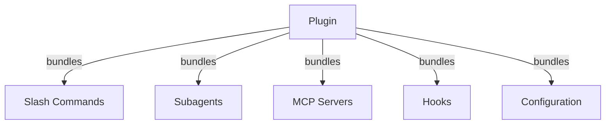
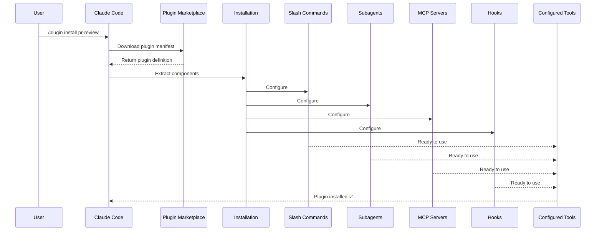
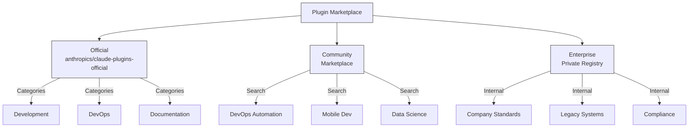
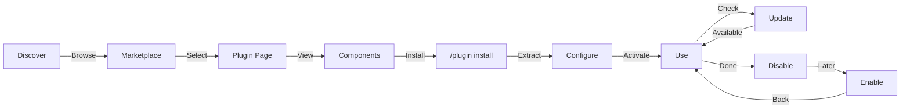
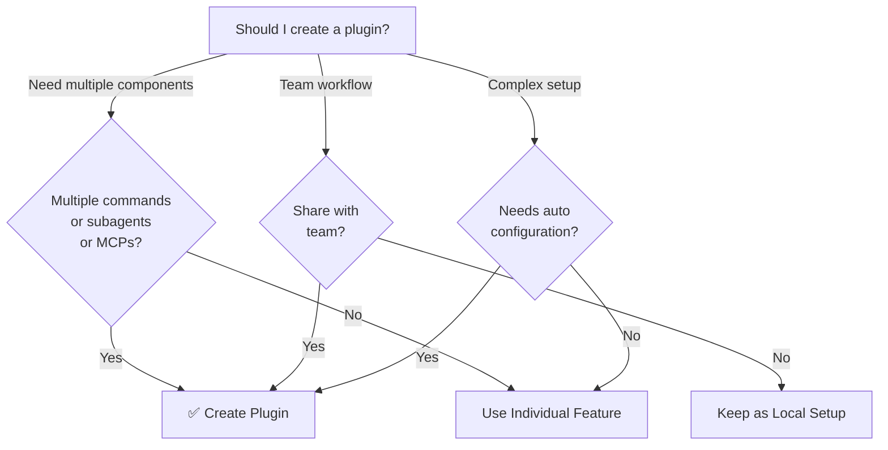

<picture>
  <source media="(prefers-color-scheme: dark)" srcset="../resources/logos/claude-howto-logo-dark.svg">
  
</picture>

# Claude Code 插件

This folder contains complete 插件 示例 that bundle multiple Claude Code features into cohesive, installable packages.

## 概览

Claude Code 插件 are bundled collections of customizations (slash commands, 子代理（子代理）, MCP servers, and 钩子) that 安装 with a single command. They represent the highest-level extension mechanism—combining multiple features into cohesive, shareable packages.

## 插件 架构



## 插件 Loading Process



## 插件 Types & Distribution

|  | 类型 | 作用域 | Shared | Authority | 示例 |  |
|  | ------ | ------- | -------- | ----------- | ---------- |  |
|  | Official | Global | All users | Anthropic | PR Review, 安全性 Guidance |  |
|  | 社区 | Public | All users | 社区 | DevOps, Data Science |  |
|  | Organization | Internal | 团队 members | Company | Internal standards, tools |  |
|  | Personal | Individual | Single 用户 | 开发者 | 自定义 workflows |  |

## 插件 Definition Structure

插件 manifest uses JSON 格式 in `.claude-插件/插件.JSON`:

```json
{
  "name": "my-first-plugin",
  "description": "A greeting plugin",
  "version": "1.0.0",
  "author": {
    "name": "Your Name"
  },
  "homepage": "https://example.com",
  "repository": "https://github.com/user/repo",
  "license": "MIT"
}
```

## 插件 Structure 示例

```
my-plugin/
├── .claude-plugin/
│   └── plugin.json       #  Manifest (name, 描述, 版本, 作者)
├── commands/             #  技能 as Markdown files
│   ├── task-1.md
│   ├── task-2.md
│   └── workflows/
├── agents/               #  自定义 代理 definitions
│   ├── specialist-1.md
│   ├── specialist-2.md
│   └── configs/
├── skills/               #  代理 技能 with 技能.md files
│   ├── skill-1.md
│   └── skill-2.md
├── hooks/                #  Event handlers in 钩子.JSON
│   └── hooks.json
├── .mcp.json             #  MCP 服务器 configurations
├── .lsp.json             #  LSP server configurations for code intelligence
├── bin/                  #  Executables added to Bash tool's PATH while 插件 is enabled
├── settings.json         #  默认 settings applied when 插件 is enabled (currently only `代理` key supported)
├── themes/               #  可选: ship 自定义 Claude Code themes (v2.1.118+)
├── templates/
│   └── issue-template.md
├── scripts/
│   ├── helper-1.sh
│   └── helper-2.py
├── docs/
│   ├── README.md
│   └── USAGE.md
└── tests/
    └── plugin.test.js
```

### LSP server 配置

插件 can include Language Server 协议 (LSP) 支持 for real-time code intelligence. LSP servers provide diagnostics, code navigation, and symbol information as you work.

**Configuration locations**:
- `.lsp.JSON` file in the 插件 root directory
- Inline `lsp` key in `插件.JSON`

#### Field 参考

|  | Field | 必需 | 描述 |  |
|  | ------- | ---------- | ------------- |  |
|  | `command` | Yes | LSP server binary (must be in PATH) |  |
|  | `extensionToLanguage` | Yes | Maps file extensions to language IDs |  |
|  | `args` | No | Command-line arguments for the server |  |
|  | `transport` | No | Communication method: `stdio` (默认) or `socket` |  |
|  | `env` | No | 环境变量 for the server process |  |
|  | `initializationOptions` | No | Options sent during LSP initialization |  |
|  | `settings` | No | Workspace 配置 passed to the server |  |
|  | `workspaceFolder` | No | Override the workspace folder path |  |
|  | `startupTimeout` | No | Maximum time (ms) to wait for server startup |  |
|  | `shutdownTimeout` | No | Maximum time (ms) for graceful shutdown |  |
|  | `restartOnCrash` | No | Automatically restart if the server crashes |  |
|  | `maxRestarts` | No | Maximum restart attempts before giving up |  |

#### 示例 configurations

**Go (gopls)**:

```json
{
  "go": {
    "command": "gopls",
    "args": ["serve"],
    "extensionToLanguage": {
      ".go": "go"
    }
  }
}
```

**Python (pyright)**:

```json
{
  "python": {
    "command": "pyright-langserver",
    "args": ["--stdio"],
    "extensionToLanguage": {
      ".py": "python",
      ".pyi": "python"
    }
  }
}
```

**TypeScript**:

```json
{
  "typescript": {
    "command": "typescript-language-server",
    "args": ["--stdio"],
    "extensionToLanguage": {
      ".ts": "typescript",
      ".tsx": "typescriptreact",
      ".js": "javascript",
      ".jsx": "javascriptreact"
    }
  }
}
```

#### Available LSP 插件

The official marketplace includes pre-configured LSP 插件:

|  | 插件 | Language | Server Binary | 安装 Command |  |
|  | -------- | ---------- | --------------- | ---------------- |  |
|  | `pyright-lsp` | Python | `pyright-langserver` | `pip 安装 pyright` |  |
|  | `typescript-lsp` | TypeScript/JavaScript | `typescript-language-server` | `npm 安装 -g typescript-language-server typescript` |  |
|  | `rust-lsp` | Rust | `rust-analyzer` | 安装 via `rustup component add rust-analyzer` |  |

#### LSP capabilities

Once configured, LSP servers provide:

- **Instant diagnostics** — errors and warnings appear immediately after edits
- **Code navigation** — go to definition, find references, implementations
- **Hover information** — 类型 signatures and 文档 on hover
- **Symbol listing** — browse symbols in the current file or workspace

## 插件 Options (v2.1.83+)

插件 can declare 用户-configurable options in the manifest via `userConfig`. Values marked `sensitive: true` are stored in the system keychain rather than plain-text settings files:

```json
{
  "name": "my-plugin",
  "version": "1.0.0",
  "userConfig": {
    "apiKey": {
      "description": "API key for the service",
      "sensitive": true
    },
    "region": {
      "description": "Deployment region",
      "default": "us-east-1"
    }
  }
}
```

## Persistent 插件 Data (`${CLAUDE_PLUGIN_DATA}`) (v2.1.78+)

插件 have access to a persistent state directory via the `${CLAUDE_PLUGIN_DATA}` environment variable. This directory is unique per 插件 and survives across sessions, making it suitable for caches, databases, and other persistent state:

```json
{
  "hooks": {
    "PostToolUse": [
      {
        "command": "node ${CLAUDE_PLUGIN_DATA}/track-usage.js"
      }
    ]
  }
}
```

The directory is created automatically when the 插件 is installed. Files stored here persist until the 插件 is uninstalled.

### Background Monitors (v2.1.105)

插件 can register background monitors that auto-arm when a session starts or when the 插件's 技能 is invoked. Add a top-level `monitors` key to your 插件 manifest:

```json
{
  "name": "my-plugin",
  "version": "1.0.0",
  "monitors": [
    {
      "command": "tail -f /var/log/app.log",
      "trigger": "session_start"
    }
  ]
}
```

The `trigger` field accepts:
- `"session_start"` — arm the monitor automatically when a session begins
- `"skill_invoke"` — arm the monitor when the 插件's 技能 is invoked

Monitors use the same Monitor tool under the hood, streaming stdout lines as events Claude can react to.

## Inline 插件 via Settings (`source: 'settings'`) (v2.1.80+)

插件 can be defined inline in settings files as marketplace entries 使用 the `source: 'settings'` field. This allows embedding a 插件 definition directly without requiring a separate 仓库 or marketplace:

```json
{
  "pluginMarketplaces": [
    {
      "name": "inline-tools",
      "source": "settings",
      "plugins": [
        {
          "name": "quick-lint",
          "source": "./local-plugins/quick-lint"
        }
      ]
    }
  ]
}
```

## 插件 Settings

插件 can ship a `settings.JSON` file to provide 默认 配置. This currently supports the `代理` key, which sets the main thread 代理 for the 插件:

```json
{
  "agent": "agents/specialist-1.md"
}
```

When a 插件 includes `settings.JSON`, its defaults are applied on 安装. Users can override these settings in their own 项目 or 用户 配置.

## Standalone vs 插件 Approach

|  | Approach | Command Names | 配置 | Best For |  |
|  | ---------- | --------------- | --- | --- |  |
|  | **Standalone** | `/hello` | 手册 设置 in CLAUDE.md | Personal, 项目-specific |  |
|  | **插件** | `/插件-name:hello` | Automated via 插件.JSON | Sharing, distribution, 团队 use |  |

Use **standalone slash commands** for quick personal workflows. Use **插件** when you want to bundle multiple features, share with a 团队, or publish for distribution.

## Practical 示例

### 示例 1: PR Review 插件

**File:** `.claude-plugin/plugin.json`

```json
{
  "name": "pr-review",
  "version": "1.0.0",
  "description": "Complete PR review workflow with security, testing, and docs",
  "author": {
    "name": "Anthropic"
  },
  "repository": "https://github.com/your-org/pr-review",
  "license": "MIT"
}
```

**File:** `commands/review-pr.md`

```markdown
---
name: Review PR
description: Start comprehensive PR review with security and testing checks
---

#  PR Review

This command initiates a complete pull request review including:

1. Security analysis
2. Test coverage verification
3. Documentation updates
4. Code quality checks
5. Performance impact assessment
```

**File:** `agents/security-reviewer.md`

```yaml
---
name: security-reviewer
description: Security-focused code review
tools: read, grep, diff
---

#  安全性 Reviewer

Specializes in finding security vulnerabilities:
- Authentication/authorization issues
- Data exposure
- Injection attacks
- Secure configuration
```

**Installation:**

```bash
/plugin install pr-review

#  Result:
#  ✅ 3 slash commands installed
#  ✅ 3 子代理（子代理） configured
#  ✅ 2 MCP servers connected
#  ✅ 4 钩子 registered
#  ✅ Ready to use!
```

### 示例 2: DevOps 插件

**Components:**

```
devops-automation/
├── commands/
│   ├── deploy.md
│   ├── rollback.md
│   ├── status.md
│   └── incident.md
├── agents/
│   ├── deployment-specialist.md
│   ├── incident-commander.md
│   └── alert-analyzer.md
├── mcp/
│   ├── github-config.json
│   ├── kubernetes-config.json
│   └── prometheus-config.json
├── hooks/
│   ├── pre-deploy.js
│   ├── post-deploy.js
│   └── on-error.js
└── scripts/
    ├── deploy.sh
    ├── rollback.sh
    └── health-check.sh
```

### 示例 3: 文档 插件

**Bundled Components:**

```
documentation/
├── commands/
│   ├── generate-api-docs.md
│   ├── generate-readme.md
│   ├── sync-docs.md
│   └── validate-docs.md
├── agents/
│   ├── api-documenter.md
│   ├── code-commentator.md
│   └── example-generator.md
├── mcp/
│   ├── github-docs-config.json
│   └── slack-announce-config.json
└── templates/
    ├── api-endpoint.md
    ├── function-docs.md
    └── adr-template.md
```

## 插件 Marketplace

The official Anthropic-managed 插件 directory is `anthropics/claude-插件-official`. Enterprise admins can also 创建 private 插件 marketplaces for internal distribution.



### Marketplace 配置

Enterprise and advanced users can control marketplace behavior through settings:

|  | Setting | 描述 |  |
|  | --------- | ------------- |  |
|  | `extraKnownMarketplaces` | Add additional marketplace sources beyond the defaults |  |
|  | `strictKnownMarketplaces` | Control which marketplaces users are allowed to add (managed-only) |  |
|  | `blockedMarketplaces` | Admin-managed blocklist of marketplaces (supports `hostPattern` / `pathPattern` regex fields since v2.1.119) |  |
|  | `deniedPlugins` | Admin-managed blocklist to prevent specific 插件 from being installed |  |

> **Enforcement** (v2.1.117+): `blockedMarketplaces` and `strictKnownMarketplaces` are enforced on every plugin lifecycle event — install, update, refresh, and autoupdate — not just at first add. `strictKnownMarketplaces` is managed-only.

示例 `blockedMarketplaces` with host/path regex (v2.1.119):

```json
{
  "blockedMarketplaces": [
    {
      "hostPattern": "^evil\\.example\\.com$",
      "pathPattern": "^/marketplaces/.*"
    }
  ]
}
```

### Additional Marketplace Features

- **默认 git timeout**: Increased from 30s to 120s for large 插件 repositories
- **自定义 npm registries**: 插件 can specify 自定义 npm registry URLs for dependency resolution
- **版本 pinning**: Lock 插件 to specific versions for reproducible environments

### Marketplace definition 模式

插件 marketplaces are defined in `.claude-插件/marketplace.JSON`:

```json
{
  "name": "my-team-plugins",
  "owner": "my-org",
  "plugins": [
    {
      "name": "code-standards",
      "source": "./plugins/code-standards",
      "description": "Enforce team coding standards",
      "version": "1.2.0",
      "author": "platform-team"
    },
    {
      "name": "deploy-helper",
      "source": {
        "source": "github",
        "repo": "my-org/deploy-helper",
        "ref": "v2.0.0"
      },
      "description": "Deployment automation workflows"
    }
  ]
}
```

|  | Field | 必需 | 描述 |  |
|  | ------- | ---------- | ------------- |  |
|  | `name` | Yes | Marketplace name in kebab-case |  |
|  | `owner` | Yes | Organization or 用户 who maintains the marketplace |  |
|  | `插件` | Yes | Array of 插件 entries |  |
|  | `插件[].name` | Yes | 插件 name (kebab-case) |  |
|  | `插件[].source` | Yes | 插件 source (path string or source object) |  |
|  | `插件[].描述` | No | Brief 插件 描述 |  |
|  | `插件[].版本` | No | Semantic 版本 string |  |
|  | `插件[].作者` | No | 插件 作者 name |  |

### 插件 source types

插件 can be sourced from multiple locations:

|  | Source | Syntax | 示例 |  |
|  | -------- | -------- | --------- |  |
|  | **Relative path** | String path | `"./插件/my-插件"` |  |
|  | **GitHub** | `{ "source": "github", "repo": "owner/repo" }` | `{ "source": "github", "repo": "acme/lint-插件", "ref": "v1.0" }` |  |
|  | **Git URL** | `{ "source": "url", "url": "..." }` | `{ "source": "url", "url": "https://git.internal/插件.git" }` |  |
|  | **Git subdirectory** | `{ "source": "git-subdir", "url": "...", "path": "..." }` | `{ "source": "git-subdir", "url": "https://github.com/org/monorepo.git", "path": "packages/插件" }` |  |
|  | **npm** | `{ "source": "npm", "package": "..." }` | `{ "source": "npm", "package": "@acme/claude-插件", "版本": "^2.0" }` |  |
|  | **pip** | `{ "source": "pip", "package": "..." }` | `{ "source": "pip", "package": "claude-data-插件", "版本": ">=1.0" }` |  |

GitHub and git sources 支持 可选 `ref` (分支/tag) and `sha` (提交 hash) fields for 版本 pinning.

### Distribution methods

**GitHub (recommended)**:
```bash
#  Users add your marketplace
/plugin marketplace add owner/repo-name
```

**Other git services** (full URL required):
```bash
/plugin marketplace add https://gitlab.com/org/marketplace-repo.git
```

**Private repositories**: Supported via git credential helpers or environment tokens. Users must have read access to the repository.

**Official marketplace submission**: Submit plugins to the Anthropic-curated marketplace for broader distribution via [claude.ai/settings/plugins/submit](https://claude.ai/settings/plugins/submit) or [platform.claude.com/plugins/submit](https://platform.claude.com/plugins/submit).

### 管理 Marketplaces

```bash
#  Marketplace CLI commands
claude plugin marketplace add <source>       #  Add marketplace (GitHub, URL, local)
claude plugin marketplace update [name]      #  Refresh catalog index
claude plugin marketplace remove <name>      #  Remove marketplace
claude plugin marketplace list               #  List configured marketplaces
```

> **Important**: `marketplace update` only refreshes the plugin catalog (what's available to install). It does NOT update installed plugins. Use `plugin update <name>` to update specific installed plugins.

### Strict mode

Control how marketplace definitions interact with local `插件.JSON` files:

|  | Setting | Behavior |  |
|  | --------- | ---------- |  |
|  | `strict: true` (默认) | Local `插件.JSON` is authoritative; marketplace entry supplements it |  |
|  | `strict: false` | Marketplace entry is the entire 插件 definition |  |

**Organization restrictions** with `strictKnownMarketplaces`:

|  | Value | Effect |  |
|  | ------- | -------- |  |
|  | Not set | No restrictions — users can add any marketplace |  |
|  | Empty array `[]` | Lockdown — no marketplaces allowed |  |
|  | Array of patterns | Allowlist — only matching marketplaces can be added |  |

```json
{
  "strictKnownMarketplaces": [
    "my-org/*",
    "github.com/trusted-vendor/*"
  ]
}
```

> **Warning**: In strict mode with `strictKnownMarketplaces`, users can only install plugins from allowlisted marketplaces. This is useful for enterprise environments requiring controlled plugin distribution.

## 插件 安装 & Lifecycle



## 插件 Features Comparison

|  | 功能 | 斜杠命令 | 技能 | 子代理 | 插件 |  |
|  | --------- | --------------- | ------- | ---------- | -------- |  |
|  | **安装** | 手册 copy | 手册 copy | 手册 config | One command |  |
|  | **设置 Time** | 5 minutes | 10 minutes | 15 minutes | 2 minutes |  |
|  | **Bundling** | Single file | Single file | Single file | Multiple |  |
|  | **Versioning** | 手册 | 手册 | 手册 | Automatic |  |
|  | **团队 Sharing** | Copy file | Copy file | Copy file | 安装 ID |  |
|  | **Updates** | 手册 | 手册 | 手册 | Auto-available |  |
|  | **Dependencies** | None | None | None | May include |  |
|  | **Marketplace** | No | No | No | Yes |  |
|  | **Distribution** | 仓库 | 仓库 | 仓库 | Marketplace |  |

## 插件 CLI Commands

All 插件 operations are available as CLI commands:

```bash
claude plugin install <name>@<marketplace>   #  安装 from a marketplace
claude plugin uninstall <name>               #  Remove a 插件
claude plugin update <name>                  #  更新 installed 插件 to latest 版本
claude plugin list                           #  List installed 插件
claude plugin enable <name>                  #  启用 a disabled 插件
claude plugin disable <name>                 #  禁用 a 插件
claude plugin validate                       #  Validate 插件 structure
claude plugin tag <version>                  #  创建 a 发布 git tag with 版本 validation (v2.1.118+)
```

示例: `claude 插件 tag v0.3.0` validates the 版本 格式, creates the matching git tag, and is the recommended way to cut 插件 releases for distribution.

## 安装 Methods

### From Marketplace
```bash
/plugin install plugin-name
#  or from CLI:
claude plugin install plugin-name@marketplace-name
```

### 启用 / 禁用 (with auto-detected 作用域)
```bash
/plugin enable plugin-name
/plugin disable plugin-name
```

### Local 插件 (for development)
```bash
#  CLI flag for local testing (repeatable for multiple 插件)
claude --plugin-dir ./path/to/plugin
claude --plugin-dir ./plugin-a --plugin-dir ./plugin-b
```

### From Git 仓库
```bash
/plugin install github:username/repo
```

## Auto-更新

Claude Code can automatically 更新 marketplaces and their installed 插件 at startup.

|  | Marketplace 类型 | Auto-更新 默认 | How to Toggle |  |
|  | ------------------ | --------------------- | --------------- |  |
|  | Official (`claude-插件-official`) | ✅ Enabled | `/插件` → Marketplaces → Select |  |
|  | Third-party / Local | ❌ Disabled | Same UI path |  |

When auto-更新 runs, Claude Code:
1. Refreshes marketplace catalog
2. Updates installed 插件 to latest versions
3. Shows notification prompting `/reload-插件`

### 环境变量

|  | Variable | Effect |  |
|  | ---------- | -------- |  |
|  | `DISABLE_AUTOUPDATER=1` | 禁用 all auto-updates (Claude Code + 插件) |  |
|  | `DISABLE_AUTOUPDATER=1` + `FORCE_AUTOUPDATE_PLUGINS=1` | Keep 插件 updates, 禁用 Claude Code updates |  |

```bash
#  禁用 all auto-updates
export DISABLE_AUTOUPDATER=1

#  Keep 插件 auto-updates only
export DISABLE_AUTOUPDATER=1
export FORCE_AUTOUPDATE_PLUGINS=1
```

## When to 创建 a 插件



### 插件 Use Cases

|  | Use Case | Recommendation | Why |  |
|  | ---------- | ----------------- | ----- |  |
|  | **团队 Onboarding** | ✅ Use 插件 | Instant 设置, all configurations |  |
|  | **Framework 设置** | ✅ Use 插件 | Bundles framework-specific commands |  |
|  | **Enterprise Standards** | ✅ Use 插件 | Central distribution, 版本 control |  |
|  | **Quick Task Automation** | ❌ Use Command | Overkill complexity |  |
|  | **Single Domain Expertise** | ❌ Use 技能 | Too heavy, use 技能 instead |  |
|  | **Specialized Analysis** | ❌ Use 子代理 | 创建 manually or use 技能 |  |
|  | **Live Data Access** | ❌ Use MCP | Standalone, don't bundle |  |

## Testing a 插件

Before publishing, 测试 your 插件 locally 使用 the `--插件-dir` CLI flag (repeatable for multiple 插件):

```bash
claude --plugin-dir ./my-plugin
claude --plugin-dir ./my-plugin --plugin-dir ./another-plugin
```

This launches Claude Code with your 插件 loaded, allowing you to:
- Verify all slash commands are available
- 测试 子代理（子代理） and agents function correctly
- Confirm MCP servers connect properly
- Validate 钩子 execution
- Check LSP server configurations
- Check for any 配置 errors

## Hot-Reload

插件 支持 hot-reload during development. When you modify 插件 files, Claude Code can detect changes automatically. You can also force a reload with:

```bash
/reload-plugins
```

This re-reads all 插件 manifests, commands, agents, 技能, 钩子, and MCP/LSP configurations without restarting the session.

## Managed Settings for 插件

Administrators can control 插件 behavior across an organization 使用 managed settings:

|  | Setting | 描述 |  |
|  | --------- | ------------- |  |
|  | `enabledPlugins` | Allowlist of 插件 that are enabled by 默认 |  |
|  | `deniedPlugins` | Blocklist of 插件 that cannot be installed |  |
|  | `extraKnownMarketplaces` | Add additional marketplace sources beyond the defaults |  |
|  | `strictKnownMarketplaces` | Restrict which marketplaces users are allowed to add (managed-only; enforced on every 插件 lifecycle event since v2.1.117) |  |
|  | `blockedMarketplaces` | Blocklist of marketplaces; enforced on every 插件 lifecycle event since v2.1.117; supports `hostPattern` / `pathPattern` regex fields since v2.1.119 |  |
|  | `allowedChannelPlugins` | Control which 插件 are permitted per 发布 channel |  |

These settings can be applied at the organization level via managed 配置 files and take precedence over 用户-level settings.

## 插件 安全性

插件 子代理（子代理） run in a restricted sandbox. The following frontmatter keys are **not allowed** in 插件 子代理 definitions:

- `钩子` -- 子代理（子代理） cannot register event handlers
- `mcpServers` -- 子代理（子代理） cannot 配置 MCP servers
- `permissionMode` -- 子代理（子代理） cannot override the permission model

This ensures that 插件 cannot escalate privileges or modify the host environment beyond their declared 作用域.

## Publishing a 插件

**Steps to publish:**

1. 创建 插件 structure with all components
2. Write `.claude-插件/插件.JSON` manifest
3. 创建 `README.md` with 文档
4. 测试 locally with `claude --插件-dir ./my-插件`
5. Tag the 发布 with `claude 插件 tag v0.3.0` (v2.1.118+) — validates the 版本 string and creates the matching git tag
6. Submit to 插件 marketplace
7. Get reviewed and approved
8. Published on marketplace
9. Users can 安装 with one command

**Example submission:**

```markdown
#  PR Review 插件

# # 描述
Complete PR review workflow with security, testing, and documentation checks.

# # What's Included
- 3 slash commands for different review types
- 3 specialized subagents
- GitHub and CodeQL MCP integration
- Automated security scanning hooks

# # 安装
```bash
/插件 安装 pr-review
```

# # Features
✅ Security analysis
✅ Test coverage checking
✅ Documentation verification
✅ Code quality assessment
✅ Performance impact analysis

# # 使用方法
```bash
/review-pr
/check-安全性
/check-tests
```

# # 系统要求
- Claude Code 1.0+
- GitHub access
- CodeQL (optional)
```

## 插件 vs 手册 配置

**Manual Setup (2+ hours):**
- 安装 slash commands one by one
- 创建 子代理（子代理） individually
- 配置 MCPs separately
- Set up 钩子 manually
- Document everything
- Share with 团队 (hope they 配置 correctly)

**With Plugin (2 minutes):**
```bash
/plugin install pr-review
#  ✅ Everything installed and configured
#  ✅ Ready to use immediately
#  ✅ 团队 can reproduce exact 设置
```

## 最佳实践

### Do's ✅
- Use clear, descriptive 插件 names
- Include comprehensive README
- 版本 your 插件 properly (semver)
- 测试 all components together
- Document 系统要求 clearly
- Provide 使用方法 示例
- Include error handling
- Tag appropriately for discovery
- Maintain backward 兼容性
- Keep 插件 focused and cohesive
- Include comprehensive tests
- Document all dependencies

### Don'ts ❌
- Don't bundle unrelated features
- Don't hardcode credentials
- Don't skip testing
- Don't forget 文档
- Don't 创建 redundant 插件
- Don't ignore versioning
- Don't overcomplicate component dependencies
- Don't forget to handle errors gracefully

## 安装 Instructions

### Installing from Marketplace

1. **Browse available 插件:**
   ```bash
   /plugin list
   ```

2. **View 插件 details:**
   ```bash
   /plugin info plugin-name
   ```

3. **安装 a 插件:**
   ```bash
   /plugin install plugin-name
   ```

### Installing from Local Path

```bash
/plugin install ./path/to/plugin-directory
```

### Installing from GitHub

```bash
/plugin install github:username/repo
```

### Listing Installed 插件

```bash
/plugin list --installed
```

### Updating a 插件

```bash
/plugin update plugin-name
```

### Disabling/Enabling a 插件

```bash
#  Temporarily 禁用
/plugin disable plugin-name

#  Re-启用
/plugin enable plugin-name
```

### Uninstalling a 插件

```bash
/plugin uninstall plugin-name
```

## 相关概念

The following Claude Code features work together with 插件:

- **[Slash Commands](../01-slash-commands/)** - Individual commands bundled in 插件
- **[记忆](../02-记忆/)** - Persistent context for 插件
- **[技能](../03-技能/)** - Domain expertise that can be wrapped into 插件
- **[子代理（子代理）](../04-子代理（子代理）/)** - Specialized agents included as 插件 components
- **[MCP Servers](../05-mcp/)** - Model Context 协议 integrations bundled in 插件
- **[钩子](../06-钩子/)** - Event handlers that trigger 插件 workflows

## Complete 示例 Workflow

### PR Review 插件 Full Workflow

```
1. User: /review-pr

2. Plugin executes:
   ├── pre-review.js hook validates git repo
   ├── GitHub MCP fetches PR data
   ├── security-reviewer subagent analyzes security
   ├── test-checker subagent verifies coverage
   └── performance-analyzer subagent checks performance

3. Results synthesized and presented:
   ✅ Security: No critical issues
   ⚠️  Testing: Coverage 65% (recommend 80%+)
   ✅ Performance: No significant impact
   📝 12 recommendations provided
```

## 故障排除

### 插件 Won't 安装
- Check Claude Code 版本 兼容性: `/版本`
- Verify `插件.JSON` syntax with a JSON validator
- Check internet connection (for remote 插件)
- Review permissions: `ls -la 插件/`

### Components Not Loading
- Verify paths in `插件.JSON` match actual directory structure
- Check file permissions: `chmod +x scripts/`
- Review component file syntax
- Check logs: `/插件 调试 插件-name`

### MCP Connection Failed
- Verify 环境变量 are set correctly
- Check MCP 服务器 安装 and health
- 测试 MCP connection independently with `/mcp 测试`
- Review MCP 配置 in `mcp/` directory

### Commands Not Available After 安装
- Ensure 插件 was installed successfully: `/插件 list --installed`
- Check if 插件 is enabled: `/插件 status 插件-name`
- Restart Claude Code: `exit` and reopen
- Check for naming conflicts with existing commands

### 钩子 Execution Issues
- Verify 钩子 files have correct permissions
- Check 钩子 syntax and event names
- Review 钩子 logs for error details
- 测试 钩子 manually if possible

## Additional 资源

- [Official 插件 文档](https://code.claude.com/docs/en/插件)
- [Discover 插件](https://code.claude.com/docs/en/discover-插件)
- [插件 Marketplaces](https://code.claude.com/docs/en/插件-marketplaces)
- [插件 参考](https://code.claude.com/docs/en/插件-参考)
- [MCP 服务器 参考](https://modelcontextprotocol.io/)
- [子代理 配置 指南](../04-子代理（子代理）/README.md)
- [钩子 System 参考](../06-钩子/README.md)

---

**Last Updated**: April 24, 2026
**Claude Code Version**: 2.1.119
**Sources**:
- https://code.claude.com/docs/en/插件
- https://code.claude.com/docs/en/插件-marketplaces
- https://github.com/anthropics/claude-code/releases/tag/v2.1.117
- https://github.com/anthropics/claude-code/releases/tag/v2.1.118
- https://github.com/anthropics/claude-code/releases/tag/v2.1.119
**Compatible Models**: Claude Sonnet 4.6, Claude Opus 4.7, Claude Haiku 4.5
