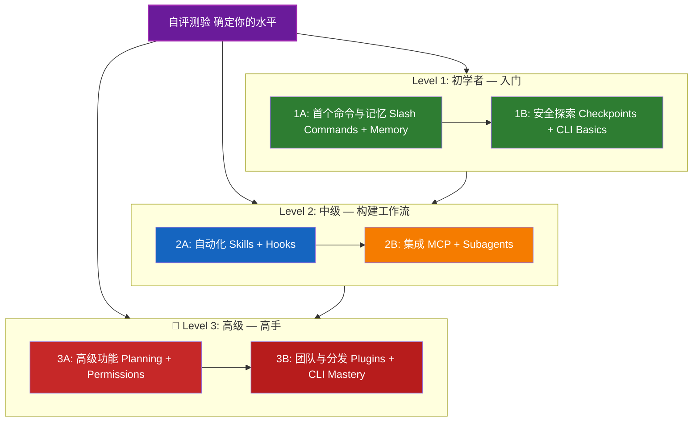

<picture>
  <source media="(prefers-color-scheme: dark)" srcset="resources/logos/claude-howto-logo-dark.svg">
  
</picture>

# 📚 Claude Code 学习路线图

**Claude Code 新手？** 本指南帮助你按照自己的节奏掌握 Claude Code 的功能。无论你是完全的新手还是经验丰富的开发者，都可以通过下方的自评测验找到适合你的起点。

---

## 🧭 确定你的水平

并非所有人都从同一个起点出发。快速完成以下自评，找到最适合你的入口。

**请诚实回答以下问题：**

- [ ] 我可以启动 Claude Code 并进行对话（`claude`）
- [ ] 我已经创建或编辑过 CLAUDE.md 文件
- [ ] 我使用过至少 3 个内置斜杠命令（如 /help、/compact、/model）
- [ ] 我创建过自定义斜杠命令或技能（SKILL.md）
- [ ] 我配置过 MCP 服务器（如 GitHub、数据库）
- [ ] 我在 ~/.claude/settings.json 中设置过 hooks
- [ ] 我创建或使用过自定义子代理（.claude/agents/）
- [ ] 我使用过打印模式（`claude -p`）进行脚本编程或 CI/CD

**你的水平：**

| 勾选数 | 水平 | 从这里开始 | 完成时间 |
|--------|-------|----------|------------------|
| 0-2 | **Level 1: 初学者（Beginner）** — 入门 | [里程碑 1A](#里程碑-1a--首个命令与记忆) | 约 3 小时 |
| 3-5 | **Level 2: 中级（Intermediate）** — 构建工作流 | [里程碑 2A](#里程碑-2a--自动化技能与钩子) | 约 5 小时 |
| 6-8 | **Level 3: 高级（Advanced）** — 高手与团队负责人 | [里程碑 3A](#里程碑-3a--高级功能) | 约 5 小时 |

> **提示**：如果不确定，建议从低一级开始。快速复习熟悉的内容比遗漏基础概念要好。

> **交互式版本**：在 Claude Code 中运行 `/self-assessment`，参与引导式交互式测验，评估你在全部 10 个功能领域的熟练度，并生成个性化学习路径。

---

## 🎯 学习理念

本仓库中的文件夹按**推荐学习顺序**编号，基于三个核心原则：

1. **依赖关系** — 基础概念优先
2. **复杂度递进** — 从简单到高级
3. **使用频率** — 最常用的功能先教

这种方式确保你在获得即时生产力提升的同时，打下坚实的基础。

---

## 🗺️ 你的学习路径



**颜色说明：**
- 💜 紫色：自评测验
- 🟢 绿色：Level 1 — 初学者路径
- 🔵 蓝色 / 🟡 金色：Level 2 — 中级路径
- 🔴 红色：Level 3 — 高级路径

---

## 📊 完整路线图总表

| 步骤 | 功能 | 复杂度 | 时间 | 水平 | 前置依赖 | 为什么学这个 | 核心收益 |
|------|---------|-----------|------|-------|--------------|----------------|----------|
| **1** | [Slash Commands（斜杠命令）](01-slash-commands/) | ⭐ 初学者 | 30 分钟 | Level 1 | 无 | 快速获得生产力（55+ 内置 + 5 个内置技能） | 即时自动化、团队规范 |
| **2** | [Memory（记忆）](02-memory/) | ⭐⭐ 初学者+ | 45 分钟 | Level 1 | 无 | 所有功能的基础 | 持久化上下文、偏好设置 |
| **3** | [Checkpoints（检查点）](08-checkpoints/) | ⭐⭐ 中级 | 45 分钟 | Level 1 | 会话管理 | 安全探索 | 实验、恢复 |
| **4** | [CLI Basics（命令行基础）](10-cli/) | ⭐⭐ 初学者+ | 30 分钟 | Level 1 | 无 | 核心 CLI 使用 | 交互模式和打印模式 |
| **5** | [Skills（技能）](03-skills/) | ⭐⭐ 中级 | 1 小时 | Level 2 | Slash Commands | 自动化专业能力 | 可复用能力、一致性 |
| **6** | [Hooks（钩子）](06-hooks/) | ⭐⭐ 中级 | 1 小时 | Level 2 | 工具、命令 | 工作流自动化（25 种事件、4 种类型） | 校验、质量门禁 |
| **7** | [MCP（模型上下文协议）](05-mcp/) | ⭐⭐⭐ 中级+ | 1 小时 | Level 2 | 配置 | 实时数据访问 | 实时集成、API 接入 |
| **8** | [Subagents（子代理）](04-subagents/) | ⭐⭐⭐ 中级+ | 1.5 小时 | Level 2 | Memory、Commands | 复杂任务处理（6 个内置含 Bash） | 委派、专业化能力 |
| **9** | [Advanced Features（高级功能）](09-advanced-features/) | ⭐⭐⭐⭐⭐ 高级 | 2-3 小时 | Level 3 | 以上所有 | 高手工具箱 | 规划模式、自动模式、频道、语音听写、权限控制 |
| **10** | [Plugins（插件）](07-plugins/) | ⭐⭐⭐⭐ 高级 | 2 小时 | Level 3 | 以上所有 | 完整解决方案 | 团队入职、分发部署 |
| **11** | [CLI Mastery（命令行精通）](10-cli/) | ⭐⭐⭐ 高级 | 1 小时 | Level 3 | 推荐：全部 | 精通命令行用法 | 脚本编程、CI/CD、自动化 |

**总学习时间**：约 11-13 小时（或跳到你的水平以节省时间）

---

## 🟢 Level 1: 初学者 — 入门

**适用对象**：自评勾选 0-2 项的用户
**预计时间**：约 3 小时
**重点**：即时生产力、理解基础概念
**目标**：成为熟练的日常用户，为进入 Level 2 做好准备

### 里程碑 1A: 首个命令与记忆

**主题**：Slash Commands + Memory
**时间**：1-2 小时
**复杂度**：⭐ 初学者
**目标**：通过自定义命令和持久化上下文立即提升生产力

#### 你将学会
✅ 为重复性任务创建自定义斜杠命令
✅ 设置项目记忆来管理团队规范
✅ 配置个人偏好
✅ 理解 Claude 如何自动加载上下文

#### 动手练习

```bash
# 练习 1：安装你的第一个斜杠命令
mkdir -p .claude/commands
cp 01-slash-commands/optimize.md .claude/commands/

# 练习 2：创建项目记忆
cp 02-memory/project-CLAUDE.md ./CLAUDE.md

# 练习 3：试试看
# 在 Claude Code 中输入：/optimize
```

#### 成功标准
- [ ] 成功调用 `/optimize` 命令
- [ ] Claude 记住了你 CLAUDE.md 中的项目规范
- [ ] 理解何时使用斜杠命令 vs 记忆

#### 下一步
完成以上内容后，阅读：
- [01-slash-commands/README.md](01-slash-commands/README.md)
- [02-memory/README.md](02-memory/README.md)

> **检查理解程度**：在 Claude Code 中运行 `/lesson-quiz slash-commands` 或 `/lesson-quiz memory` 来测试所学内容。

---

### 里程碑 1B: 安全探索

**主题**：Checkpoints + CLI Basics
**时间**：1 小时
**复杂度**：⭐⭐ 初学者+
**目标**：学会安全地实验并使用核心 CLI 命令

#### 你将学会
✅ 创建和恢复检查点以进行安全实验
✅ 理解交互模式 vs 打印模式
✅ 使用基本的 CLI 标志和选项
✅ 通过管道处理文件

#### 动手练习

```bash
# 练习 1：尝试检查点工作流
# 在 Claude Code 中：
# 进行一些实验性修改，然后按 Esc+Esc 或使用 /rewind
# 选择实验之前的检查点
# 选择"恢复代码和对话"回到之前的状态

# 练习 2：交互模式 vs 打印模式
claude "explain this project"           # 交互模式
claude -p "explain this function"       # 打印模式（非交互式）

# 练习 3：通过管道处理文件内容
cat error.log | claude -p "explain this error"
```

#### 成功标准
- [ ] 创建并回退到了一个检查点
- [ ] 使用了交互模式和打印模式
- [ ] 将文件通过管道传给 Claude 进行分析
- [ ] 理解何时使用检查点进行安全实验

#### 下一步
- 阅读：[08-checkpoints/README.md](08-checkpoints/README.md)
- 阅读：[10-cli/README.md](10-cli/README.md)
- **准备好进入 Level 2 了！** 继续前往 [里程碑 2A](#里程碑-2a--自动化技能与钩子)

> **检查理解程度**：运行 `/lesson-quiz checkpoints` 或 `/lesson-quiz cli` 来验证你是否已为 Level 2 做好准备。

---

## 🔵 Level 2: 中级 — 构建工作流

**适用对象**：自评勾选 3-5 项的用户
**预计时间**：约 5 小时
**重点**：自动化、集成、任务委派
**目标**：建立自动化工作流、外部集成，为 Level 3 做好准备

### 前置条件检查

在开始 Level 2 之前，确保你已经掌握以下 Level 1 概念：

- [ ] 能够创建和使用斜杠命令（[01-slash-commands/](01-slash-commands/)）
- [ ] 已通过 CLAUDE.md 设置了项目记忆（[02-memory/](02-memory/)）
- [ ] 知道如何创建和恢复检查点（[08-checkpoints/](08-checkpoints/)）
- [ ] 能在命令行中使用 `claude` 和 `claude -p`（[10-cli/](10-cli/)）

> **有缺口？** 在继续之前复习上方链接的教程。

---

### 里程碑 2A: 自动化（Skills + Hooks）

**主题**：Skills + Hooks
**时间**：2-3 小时
**复杂度**：⭐⭐ 中级
**目标**：自动化常见工作流和质量检查

#### 你将学会
✅ 通过 YAML frontmatter（包括 `effort` 和 `shell` 字段）自动调用专业化能力
✅ 设置覆盖 25 种钩子事件的事件驱动自动化
✅ 使用全部 4 种钩子类型（command、http、prompt、agent）
✅ 强制执行代码质量标准
✅ 为你的工作流创建自定义钩子

#### 动手练习

```bash
# 练习 1：安装一个技能
cp -r 03-skills/code-review ~/.claude/skills/

# 练习 2：设置钩子
mkdir -p ~/.claude/hooks
cp 06-hooks/pre-tool-check.sh ~/.claude/hooks/
chmod +x ~/.claude/hooks/pre-tool-check.sh

# 练习 3：在 settings 中配置钩子
# 添加到 ~/.claude/settings.json：
{
  "hooks": {
    "PreToolUse": [
      {
        "matcher": "Bash",
        "hooks": [
          {
            "type": "command",
            "command": "~/.claude/hooks/pre-tool-check.sh"
          }
        ]
      }
    ]
  }
}
```

#### 成功标准
- [ ] 代码审查技能在相关场景下被自动调用
- [ ] PreToolUse 钩子在工具执行前运行
- [ ] 理解技能自动调用 vs 钩子事件触发的区别

#### 下一步
- 创建你自己的自定义技能
- 为你的工作流设置额外的钩子
- 阅读：[03-skills/README.md](03-skills/README.md)
- 阅读：[06-hooks/README.md](06-hooks/README.md)

> **检查理解程度**：运行 `/lesson-quiz skills` 或 `/lesson-quiz hooks` 在继续之前测试你的知识。

---

### 里程碑 2B: 集成（MCP + Subagents）

**主题**：MCP + Subagents
**时间**：2-3 小时
**复杂度**：⭐⭐⭐ 中级+
**目标**：集成外部服务并委派复杂任务

#### 你将学会
✅ 从 GitHub、数据库等获取实时数据
✅ 将工作委派给专用 AI 代理
✅ 理解何时使用 MCP vs 子代理
✅ 构建集成化的工作流

#### 动手练习

```bash
# 练习 1：设置 GitHub MCP
export GITHUB_TOKEN="your_github_token"
claude mcp add github -- npx -y @modelcontextprotocol/server-github

# 练习 2：测试 MCP 集成
# 在 Claude Code 中：/mcp__github__list_prs

# 练习 3：安装子代理
mkdir -p .claude/agents
cp 04-subagents/*.md .claude/agents/
```

#### 集成练习
尝试以下完整工作流：
1. 使用 MCP 获取一个 GitHub PR
2. 让 Claude 将审查任务委派给 code-reviewer 子代理
3. 使用钩子自动运行测试

#### 成功标准
- [ ] 通过 MCP 成功查询了 GitHub 数据
- [ ] Claude 将复杂任务委派给子代理
- [ ] 理解 MCP 和子代理的区别
- [ ] 在一个工作流中组合使用了 MCP + 子代理 + 钩子

#### 下一步
- 设置额外的 MCP 服务器（数据库、Slack 等）
- 为你的领域创建自定义子代理
- 阅读：[05-mcp/README.md](05-mcp/README.md)
- 阅读：[04-subagents/README.md](04-subagents/README.md)
- **准备好进入 Level 3 了！** 继续前往 [里程碑 3A](#里程碑-3a--高级功能)

> **检查理解程度**：运行 `/lesson-quiz mcp` 或 `/lesson-quiz subagents` 来验证你是否已为 Level 3 做好准备。

---

## 🔴 Level 3: 高级 — 高手与团队负责人

**适用对象**：自评勾选 6-8 项的用户
**预计时间**：约 5 小时
**重点**：团队工具、CI/CD、企业级功能、插件开发
**目标**：成为高手，能够搭建团队工作流和 CI/CD 流水线

### 前置条件检查

在开始 Level 3 之前，确保你已经掌握以下 Level 2 概念：

- [ ] 能够创建和使用支持自动调用的技能（[03-skills/](03-skills/)）
- [ ] 已设置用于事件驱动自动化的钩子（[06-hooks/](06-hooks/)）
- [ ] 能够配置 MCP 服务器以访问外部数据（[05-mcp/](05-mcp/)）
- [ ] 知道如何使用子代理进行任务委派（[04-subagents/](04-subagents/)）

> **有缺口？** 在继续之前复习上方链接的教程。

---

### 里程碑 3A: 高级功能

**主题**：Advanced Features（规划、权限、扩展思考、自动模式、频道、语音听写、远程/桌面/Web）
**时间**：2-3 小时
**复杂度**：⭐⭐⭐⭐⭐ 高级
**目标**：掌握高级工作流和高手的工具箱

#### 你将学会
✅ 复杂功能的规划模式
✅ 6 种模式的细粒度权限控制（default、acceptEdits、plan、auto、dontAsk、bypassPermissions）
✅ 通过 Alt+T / Option+T 切换的扩展思考
✅ 后台任务管理
✅ 带后台安全分类器的 Auto Mode（自动模式）
✅ 用于结构化多会话工作流的 Channels（频道）
✅ 免提语音听写的 Voice Dictation（语音输入）
✅ 远程控制、桌面应用和 Web 会话
✅ 用于多代理协作的 Agent Teams（代理团队）

#### 动手练习

```bash
# 练习 1：使用规划模式
/plan Implement user authentication system

# 练习 2：尝试权限模式（6 种可用：default、acceptEdits、plan、auto、dontAsk、bypassPermissions）
claude --permission-mode plan "analyze this codebase"
claude --permission-mode acceptEdits "refactor the auth module"
claude --permission-mode auto "implement the feature"

# 练习 3：启用扩展思考
# 在会话中按 Alt+T（macOS 上为 Option+T）切换

# 练习 4：高级检查点工作流
# 1. 创建检查点"Clean state"
# 2. 使用规划模式设计一个功能
# 3. 通过子代理委派实现
# 4. 在后台运行测试
# 5. 如果测试失败，回退到检查点
# 6. 尝试替代方案

# 练习 5：尝试自动模式（后台安全分类器）
claude --permission-mode auto "implement user settings page"

# 练习 6：启用代理团队
export CLAUDE_AGENT_TEAMS=1
# 让 Claude："Implement feature X using a team approach"

# 练习 7：定时任务
/loop 5m /check-status
# 或使用 CronCreate 创建持久化的定时任务

# 练习 8：多会话工作流的频道
# 使用频道来组织跨会话的工作

# 练习 9：语音听写
# 使用语音输入与 Claude Code 进行免提交互
```

#### 成功标准
- [ ] 对复杂功能使用了规划模式
- [ ] 配置了权限模式（plan、acceptEdits、auto、dontAsk）
- [ ] 通过 Alt+T / Option+T 切换了扩展思考
- [ ] 使用了带安全分类器的自动模式
- [ ] 对长时间操作使用了后台任务
- [ ] 探索了 Channels 多会话工作流
- [ ] 尝试了免提语音输入
- [ ] 理解远程控制、桌面应用和 Web 会话
- [ ] 启用并使用了 Agent Teams 进行协作任务
- [ ] 使用 `/loop` 进行定时任务或定时监控

#### 下一步
- 阅读：[09-advanced-features/README.md](09-advanced-features/README.md)

> **检查理解程度**：运行 `/lesson-quiz advanced` 来测试你对高手功能的掌握程度。

---

### 里程碑 3B: 团队与分发（Plugins + CLI 精通）

**主题**：Plugins + CLI Mastery + CI/CD
**时间**：2-3 小时
**复杂度**：⭐⭐⭐⭐ 高级
**目标**：构建团队工具、创建插件、精通 CI/CD 集成

#### 你将学会
✅ 安装和创建完整的打包插件
✅ 精通 CLI 以进行脚本编程和自动化
✅ 使用 `claude -p` 设置 CI/CD 集成
✅ JSON 输出用于自动化流水线
✅ 会话管理和批处理

#### 动手练习

```bash
# 练习 1：安装完整插件
# 在 Claude Code 中：/plugin install pr-review

# 练习 2：打印模式用于 CI/CD
claude -p "Run all tests and generate report"

# 练习 3：JSON 输出用于脚本
claude -p --output-format json "list all functions"

# 练习 4：会话管理和恢复
claude -r "feature-auth" "continue implementation"

# 练习 5：带约束条件的 CI/CD 集成
claude -p --max-turns 3 --output-format json "review code"

# 练习 6：批处理
for file in *.md; do
  claude -p --output-format json "summarize this: $(cat $file)" > ${file%.md}.summary.json
done
```

#### CI/CD 集成练习
创建一个简单的 CI/CD 脚本：
1. 使用 `claude -p` 审查变更的文件
2. 以 JSON 格式输出结果
3. 用 `jq` 处理特定问题
4. 集成到 GitHub Actions 工作流中

#### 成功标准
- [ ] 安装并使用了一个插件
- [ ] 为你的团队构建或修改了一个插件
- [ ] 在 CI/CD 中使用了打印模式（`claude -p`）
- [ ] 生成了 JSON 输出用于脚本编程
- [ ] 成功恢复了之前的会话
- [ ] 创建了批处理脚本
- [ ] 将 Claude 集成到了 CI/CD 工作流中

#### CLI 的实际使用场景
- **代码审查自动化**：在 CI/CD 流水线中运行代码审查
- **日志分析**：分析错误日志和系统输出
- **文档生成**：批量生成文档
- **测试洞察**：分析测试失败原因
- **性能分析**：审查性能指标
- **数据处理**：转换和分析数据文件

#### 下一步
- 阅读：[07-plugins/README.md](07-plugins/README.md)
- 阅读：[10-cli/README.md](10-cli/README.md)
- 创建团队范围的 CLI 快捷方式和插件
- 设置批处理脚本

> **检查理解程度**：运行 `/lesson-quiz plugins` 或 `/lesson-quiz cli` 来确认你的掌握程度。

---

## 🧪 测试你的知识

本仓库包含两个你可以在 Claude Code 中随时使用的交互式技能来评估你的理解程度：

| 技能 | 命令 | 目的 |
|-------|---------|---------|
| **Self-Assessment（自评）** | `/self-assessment` | 评估你在所有 10 个功能领域的整体熟练度。选择快速（2 分钟）或深度（5 分钟）模式获取个性化技能画像和学习路径。 |
| **Lesson Quiz（课程测验）** | `/lesson-quiz [课程]` | 用 10 个问题测试你对特定课程的理解。可用于课前（预测试）、课中（进度检查）或课后（掌握验证）。 |

**示例：**
```
/self-assessment                  # 确定你的整体水平
/lesson-quiz hooks                # 课程 06 测验：Hooks
/lesson-quiz 03                   # 课程 03 测验：Skills
/lesson-quiz advanced-features    # 课程 09 测验
```

---

## ⚡ 快速入门路径

### 如果你只有 15 分钟
**目标**：获得第一次成功体验

1. 复制一个斜杠命令：`cp 01-slash-commands/optimize.md .claude/commands/`
2. 在 Claude Code 中试用：`/optimize`
3. 阅读：[01-slash-commands/README.md](01-slash-commands/README.md)

**成果**：你将拥有一个可工作的斜杠命令并理解基本概念

---

### 如果你有 1 小时
**目标**：设置核心生产力工具

1. **斜杠命令**（15 分钟）：复制并测试 `/optimize` 和 `/pr`
2. **项目记忆**（15 分钟）：创建包含项目规范的 CLAUDE.md
3. **安装一个技能**（15 分钟）：设置 code-review 技能
4. **组合使用**（15 分钟）：观察它们如何协同工作

**成果**：通过命令、记忆和自动技能获得基础的生产力提升

---

### 如果你有一个周末
**目标**：精通大多数功能

**周六上午**（3 小时）：
- 完成里程碑 1A：Slash Commands + Memory
- 完成里程碑 1B：Checkpoints + CLI Basics

**周六下午**（3 小时）：
- 完成里程碑 2A：Skills + Hooks
- 完成里程碑 2B：MCP + Subagents

**周日**（4 小时）：
- 完成里程碑 3A：Advanced Features
- 完成里程碑 3B：Plugins + CLI Mastery + CI/CD
- 为你的团队构建一个自定义插件

**成果**：你将成为 Claude Code 高手，能够培训他人并自动化复杂的工作流

---

## 💡 学习技巧

### ✅ 推荐做法

- **先做测验**来确定你的起点
- **完成每个里程碑的动手练习**
- **从简单开始**，逐步增加复杂度
- **在进入下一个功能前先测试当前功能**
- **记录**哪些方式对你的工作流有效
- **在学习高级主题时回顾**之前的概念
- **使用检查点安全地实验**
- **与团队分享知识**

### ❌ 避免事项

- **跳过前置条件检查**直接跳到更高水平
- **试图一次学完所有东西**——这会让你不知所措
- **在不理解的情况下复制配置**——你将不知道如何调试
- **忘记测试**——始终验证功能是否正常工作
- **匆忙完成里程碑**——花时间真正理解
- **忽视文档**——每个 README 都有宝贵的细节
- **独自闭门造车**——与队友讨论

---

## 🎓 学习风格

### 视觉学习者
- 学习每个 README 中的 Mermaid 图表
- 观察命令执行流程
- 绘制自己的工作流图
- 使用上方的可视化学习路径

### 动手实践者
- 完成每一个动手练习
- 尝试各种变体
- 故意弄坏再修复（使用检查点！）
- 创建你自己的示例

### 阅读者
- 彻底阅读每个 README
- 研究代码示例
- 审查对比表格
- 阅读资源中链接的博客文章

### 社交学习者
- 安排结对编程会议
- 向队友教授概念
- 加入 Claude Code 社区讨论
- 分享你的自定义配置

---

## 📈 进度跟踪

使用以下清单按水平跟踪你的进度。随时运行 `/self-assessment` 获取更新的技能画像，或在每个教程后运行 `/lesson-quiz [课程]` 来验证你的理解。

### 🟢 Level 1: 初学者
- [ ] 完成 [01-slash-commands](01-slash-commands/)
- [ ] 完成 [02-memory](02-memory/)
- [ ] 创建第一个自定义斜杠命令
- [ ] 设置项目记忆
- [ ] **里程碑 1A 已达成**
- [ ] 完成 [08-checkpoints](08-checkpoints/)
- [ ] 完成 [10-cli](10-cli/) 基础部分
- [ ] 创建并回退到一个检查点
- [ ] 使用了交互模式和打印模式
- [ ] **里程碑 1B 已达成**

### 🔵 Level 2: 中级
- [ ] 完成 [03-skills](03-skills/)
- [ ] 完成 [06-hooks](06-hooks/)
- [ ] 安装了第一个技能
- [ ] 设置了 PreToolUse 钩子
- [ ] **里程碑 2A 已达成**
- [ ] 完成 [05-mcp](05-mcp/)
- [ ] 完成 [04-subagents](04-subagents/)
- [ ] 连接了 GitHub MCP
- [ ] 创建了自定义子代理
- [ ] 在工作流中组合了多种集成
- [ ] **里程碑 2B 已达成**

### 🔴 Level 3: 高级
- [ ] 完成 [09-advanced-features](09-advanced-features/)
- [ ] 成功使用了规划模式
- [ ] 配置了权限模式（6 种模式含 auto）
- [ ] 使用了带安全分类器的自动模式
- [ ] 使用了扩展思考切换
- [ ] 探索了频道和语音听写
- [ ] **里程碑 3A 已达成**
- [ ] 完成 [07-plugins](07-plugins/)
- [ ] 完成 [10-cli](10-cli/) 高级用法
- [ ] 设置了打印模式（`claude -p`）CI/CD
- [ ] 创建了 JSON 输出用于自动化
- [ ] 将 Claude 集成到 CI/CD 流水线
- [ ] 创建了团队插件
- [ ] **里程碑 3B 已达成**

---

## 🆘 常见学习挑战

### 挑战 1："一次性概念太多"
**解决方案**：每次专注于一个里程碑。完成所有练习后再继续前进。

### 挑战 2："不知道该在什么时候使用哪个功能"
**解决方案**：参考主 README 中的[使用场景矩阵](README.md#你能用它构建什么)。

### 挑战 3："配置不生效"
**解决方案**：查看[故障排除](README.md#故障排除)部分并验证文件位置是否正确。

### 挑战 4："概念看起来有重叠"
**解决方案**：审阅[功能对比](README.md#功能对比)表来理解各功能的区别。

### 挑战 5："很难记住所有内容"
**解决方案**：创建你自己的速查表。使用检查点安全地进行实验。

### 挑战 6："我有经验但不确定从哪里开始"
**解决方案**：参加上面的[自评测验](#-确定你的水平)。跳到你的水平级别，然后使用前置条件检查来识别任何知识缺口。

---

## 🎯 完成之后做什么？

当你完成所有里程碑后：

1. **创建团队文档** —— 记录团队的 Claude Code 配置
2. **构建自定义插件** —— 打包你们团队的工作流
3. **探索远程控制** —— 从外部工具以编程方式控制 Claude Code 会话
4. **尝试 Web 会话** —— 通过浏览器界面使用 Claude Code 进行远程开发
5. **使用桌面应用** —— 通过原生桌面应用访问 Claude Code 功能
6. **使用自动模式** —— 让 Claude 在后台安全分类器的保护下自主工作
7. **利用自动记忆** —— 让 Claude 随着时间的推移自动学习你的偏好
8. **设置代理团队** —— 协调多个代理处理复杂的、多维度的任务
9. **使用频道** —— 组织跨结构化多会话的工作流
10. **尝试语音听写** —— 使用免提语音输入与 Claude Code 交互
11. **使用定时任务** —— 使用 `/loop` 和 cron 工具自动化定期检查
12. **贡献示例** —— 与社区分享
13. **指导他人** —— 帮助队友学习
14. **优化工作流** —— 根据使用情况持续改进
15. **保持更新** —— 关注 Claude Code 发布和新功能

---

## 📚 补充资源

### 官方文档
- [Claude Code 文档](https://code.claude.com/docs/en/overview)
- [Anthropic 文档](https://docs.anthropic.com)
- [MCP 协议规范](https://modelcontextprotocol.io)

### 博客文章
- [发现 Claude Code 斜杠命令](https://medium.com/@luongnv89/discovering-claude-code-slash-commands-cdc17f0dfb29)

### 社区
- [Anthropic Cookbook](https://github.com/anthropics/anthropic-cookbook)
- [MCP 服务器仓库](https://github.com/modelcontextprotocol/servers)

---

## 💬 反馈与支持

- **发现问题？** 在仓库中创建 Issue
- **有建议？** 提交 Pull Request
- **需要帮助？** 查阅文档或向社区提问

---

**最后更新**：2026 年 3 月
**维护者**：Claude How-To 贡献者
**许可证**：教育用途，可自由使用和改编

---

[← 返回主 README](README.md)
