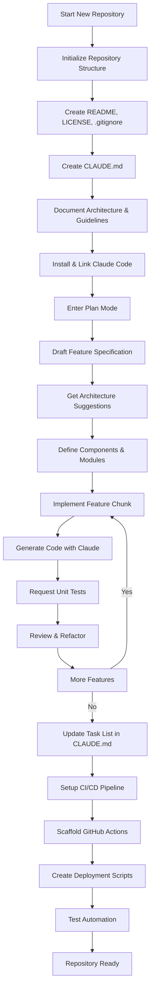
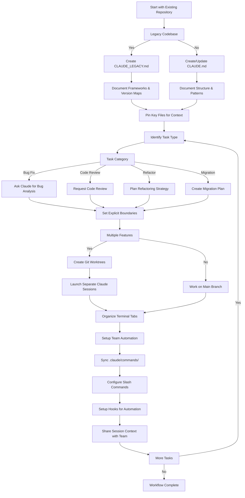

<picture>
  <source media="(prefers-color-scheme: dark)" srcset="resources/logos/claude-howto-logo-dark.svg">
  
</picture>

# 推荐资源汇总

## 官方文档

| 资源 | 描述 | 链接 |
|------|------|------|
| Claude Code 文档 | Claude Code 官方文档 | [code.claude.com/docs/en/overview](https://code.claude.com/docs/en/overview) |
| Anthropic 文档 | Anthropic 全套文档 | [docs.anthropic.com](https://docs.anthropic.com) |
| MCP 协议 | Model Context Protocol 规范 | [modelcontextprotocol.io](https://modelcontextprotocol.io) |
| MCP 服务器 | 官方 MCP 服务器实现 | [github.com/modelcontextprotocol/servers](https://github.com/modelcontextprotocol/servers) |
| Anthropic Cookbook | 代码示例和教程 | [github.com/anthropics/anthropic-cookbook](https://github.com/anthropics/anthropic-cookbook) |
| Claude Code Skills | 社区技能仓库 | [github.com/anthropics/skills](https://github.com/anthropics/skills) |
| Agent Teams | 多代理协作与协调 | [code.claude.com/docs/en/agent-teams](https://code.claude.com/docs/en/agent-teams) |
| Scheduled Tasks | 通过 /loop 和 cron 设置定时任务 | [code.claude.com/docs/en/scheduled-tasks](https://code.claude.com/docs/en/scheduled-tasks) |
| Chrome Integration | 浏览器自动化 | [code.claude.com/docs/en/chrome](https://code.claude.com/docs/en/chrome) |
| Keybindings | 键盘快捷键定制 | [code.claude.com/docs/en/keybindings](https://code.claude.com/docs/en/keybindings) |
| Desktop App | 原生桌面应用 | [code.claude.com/docs/en/desktop](https://code.claude.com/docs/en/desktop) |
| Remote Control | 远程会话控制 | [code.claude.com/docs/en/remote-control](https://code.claude.com/docs/en/remote-control) |
| Auto Mode | 自动权限管理 | [code.claude.com/docs/en/permissions](https://code.claude.com/docs/en/permissions) |
| Channels | 多频道通讯 | [code.claude.com/docs/en/channels](https://code.claude.com/docs/en/channels) |
| Voice Dictation | Claude Code 语音输入 | [code.claude.com/docs/en/voice-dictation](https://code.claude.com/docs/en/voice-dictation) |

## Anthropic 工程博客

| 文章 | 描述 | 链接 |
|------|------|------|
| Code Execution with MCP | 如何通过代码执行解决 MCP 上下文膨胀问题 ---- Token 减少 98.7% | [anthropic.com/engineering/code-execution-with-mcp](https://www.anthropic.com/engineering/code-execution-with-mcp) |

---

## 30 分钟精通 Claude Code

_视频_:https://www.youtube.com/watch?v=6eBSHbLKuN0

_**全部技巧**_
- **探索高级功能和快捷键**
  - 定期查看 Claude 的发布说明,了解新的代码编辑和上下文功能。
  - 学习键盘快捷键以便快速切换聊天、文件和编辑器视图。

- **高效设置**
  - 创建带有清晰名称/描述的项目专属会话,方便检索。
  - 固定最常用的文件或文件夹,使 Claude 能随时访问它们。
  - 设置 Claude 的集成(例如 GitHub、流行的 IDE),以简化编码流程。

- **高效的代码库问答**
  - 向 Claude 详细询问架构、设计模式和特定模块的问题。
  - 在提问中使用文件和行引用(例如 "`app/models/user.py` 中的逻辑完成了什么?")。
  - 对于大型代码库,提供摘要或清单来帮助 Claude 聚焦。
  - **示例提示词**:_"能否解释一下 `src/auth/AuthService.ts:45-120` 中实现的认证流程?它与 `src/middleware/auth.ts` 中的中间件是如何集成的?"_

- **代码编辑与重构**
  - 使用内联注释或在代码块中提出请求来进行精准编辑("为了清晰起见重构此函数")。
  - 要求提供前后的对比视图。
  - 让 Claude 在重大编辑后生成测试或文档以保证质量。
  - **示例提示词**:_"将 `api/users.js` 中的 `getUserData` 函数重构为使用 async/await 替代 Promise。展示前后对比并为重构后的版本生成单元测试。"_

- **上下文管理**
  - 将粘贴的代码/上下文限制在与当前任务相关的范围内。
  - 使用结构化的提示词("这是文件 A,这是函数 B,我的问题是 X")以获得最佳性能。
  - 移除或折叠提示窗口中的大文件,以避免超出上下文限制。
  - **示例提示词**:_"这是来自 `models/User.js` 的 User 模型和来自 `utils/validation.js` 的 validateUser 函数。我的问题是:如何在保持向后兼容性的同时添加邮箱验证?"_

- **团队工具集成**
  - 将 Claude 会话连接到你团队的仓库和文档。
  - 使用内置模板或为常见的工程任务创建自定义模板。
  - 通过分享会话记录和提示词与团队成员协作。

- **提升性能**
  - 给出清晰、目标明确的指令(例如,"用五个要点总结此类")。
  - 从上下文窗口中裁剪不必要的注释和样板代码。
  - 如果 Claude 的输出偏离了方向,重置上下文或重新组织问题以获得更好的对齐。
  - **示例提示词**:_"用五个要点总结 `src/db/Manager.ts` 中的 DatabaseManager 类,重点关注其主要职责和关键方法。"_

- **实际使用示例**
  - 调试:粘贴错误信息和堆栈跟踪,然后询问可能的原因和修复方案。
  - 测试生成:为复杂逻辑请求基于属性的测试、单元测试或集成测试。
  - 代码审查:要求 Claude 识别风险变更、边缘情况或代码异味。
  - **示例提示词**:
    - _"我遇到了这个错误:'TypeError: Cannot read property 'map' of undefined at line 42 in components/UserList.jsx'。以下是堆栈跟踪和相关代码。这是什么原因导致的?我该如何修复?"_
    - _"为 PaymentProcessor 类生成全面的单元测试,包括失败交易、超时和无效输入等边缘情况。"_
    - _"审查此 Pull Request 差异并识别潜在的安全问题、性能瓶颈和代码异味。"_

- **工作流自动化**
  - 使用 Claude 提示词编写重复任务的脚本(如格式化、清理和批量重命名)。
  - 让 Claude 根据代码差异起草 PR 描述、发布说明或文档。
  - **示例提示词**:_"根据 git diff 创建一份详细的 PR 描述,包括变更摘要、修改文件列表、测试步骤和潜在影响。同时生成 2.3.0 版本的发布说明。"_

**提示**:为获得最佳效果,结合使用以上几种实践----首先固定关键文件并概述你的目标,然后使用聚焦的提示词和 Claude 的重构工具来逐步改善你的代码库和自动化。

---

**推荐的工作流**

### 新建仓库推荐工作流

#### 对于新仓库

1. **初始化仓库 & Claude 集成**
   - 用必要的结构搭建新仓库:README、LICENSE、.gitignore、根配置文件。
   - 创建一个 `CLAUDE.md` 文件,描述架构、高层目标和编码指南。
   - 安装 Claude Code 并将其连接到你的仓库,用于代码建议、测试脚手架和工作流自动化。

2. **使用规划模式和规格说明**
   - 使用规划模式(`Shift+Tab` 或 `/plan`)在实施功能之前草拟详细规格说明。
   - 向 Claude 询问架构建议和初始项目布局。
   - 保持清晰、目标导向的提示序列----询问组件大纲、主要模块和职责。

3. **迭代开发与审查**
   - 分小块实施核心功能,提示 Claude 进行代码生成、重构和文档编写。
   - 每次增量后请求单元测试和示例。
   - 在 CLAUDE.md 中维护一个持续的任务列表。

4. **自动化 CI/CD 和部署**
   - 使用 Claude 搭建 GitHub Actions、npm/yarn 脚本或部署工作流。
   - 通过更新 CLAUDE.md 并请求相应的命令/脚本轻松适配流水线。

#### 对于现有仓库

1. **仓库与上下文搭建**
   - 添加或更新 `CLAUDE.md` 来记录仓库结构、编码模式和关键文件。对于遗留仓库,使用 `CLAUDE_LEGACY.md` 涵盖框架、版本映射、指令、Bug 和升级说明。
   - 固定或突出显示 Claude 应该用作上下文的主要文件。

2. **上下文化代码问答**
   - 向 Claude 请求代码审查、Bug 解释、重构或迁移计划,引用特定文件/函数。
   - 给 Claude 明确的边界(例如,"只修改这些文件"或"不允许引入新依赖")。

3. **分支、工作树和多会话管理**
   - 使用多个 git worktree 进行隔离的功能开发或 Bug 修复,并为每个 worktree 启动独立的 Claude 会话。
   - 按分支或功能组织终端标签/窗口,便于并行工作流。

4. **团队工具与自动化**
   - 通过 `.claude/commands/` 同步自定义命令以实现跨团队一致性。
   - 通过 Claude 的斜杠命令或钩子自动化重复任务、PR 创建和代码格式化。
   - 与团队成员分享会话和上下文,用于协作排查和审查。

**提示**:
- 每个新功能或修复都从规格说明和规划模式的提示开始。
- 对于遗留和复杂的仓库,在 CLAUDE.md / CLAUDE_LEGACY.md 中存储详细指导。
- 给出清晰、聚焦的指示并将复杂工作拆解为多阶段计划。
- 定期清理会话、裁剪上下文并移除已完成的工作树以避免混乱。

---

## 新功能与能力(2026 年 3 月)

### 关键功能资源

| 功能 | 描述 | 了解更多 |
|------|------|----------|
| **Auto Memory(自动记忆)** | Claude 自动学习并跨会话记住你的偏好 | [Memory Guide(记忆指南)](02-memory/) |
| **Remote Control(远程控制)** | 从外部工具和脚本程序化控制 Claude Code 会话 | [Advanced Features(高级功能)](09-advanced-features/) |
| **Web Sessions(Web 会话)** | 通过浏览器界面访问 Claude Code 进行远程开发 | [CLI Reference(CLI 参考)](10-cli/) |
| **Desktop App(桌面应用)** | 增强界面的原生桌面应用 | [Claude Code Docs](https://code.claude.com/docs/en/desktop) |
| **Extended Thinking(扩展思考)** | 通过 `Alt+T`/`Option+T` 或 `MAX_THINKING_TOKENS` 环境变量开启深度推理开关 | [Advanced Features(高级功能)](09-advanced-features/) |
| **Permission Modes(权限模式)** | 精细控制:default、acceptEdits、plan、auto、dontAsk、bypassPermissions | [Advanced Features(高级功能)](09-advanced-features/) |
| **7 层记忆体系** | Managed Policy → Project → Project Rules → User → User Rules → Local → Auto Memory | [Memory Guide(记忆指南)](02-memory/) |
| **Hook Events(钩子事件)** | 25 个事件:PreToolUse、PostToolUse、PostToolUseFailure、Stop、StopFailure、SubagentStart、SubagentStop、Notification、Elicitation 等 | [Hooks Guide(钩子指南)](06-hooks/) |
| **Agent Teams(代理团队)** | 协调多个代理共同完成复杂任务 | [Subagents Guide(子代理指南)](04-subagents/) |
| **Scheduled Tasks(定时任务)** | 通过 `/loop` 和 cron 工具设置循环任务 | [Advanced Features(高级功能)](09-advanced-features/) |
| **Chrome Integration(浏览器集成)** | 使用无头 Chromium 进行浏览器自动化 | [Advanced Features(高级功能)](09-advanced-features/) |
| **Keyboard Customization(键盘定制)** | 定制快捷键,包括组合键序列 | [Advanced Features(高级功能)](09-advanced-features/) |

